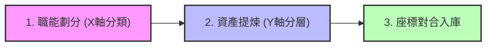

# 2.2 二維職能知識矩陣與建構流程：為 Agent 劃定智力地圖

在 2.1 節中，我們確立了「為 Agent 準備知識」的原則。然而，企業知識龐雜且混亂，若沒有一套經緯分明的地圖，AI 代理人將無從定位其思考邊界。為此，我們引入 **二維企業知識矩陣 (2D Enterprise Knowledge Matrix)**，作為軟體定義智力資產的底座。

---

## 2.2.1 經緯交織：二維企業知識矩陣

這套矩陣透過縱軸與橫軸的交織，為企業的每一項智力資產標定唯一的 **物理座標**：

### 1. 縱軸 (Y軸)：L0 - L4 知識階層 (Depth)
定義了知識的「精確度與認知提煉深度」：
*   **`L0` 型態與資料 (Type & File)**：資訊的實體格式規範。如 Markdown 格式規範、PDF 文件、多語審校標準。
*   **`L1` 產業與文明 (Domain & Civilization)**：不隨單一企業改變的產業基礎事實。如基礎熱力學原理、ISO 能效標準、通用會計科目。
*   **`L2` 職能與習慣 (SOP & Flow)**：企業通用的工作流程。如研發製圖 SOP、生產檢驗流程、行銷漏斗回覆格律。
*   **`L3` 企業與真相 (Entity & Facts)**：企業獨有的精密物理參數與真相檔案。如產品特單規格、IoT 暫存器點位與停機閥值 Facts。
*   **`L4` 個人與專家 (Heuristics & Wisdom)**：一線專家的隱性心法與現場經驗。如師傅聽音診斷異音心法、頂尖業務的破冰談判手感。

### 2. 橫軸 (X軸)：產、銷、人、發、財 企業五大職能 (Function)
劃定了知識的「業務範疇與職能邊界」：
*   **發 (`RD`)**：研發與設計。
*   **產 (`MFG`)**：生產與製造。
*   **銷 (`MKT`)**：行銷與銷售。
*   **人 (`HR`)**：人力資源與組織。
*   **財 (`FIN`)**：財務與企劃。

---

## 2.2.2 座標定位系統 (Coordinate Positioning)

透過將縱軸與橫軸結合，我們為每一條知識定義了唯一的座標標示，格式為 `[職能_階層]`。

例如：
*   **`RD_L3`**：研發設計的企業真相（如浮盛流體特定轉子的齒數比與幾何參數）。
*   **`MFG_L4`**：生產製造的專家心法（如空壓機試車房的聽音診斷異音心法）。
*   **`FIN_L2`**：財務會計的職能 SOP（如企業差旅費用核銷流程）。

在大腦事實資料庫 (`flowsheng_knowledge.db`) 中，這些座標被物理儲存為 `assets` 資料表的 `coordinate` 欄位。當對應的 Agent (如研發部的特單檢核 Agent) 啟動時，它只會被掛載並允許讀取帶有 `RD` 相關橫軸或 `RD_L3` 精確座標的智力資產，從物理上限縮其決策邊界，消除越權與幻覺。

---

## 2.2.3 實體建構流程 (Empirical Process)

企業要建構這套矩陣，必須遵循以下標準化建構流程：

1.  **職能劃分 (X軸分類)**：盤點企業目前的 Nano-Squad 部門，將原始資料按 `RD`/`MFG`/`MKT`/`HR`/`FIN` 分類歸檔。
2.  **資產提煉 (Y軸分層)**：
    *   清洗 L0 格式，將 PDF/Word 統一轉化為 Markdown。
    *   過濾 L1 通用知識，將臨界物理 Facts 與 DDL 結構化落庫為 L3。
    *   將資深專家的口述錄音通過 AI 進行去識別化反向架構，提煉為 L4 片段。
3.  **座標對合入庫**：在事實庫中建立對照索引，為每條 Chunks 標註其職能座標 (如 `MFG_L3`)，完成入庫。

### 結論
二維企業知識矩陣是自主代理人得以「順利運行」的數位憲盤。沒有座標，Agent 就如同在迷霧中航行；有了 `RD_L3` 與 `MFG_L4` 的定位，多代理團隊才能如同真實部門般各司其職、高效對合。

在接下來的 2.3 中，我們將探討如何利用這些座標化資產，透過 RAG 與脈絡堆疊（Context Stacking）技術，在運行中動態掛載至 Agent 的決策鏈中。
