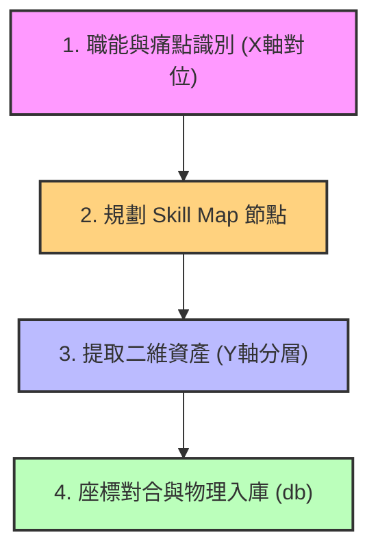

# 2.2 企業 Skill Map (技能地圖) 與知識底座之建構

在 2.1 節中，我們確立了「為 Agent 準備知識」與無感 Context 採集的原則。然而，企業知識龐雜且混亂，若沒有一套將「業務能力需求」與「資料資產座標」對合的導航地圖，AI 代理人將無從定位其思考邊界。

為此，在 v1.6.0 中，我們正式將 **二維企業知識矩陣** 升級為 **企業 Skill Map (技能地圖)** 體系，作為軟體定義智力資產與 Skill 治理的底座。

---

## 2.2.1 經緯交織：二維企業知識矩陣

這套矩陣是 Skill Map 的物理骨架，透過縱軸與橫軸的交織，為企業的每一項智力資產標定唯一的 **物理座標**：

### 1. 縱軸 (Y軸)：L0 - L4 知識階層 (Depth)
定義了知識的「精確度與認知提煉深度」：
*   **`L0` 型態與資料 (Type & File)**：資訊的實體格式規範。如 Markdown 格式規範、PDF 文件、多語審校標準。
*   **`L1` 產業與文明 (Domain & Civilization)**：不隨單一企業改變的產業基礎事實。如基礎熱力學原理、ISO 能效標準、通用會計科目。
*   **`L2` 職能與習慣 (SOP & Flow)**：企業通用的工作流程與格律。如研發製圖 SOP、生產檢驗流程、行銷漏斗回覆格律。
*   **`L3` 企業與真相 (Entity & Facts)**：企業獨有的精密物理參數與真相檔案。如產品特單規格、IoT 暫存器點位與停機閥值 Facts。
*   **`L4` 個人與專家 (Heuristics & Wisdom)**：一線專家的隱性心法與現場經驗。如師傅聽音診斷異音心法、頂尖業務的破冰談判手感。

### 2. 橫軸 (X軸)：產、銷、人、發、財 企業五大職能 (Function)
劃定了知識的「業務範疇與職能邊界」：
*   **發 (`RD`)**：研發與設計。
*   **產 (`MFG`)**：生產與製造。
*   **銷 (`MKT`)**：行銷與銷售。
*   **人 (`HR`)**：人力資源與組織。
*   **財 (`FIN`)**：財務與企劃。

---

## 2.2.2 企業 Skill Map (技能地圖) 的引入

二維矩陣解決了「資料在哪裡」的問題，而 **Skill Map (技能地圖)** 則解決了「能力該如何對齊」的問題。
Skill Map 將企業中具體的「人機協作職能」進行格律化編目，將橫軸的業務需求，轉化為 Agent 運作時可調用的特定 **Skill**：

1.  **映射業務痛點 (Gap Alignment)**：盤點各部門面臨的痛點（例如：法務合約審查延遲、RD 圖面檢索耗時），在 Skill Map 上標定對應的技能節點。
2.  **定義 Skill 規格**：每個 Skill 節點在地圖上必須明確定義其**輸入格式 (Context Inputs)**、**處理邏輯 (Semantic logic)** 以及 **輸出 CTA (行動呼籲)**。
3.  **掛載知識座標**：Skill Map 會直接指向二維矩陣中的物理座標。例如，一個名為 `MFG_Pump_Diagnostics` (泵浦診斷技能) 的 Skill 節點，會直接掛載 `MFG_L3` (機台 Facts) 與 `MFG_L4` (老技師故障心法)，確保 Agent 執行此技能時擁有精確的「機器可讀大腦」。

---

## 2.2.3 實體建構流程 (Empirical Process)

企業要建構這套結合二維矩陣與 Skill Map 的知識底座，必須遵循以下標準化流程：

1.  **職能與痛點識別 (X軸對位)**：盤點企業目前的 Nano-Squad 部門，將原始資料按 `RD`/`MFG`/`MKT`/`HR`/`FIN` 分類歸檔，並標定出 AI 優先切入的技能痛點。
2.  **規劃 Skill Map 節點**：定義 AI 代理人需要具備哪些 Skill 節點，並設計各節點的輸入、邏輯、與 CTA 動態輸出。
3.  **提取二維資產 (Y軸分層)**：
    *   清洗 L0 格式，將 PDF/Word 統一轉化為 Markdown。
    *   過濾 L1 通用知識，將臨界物理 Facts 與 DDL 結構化落庫為 L3。
    *   透過「無感 Context 採集矩陣」(見 2.1 節) 自動錄製與提煉 L4 專家隱性經驗片段。
4.  **座標對合與物理入庫**：在知識庫 (`flowsheng_knowledge.db`) 的 `coordinate` 欄位中，標註每條 Chunks 的職能座標 (如 `MFG_L3`)，完成入庫。此座標將直接作為 AI 代理人調用對應 Skill 節點時的檢索定錨。

### 結論
二維企業知識矩陣與 Skill Map 共同構成了自主代理人得以「順利運行」的數位憲盤。沒有 Skill Map，Agent 只是擁有凌亂資料的對話框；有了地圖與精確的 `RD_L3`/`MFG_L4` 定位，多代理團隊才能如同真實部門般各司其職、精準對合。

在接下來的 2.3 中，我們將探討如何利用這些座標化資產，透過 RAG 與脈絡堆疊（Context Stacking）技術，在運行中動態掛載至 Agent 的決策鏈中。
