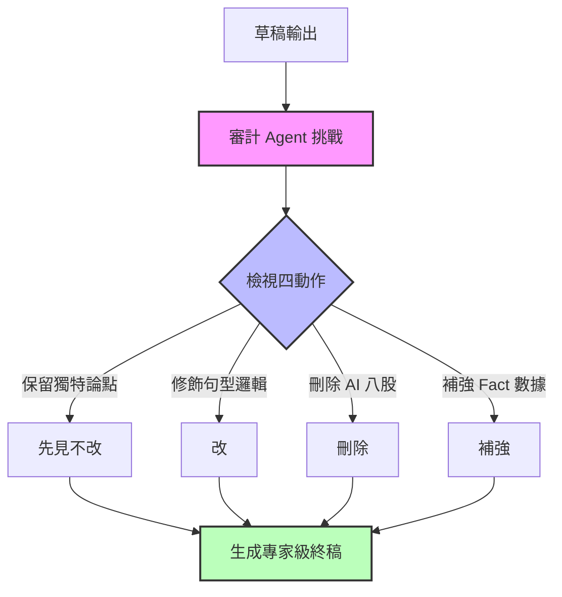

# 3.1 代理人架構設計：30 步反思寫作流與 Reflection 對抗機制

如果說第二章的 RAG 是讓 AI 擁有了「知識」，那麼第三章的 **Agentic AI (自主代理人)** 則是讓 AI 擁有了「邏輯與執行力」。這是從「對話式 AI」邁向「生產力 AI」的關鍵躍遷。企業不再只是詢問 AI 問題，而是將任務授權給一個具備推理、規劃與行動能力的數位代理人。

在 v1.6.0 中，我們將代理人架構設計的核心，從通用的推理框架，聚焦升級至具備防禦幻覺與死守品質的**「30 步反思寫作流與對抗機制」**。

---

### 1. 推理與反思的物理骨架
要構建一個可靠的企業級代理人，其架構設計必須包含以下三個核心支柱：
*   **推理引擎 (ReAct Framework)**：結合思考 (Thought)、行動 (Action)、觀察 (Observation) 的循環。代理人遇到任務時先拆解步驟，調用工具（如 SQL、API），觀察回報結果後決定下一步，直至任務收斂。
*   **記憶管理 (Memory Module)**：區分短期上下文記憶與長期向量事實庫，確保代理人在執行長週期任務時不會「忘詞」，且能隨著業務反饋自我成長。
*   **自我檢視與修正 (Self-Reflection)**：在將決策或內容交給人類前，進行自主檢查（例如：程式碼是否能執行、合規是否達標），修復錯誤後再輸出。

---

### 2. 實戰演練：寫作代理人的 30 步反思流

在創意與專業寫作（如專利撰寫、分析報告、產品手冊）的場景中，最常見的失敗是生成出結構空洞、充滿 AI 腔調的八股文。

為了解決這個問題，李慕約模式提出了一套將任務徹底原子化、切分成 **30 個具體步驟** 的人機協作代理人寫作流。這套流程不要求 AI 一口氣寫完，而是將寫作徹底解構成一條「生產流水線」：

1.  **語音/碎片採集**：收集專家的語音逐字稿或零散文字。
2.  **關鍵字與語義提取**：由專用 Agent 提取核心論點與關鍵術語。
3.  **清洗與結構化**：過濾贅詞，將內容重新排版為 Markdown 骨架。
4.  **分章節逐節擬稿**：啟動擬稿 Agent 對每一個小節進行物理撰寫。
5.  **反思對抗 (Reflection Reflector) 與上稿發布**：對每一章節的內容進行多維度修正，直至收斂。

---

### 3. Reflection 對抗機制：死守專家手感

在 30 步流程中，最核心的品質關卡是 **「反思對抗機制 (Reflection Reflector)」**。此機制透過獨立的審計 Agent，對擬稿 Agent 的輸出發動「紅軍挑戰」，強制對照四個核心編輯動作：

*   **先見不改 (Maintain Intuition)**：識別並死守作者最初在 L4 專家層注入的獨特論點與品位，嚴禁 AI 因為「求平庸、安全」而將其修改得溫吞無奇。
*   **改 (Refinement)**：針對邏輯漏洞、語句不順、文筆單調的部分進行細緻語意重構，提升專業度。
*   **刪除 (Deletion)**：強制刪除無效的鋪墊詞、AI 標誌性八股過渡句（如「首先、其次、總而言之」或「值得注意的是」），保持行文精煉。
*   **補強 (Augmentation)**：對照 L3 (企業 Fact 庫) 與 L1 (產業事實)，自動補充具體數據、專利代號、歷史脈絡與物理證據，使文章血肉豐滿。

### 結論
代理人架構設計的本質是**「工程化 LLM 的推理與編輯手感」**。透過將工作流細切至 30 步，並引入反思對抗機制，我們成功地把一個不穩定、愛說廢話的機率模型，鍛造成一個能替企業死守專業品質、產出「有人味」內容的數位幕僚。

在下一節 3.2 中，我們將探討如何為這顆大腦配上「手腳」——也就是 **工具化 (Toolification)**。
