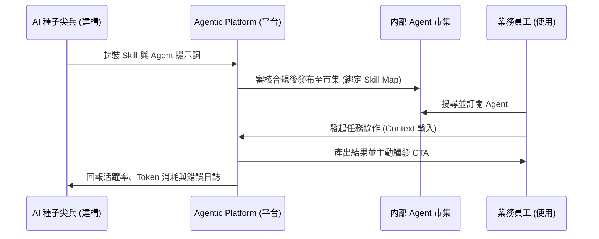

# 3.4 企業內部 Agent 市集 (Internal Agent Marketplace) 與 Agentic Platform 的設計與實踐

當企業內部的 AI 代理人數量爆發（例如在兩個月內增長至數百個）時，組織將面臨新的混亂：重複開發、資料越權、以及員工不知道有哪些工具可用。為了解決規模化後的治理問題，在 v1.6.0 中，我們引入了 **Agentic Platform (代理人平台)** 與 **內部 Agent 市集** 的架構。

---

## 3.4.1 何謂 Agentic Platform (代理人平台)？

**Agentic Platform** 不是一個簡單的聊天介面，而是企業中連接**「建構團隊 (Construction Team)」**與**「使用團隊 (Usage/Operations Team)」**的核心底座。它扮演著樞紐的角色：

*   **建構端 (The Builders)**：由 **AI 種子尖兵** 組成，他們在平台上編寫、調試 Agent 的 System Prompt、封裝 API 工具、並進行 Skill 的版本控制與部署。
*   **使用端 (The Users)**：由 **Agentic AI 使用者** 與 **App 使用者** 組成，他們在平台上調用 Agent、發起工作任務，並將執行結果反饋給建構團隊。
*   **平台三大核心功能**：
    1.  **安全與權限控制 (Gatekeeper)**：嚴格管控各個 Agent 可讀取的二維知識座標（如僅限 `MKT_L3`），防範越權讀取。
    2.  **狀態與協作流監控 (Agent Monitor)**：實時記錄各個 MAS 團隊運作時的 Token 消耗、推理鏈走向、以及是否陷入死鎖。
    3.  **API 動態映射 (Tool Registry)**：管理企業 ERP/CRM 的接口，讓 Builders 能無痛將這些接口作為「手腳」掛載給 Agent。

---

## 3.4.2 企業內部 Agent 市集 (Internal Agent Marketplace)

為了解決「工具發現率低」的痛點，企業應建立內部的 Agent 市集。市集的實踐路徑包含：

*   **與 Skill Map (技能地圖) 動態對齊**：
    市集不是靜態的 App Store，而是依據 **Skill Map** (見 2.2 節) 的業務節點進行分類。當財務人員有「費用稽核」的需求時，可以直接在市集上找到對應 `FIN_L2` 座標、掛載了「費用稽核 Skill」的 Agent 進行調用。
*   **無縫的發布與訂閱流程**：
    種子尖兵將開發好的 Agent 經過 CoE 團隊的合規審查後，一鍵發布至市集。各部門員工可以按需訂閱，並在 Discord 或平台專用 Web 介面上即時與其協作。
*   **監控核心指標以評估健康度**：
    市集必須提供管理儀表板，追蹤 **「Agent 活躍率 (Active Rate)」**、**「Task 任務完成率 (Completion Rate)」** 與 **「用戶反饋評分 (CSAT)」**。若某個 Agent 在市集上長期活躍度為零，說明其 Skill Map 定位偏離了真實業務痛點，CoE 主管應立即發起審計並予以調整或下架。

### 結論
建立 Agentic Platform 與內部市集，是企業從「點狀試驗」走向「系統化運營」的必經之路。它提供了一個透明、安全的容器，讓 AI 種子尖兵的創意與一線員工的需求在此對合，源源不絕地演化出符合企業真相的數位員工隊伍。

在下一節 3.5 中，我們將探討如何精確編排這些多代理團隊的通訊格律，防範系統陷入死鎖與 Token 浪費。
