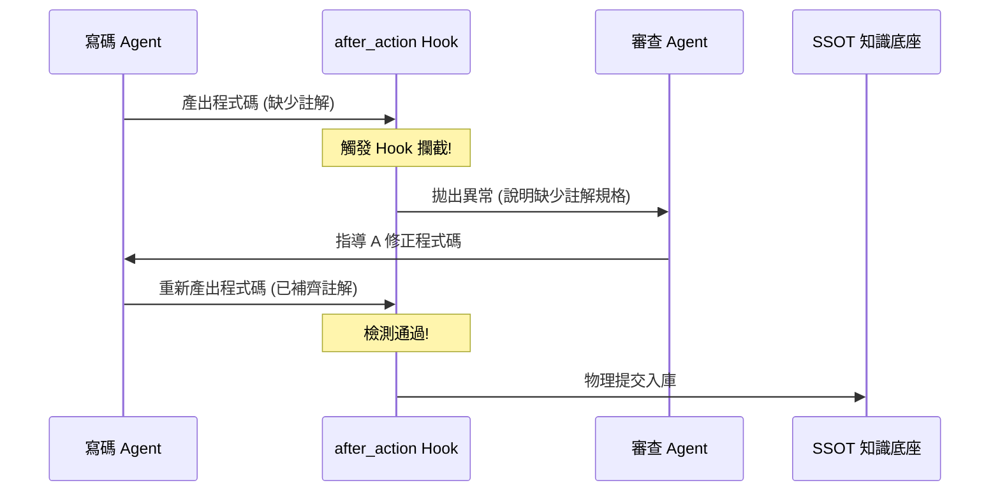

# 4.3 治理工程 (Harness Engineering) 與 Hook 攔截機制

在自主代理人 (Agentic AI) 的落地實務中，光靠 Prompt 指引或二維座標檢索是無法達到 100% 安全性的。AI 的機率性輸出特點，使得 Agent 在執行高危動作（如修改數據庫、執行刪除、發送郵件）時存在發散與失控的風險。

為了解決這個問題，在 v1.6.1 中，我們引入了 **治理工程 (Harness Engineering)** 與 **Hook 攔截機制**，在平台底座層面為 AI 戴上「剛性韁繩」。

---

## 4.3.1 什麼是治理工程 (Harness Engineering)？

**治理工程 (Harness Engineering)** 的核心是**「不靠默契與提示詞約束 Agent，而是靠平台的物理限制架構做事的規矩與界線」**。它不同於軟性的 Prompting，是在平台核心層（或利用 Antigravity SDK）將規則進行硬性編碼 (Hard-coded Constraints)：

*   **定義做事的「限制 (Constraints)」**：例如，限定某個審計 Agent 單次執行的 SQL 查詢返回量不得超過 100 筆，防止 Token 溢出；限制採購 Agent 單次對外調用 API 的交易額度不得高於 10,000 元。
*   **行使「物理熔斷」**：一旦 Agent 在推理過程中嘗試越權或修改不屬於其二維職能座標 (如 RD_L3 試圖修改 FIN_L3 資料) 的資產時，平台不經由 Agent 思考，直接物理切斷連接，阻止任務執行。

---

## 4.3.2 執行 Hooks 攔截機制 (Execution Hooks)

為了解決高危動作的檢測，平台在任務執行的前 (Before) 與後 (After) 設置攔截檢查點（Hooks）：

1.  **`before_action Hook` (執行前權限檢核)**：
    *   **場景**：當 Agent 嘗試執行敏感指令（例如刪除 Repo 中的 Facts 檔案，或調用 ERP API 修改庫存）時。
    *   **攔截機制**：`before_action Hook` 會被觸發，平台暫停該執行緒，調出該 Agent 的安全憑證 (Auth Token) 與人類經理的對合規則。若權限不符，立即拋出異常，將狀態標記為 `HALT`，呼叫人類主管進行簽核。
2.  **`after_action Hook` (執行後品質稽核)**：
    *   **場景**：當 Agent 完成特定產出（如產出程式碼、自動生成產品說明書骨架）即將交付下一步前。
    *   **攔截機制**：`after_action Hook` 被觸發，對產出進行靜態檢測與格律掃描。例如：檢查產出的程式碼中是否包含必要的文件註解 (Documentation)、檢查行銷文案中是否包含違規詞。若未達標，系統拒絕認列此成果，強制 Agent 發起循環修正。

---

## 4.3.3 基於 SDK 的多代理協作 Loop 最佳化

透過 **Antigravity SDK**，這些 Harness 與 Hook 機制能無縫嵌入多代理系統的循環修正 (MAS Loop) 中：

*   當「寫碼 Agent」產出的程式碼被 `after_action Hook` 攔截（例如缺少 documentation）後，SDK 會自動包裝此錯誤日誌並派發給「審查 Agent」。
*   審查 Agent 提出修改意見，交回寫碼 Agent 修正，形成內部的自動化對抗修正 Loop，直至 Hook 檢測完全通過，才將產出結果推送至 Repo SSOT 與 Execution Dashboard。

### 結論
治理工程與 Hook 攔截機制是 Agentic AI Platform 的「安全剎車系統」。它確保了不論大腦模型如何迭代或產生漂移，Agent 依然只能在企業主的「限制框架」中運作，為企業級的全面自動化提供了剛性的安全保障。

在下一節 4.4 中，我們將探討在此治理架構下，**當 AI 團隊下錯決定時，法律責任與認信該如何劃分？**
