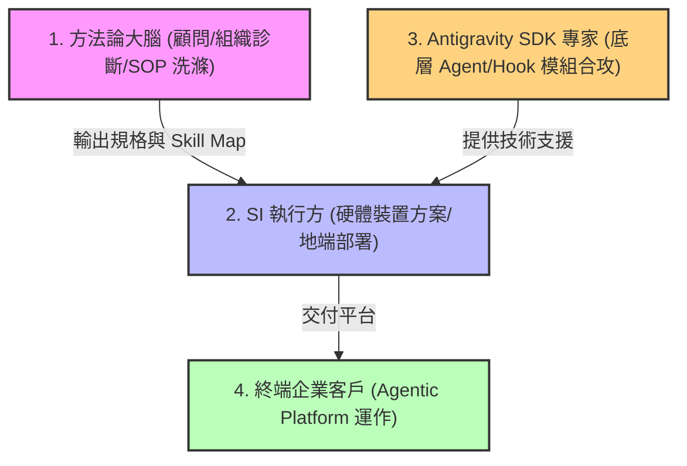

# 6.4 專業分工與外部生態合攻：方法論大腦、SI 執行與 Antigravity SDK 外部合作

在企業級 Agentic AI Platform 落地與商業運作的拼圖中，沒有任何單一實體能夠獨立完成所有的工作。要實現跨產業的規模化推廣，必須建立一套**「大腦與執行分離、生態合攻」**的運作機制。

---

## 6.4.1 核心分工：大腦與執行的二分策略

我們提倡將轉型資源與角色進行物理上的解耦，以達到最高的工作效率：

*   **方法論與架構（大腦）**：
    *   **定位**：企業 AI 轉型的「思想庫」與「策略導航」。
    *   **職責**：定義核心方法論、撰寫相關方法論書籍、傳遞人機混編與有機賦能的概念、設計二維知識矩陣與 Skill Map 的標準。提供高價值的企業組織轉型顧問服務，協助提取與洗滌業務 SOP。
*   **產品化與技術實踐（執行/SI 角色）**：
    *   **定位**：平台產品的「實體物理落地端」。
    *   **職責**：將大腦設計的 Prototype 轉化為成熟、穩定的商業軟體產品。處理地端 GPU 推論硬體採購、本地推論伺服器搭建、事實 Facts 資料庫物理部署、以及自動去識別化管道的維運。

---

## 6.4.2 外部合作與 Antigravity 生態系技術合攻

要攻下廣闊的傳統產業與合規市場，僅靠大腦與單一 SI 的力量是不夠的。我們必須在平台技術底座發動**技術合攻**：

1.  **Antigravity SDK 外部專家協同**：
    尋求具備 **Antigravity SDK 開發經驗的外部技術專家**（例如與經驗豐富的獨立開發者或外部軟體團隊）進行緊密合作。利用 SDK 的多代理協作、Hook 攔截機制以及語義 PR 管控，加速地端/雲端混合底座的 Prototype 迭代。
2.  **合攻方案 (Joint Go-to-Market)**：
    方法論大腦負責在前線教育市場、舉辦組織轉型工作坊，為企業「開好藥方」（輸出 Skill Map 與洗滌後的 SOP 規格）；SI 執行方與 Antigravity SDK 專家則負責「物理配藥與注射」（地端裝置部署、SDK 平台接口對合與運維），共同服務終端企業客戶。

### 結論
專業分工與外部生態合攻，是將 Agentic AI Platform 推向規模化商業落地的最優路徑。透過解耦大腦顧問與 SI 執行，並與 Antigravity SDK 開發者社群攜手合攻，我們能以最敏捷的姿態、最穩固的地端防禦，協助各行各業快速轉型為代理人原生的智慧企業。
