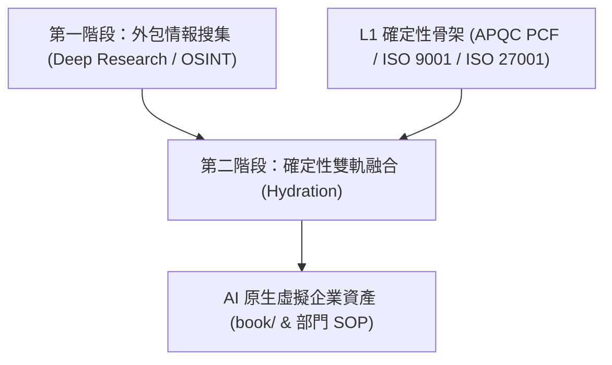

# 7.1 虛擬企業願景：Token 套利、兩階段職能解耦與雙軌融合 (Hydration) 方法學 [v1.7.0]

## 1. 轉型瓶頸：舊官僚程序複製與 Token 能耗陷阱

在企業導入生成式 AI 與 Agentic AI 的實踐中，最常見的失敗範式是「將舊有的官僚程序 1:1 複製到 AI 提示詞 (Prompt) 中」。這種盲目複製導致三大嚴重問題：
1. **API 能耗與 Token 爆表**：將全網檢索、OSINT 搜集、格式美化與邏輯推論全部塞入單一 LLM 上下文，導致 API 費用呈指數級暴增。
2. **舊官僚程序摩擦**：傳統企業程序包含大量因「人際不信任」而設的冗餘審核關卡，直接轉譯成代理人劇本只會造成代理人死鎖與多餘交互。
3. **無目的幻覺發散**：模型在缺乏確定性框架約束下進行長文本產出，極易產生虛構業務規範的幻覺。

---

## 2. 兩階段職能解耦與 Token 套利機制 (Token Arbitrage)

為解決能耗與發散問題，v1.7.0 方法論提出 **「兩階段職能解耦與 Token 套利機制」**：

### ① 第一階段：外包情報搜集 (Deep Research & OSINT)
- **物理工序：** 將高能耗、廣泛性的外部情報探勘（如競品分析、市場趨勢、法規蒐集、特定診所/企業之外部 OSINT 特徵）徹底外包給免費或低成本之深度研究工具（如 Gemini Deep Research / NotebookLM）。
- **產出目標：** 產出純粹、未經內建大腦處理的原始血肉 (Raw Flesh) 與真實個案資料。

### ② 第二階段：確定性雙軌融合 (Hydration)
- **物理工序：** 內建高級模型僅專注於「結構對齊與血肉填空」。將第一階段搜集到的實體血肉，精確注入至企業已建立好的 **L1 確定性骨架**（如 APQC PCF 程序碼與 ISO 9001/27001 控制點）。
- **Token 套利效益：** 內建大腦無需重複進行無效廣泛搜尋，Token 消耗大幅降低 70% 以上，且產出 100% 遵守企業剛性合規邊界。

---

## 3. 確定性骨架與血肉融合 (Hydration Protocol) 案例

在虛擬企業建模中，Hydration 物理工序遵循以下規範：

1. **骨架端 (The Skeleton)**：APQC-7.1 招募程序 + ISO 9001 §7.1.2 人力資源控制點。
2. **血肉端 (The Flesh)**：OSINT 採集到的特定醫療診所「訪視護理師專業技能 requirement」與「夜間急診派遣手感」。
3. **融合產出 (Hydrated Asset)**：產出符合 `HR_L2_SOP_001_recruitment_sop.md` 的具體職能 SOP 與 `HR_L4_EXPERT_001` 專家 Agent 人設，完成 AI 原生轉型。
