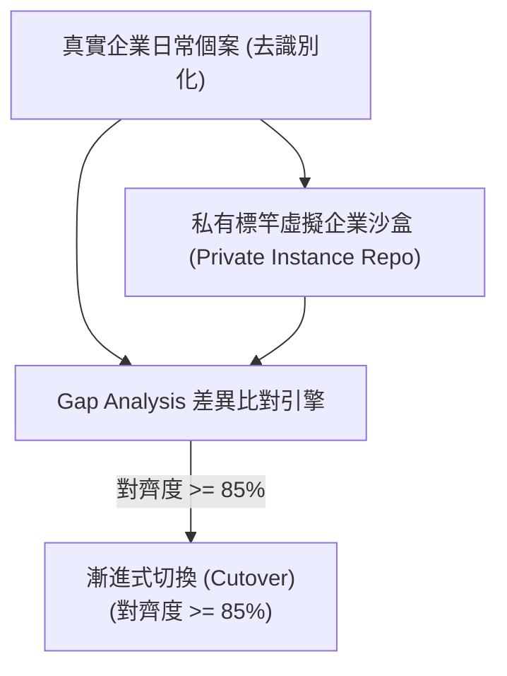

# 7.5 通用範本 (SSOT Vessel) 派生與私有標竿實例 (OSINT Hydration) 影子運轉 [v1.7.1]

## 1. 範本與實例的嚴格隔離原則 (`ADR-005`)

在企業級部署中，為保護商業機密並維持範本的純粹性，實施 **「通用範本與私有標竿實例嚴格隔離」** 戰略：

- **`virtual-enterprise-template` (Public Repo / SSOT Vessel)**：永遠保持純粹、通用、抽象之 L0-L4 骨架、APQC/ISO 控制點與 `book/00_toc.md` 意圖大綱。**嚴禁包含任何特定企業/診所之敏感個案、病患隱私或商業機密**。
- **`virtual-enterprise-[instance]` (Private Repo / Hydrated Instance)**：針對特定標竿企業（如在宅醫療診所）所開立之私有儲存庫（如 `virtual-enterprise-in-home-clinic`），專門承載 OSINT 收集之真實營運血肉與專屬表單。

---

## 2. 一鍵派生與全資產自動登錄工具 (`manage_ledger.py scan` [v1.7.1])

為實現無摩擦派生與全資產零遺漏登錄，提供標準化維運與自動掃描工具 [manage_ledger.py](file:///Users/wuulong/github/bmad-pa/events-2026Q3/virtual-enterprise/virtual-enterprise-template/db/manage_ledger.py)：

```bash
# 1. 發動一鍵派生指令
/usr/bin/python3 scripts/instantiate_ve.py \
  events/mentors/xingyi/xingyi-ai-enablement/VE \
  --name "在宅醫療診所" \
  --code "CLINIC" \
  --init-git

# 2. 全資產 100% 自動物理掃描與中控 DB 登錄 (v1.7.1)
cd VE/db
python3 manage_ledger.py scan

# 3. 查詢目前處於影子測試 (40) 或已對齊 (50) 的資產
python3 manage_ledger.py list --status 40
```

### 物理掃描登錄工序：
1. 自動讀取 7 大部門之 `functional_list.csv` (`FNC-xxx`) 與 `system_catalog.csv` (`SYS-xxx`)。
2. 自動讀取 `workflow_list.csv` (`WF-xxx`)、`_SOP/*.md` (`SOP-xxx`) 與 `Agents/*.json` (`AGT-xxx`)。
3. 執行 `INSERT OR IGNORE` 將全公司資產 100% 登錄至 `entity_state_ledger`，初始狀態為 `20` (虛擬確認)。

---

## 3. 影子模式 (Shadow Mode) 測試與 85% 對齊切換標誌

在 Private Repo 派生完成並注入 OSINT 血肉後，開啟 **影子模式 (Shadow Mode)**：



1. **資料雙送**：將去識別化之真實個案同步抄送給真實員工與 Agent 網路。
2. **Gap Analysis**：比對兩者產出之差異與合規性。
3. **85% 閥值解鎖**：當對齊度達到 85% 以上時，手動在 `manage_ledger.py` 將狀態升級為 `50` (已對齊) 乃至 `60` (已確認)，正式解鎖從「人機對合 (Human-in-the-loop)」切換至「例外管理 (Management by Exception)」的自動化營運。
