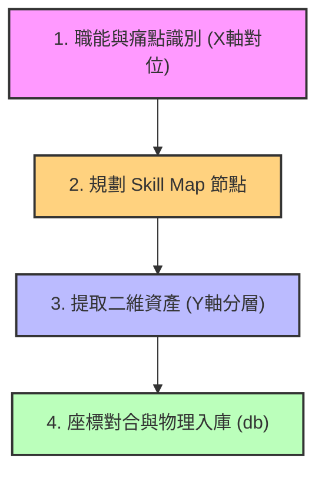
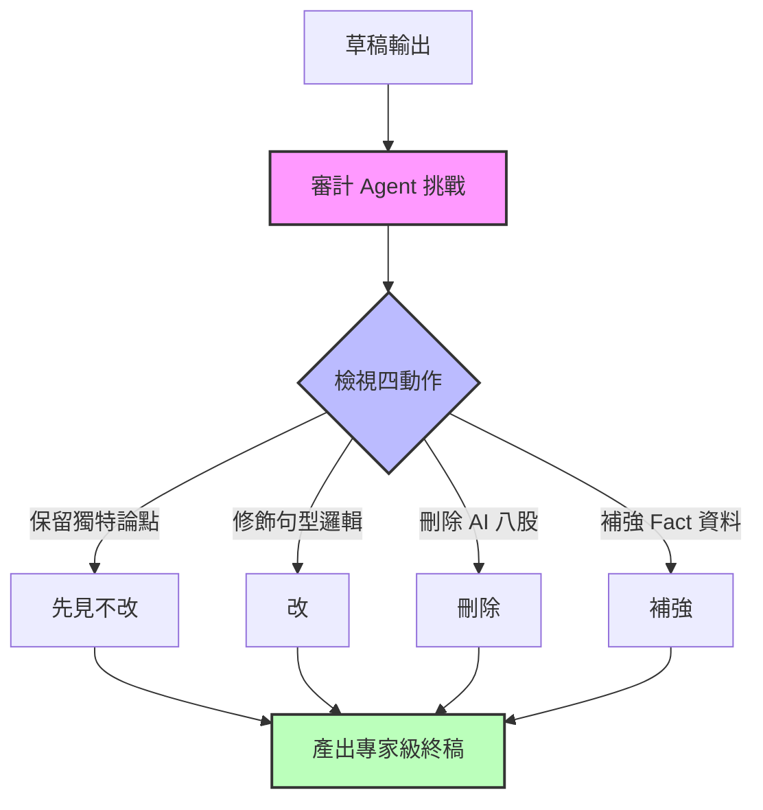
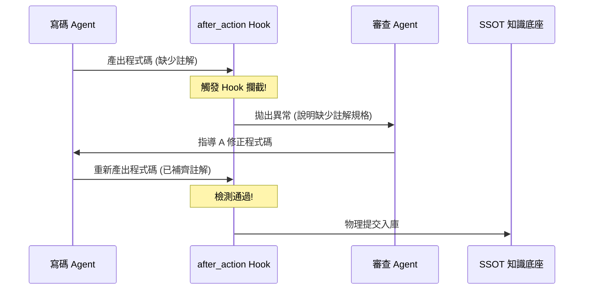
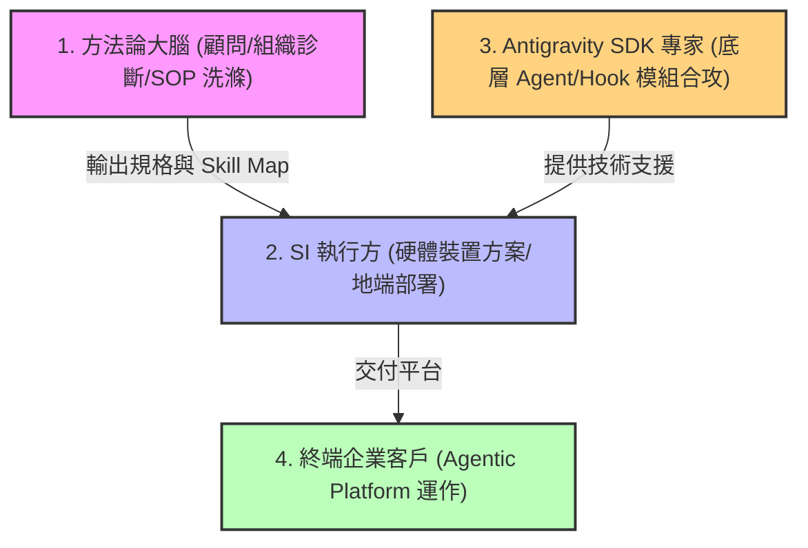
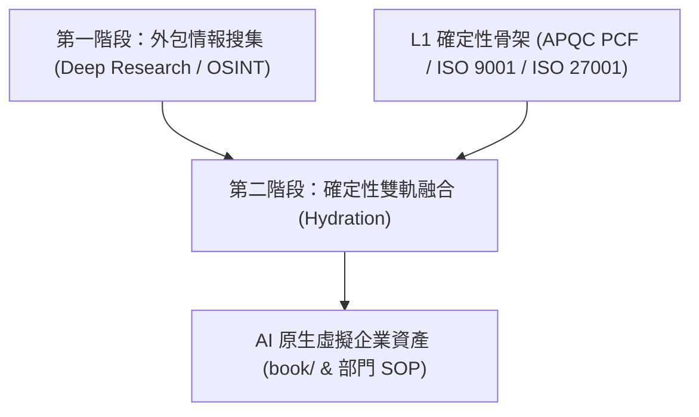
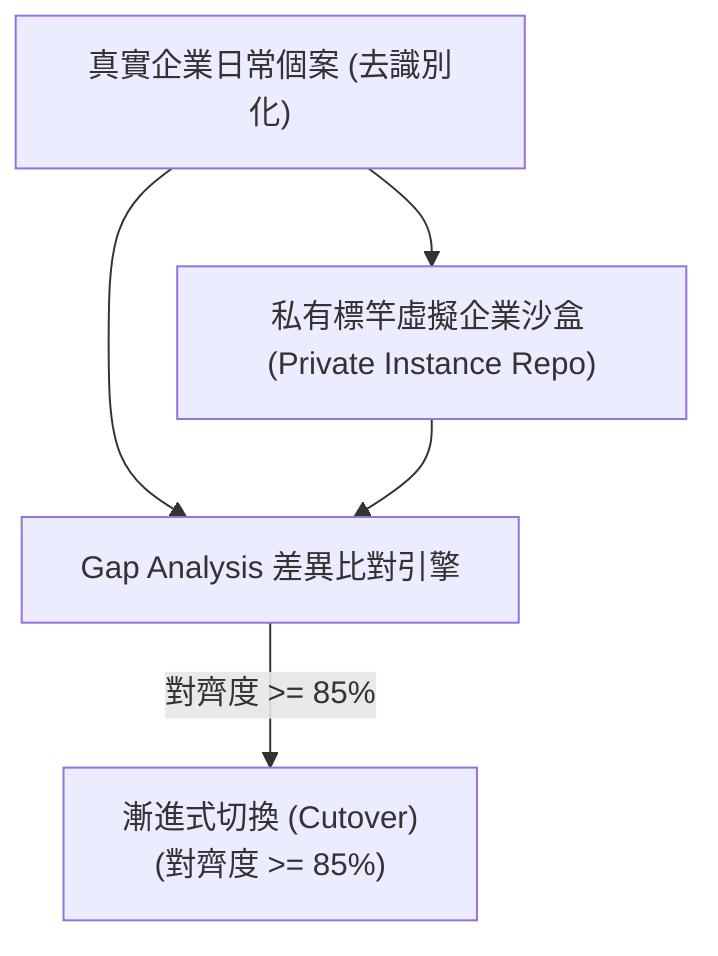

# 《企業生成式 AI 轉型全書：從知識底座到自主代理人的實踐路徑》 (v1.7.0)

## 第 0 章 虛擬企業實踐原型：團隊協作脈絡對合與 AI 賦能實測
- **0.1 演化路徑**：企業賦能的碎形邏輯：個人為基，團隊為原型。
- **0.2 協作格律**：人機混編團隊的數位契約與**工作程序節點地圖 (Node Map)** 繪製。 [v1.6.0]
- **0.3 目錄設計**：管理 Repo 的物理架構與管理 OS。
- **0.4 數位幕僚長 (SyncHub)**：基於 Git 與 Discord 的對合中樞規格與實踐。
- **0.5 接入協議**：個人 AI 賦能沙盒轉向團隊對合的操作程序。

## 第 1 章 戰略為何而戰：GenAI 與 Agentic AI 的商業本質
- **1.1 競爭範式移轉**：從「提升效率」到「重構邊際成本」，分析智力勞動成本趨零的衝擊。
- **1.2 辨識戰位：二維轉型矩陣**：二維轉型矩陣與**從 Context 到 CTA 的價值轉化**。 [v1.6.0]
- **1.3 企業 AI 遺傳密碼 (Genetic Code)**：五大維度偵測、**L0-L4 層次化賦能架構與二維座標 ID (`[DEPT]_[Lx]_[TYPE]_[NUM]`)**。 [v1.7.0]
- **1.4 評測先行 (Evaluation-First)**：以「專屬考卷」釐清需求，建立抗模型歸零的企業知識資產。
- **1.5 回報評估與成效驗證**：**財務透明、利益共享機制**與 CEO 儀表板設計。 [v1.6.0]
- **1.6 本章回顧與自測**：戰略思維的起點與核心關鍵字回顧。 [v1.3.0]

## 第 2 章 知識工程：建構 AI 代理人的「企業大腦」
- **2.1 資料資產化**：資料資產化與 **無感 Context 採集矩陣（會議、LINE、截圖）**。 [v1.6.0]
- **2.2 企業 Skill Map (技能地圖) 與知識底座之建構**：如何以 Skill Map 對應企業職能需求、**Database-First 中控控制面 (Meta DB `db/`) 與極簡 IT 系統 (`SYS-xxx`) 映射**。 [v1.7.0]
- **2.3 RAG 與脈絡堆疊 (Context Stacking)**：L0-L4 實體掛載機制，解決 Agent 的業務規則與決策邊界。 [v1.3.0]
- **2.4 知識治理與隱私堡壘**：權限分配、敏感資料去識別化與 AI 倫理的安全框架。
- **2.5 本章回顧與自測**：檢查對 RAG 技術架構與企業知識數位化路徑的掌握。

## 第 3 章 自主代理 (Agentic AI)：從對話轉向任務執行
- **3.1 代理人架構設計**：代理人架構設計：**30 步反思寫作流與 Reflection 對抗機制**。 [v1.6.0]
- **3.2 工具化 (Toolification)**：將企業現有 ERP/CRM/API 轉化為 Agent 可調用的「肢體」。
- **3.3 多代理系統 (MAS) 協作**：**完全對稱式 Standard 3-Tier `_workflow/` 管線 (`Rules/`, `Triggers/`, `Workflows/`) 與 RACI 安全邊界**。 [v1.7.0]
- **3.4 企業內部 Agent 市集、Agentic AI Platform 核心功能與通用 Skill 共享庫** [v1.6.1]
- **3.5 高效代理人編排 (Orchestration) 與通訊格律：阻斷無效 Token 浪費** [v1.6.0]
- **3.6 本章回顧與自測**：檢驗對於自動化代理推理邏輯與多機協作概念的認知。

## 第 4 章 落地運維與安全治理：AgentOps 的挑戰
- **4.1 混合架構與部署方案：`[ADR-005]` 通用範本 (Public Repo) 與私有標竿實例 (Private Repo) 隔離部署與影子模式 85% 對齊切換** [v1.7.0]
- **4.2 AgentOps 與效能監控：Execution Dashboard 設計、Skill 生命周期與 Task 監控** [v1.6.1]
- **4.3 治理工程 (Harness Engineering) 與 Hook 攔截機制**：約束規矩、Hook 攔截點與 SDK 多代理協作 Loop。 [v1.6.1]
- **4.4 法律認信與責任歸屬**：當 Agent 代表企業與外部進行商業決策時的法規應對方案。
- **4.5 本章回顧與自測**：評估對企業級部署架構與 AI 治理風險的分析能力。

## 第 5 章 組織變革與人機協作：導入的最大困難與解方
- **5.1 程序再造與實驗哲學**：POC 作為失敗預算，重新發現業務邏輯。
- **5.2 變革管理與個人編組**：變革管理與個人編組：**AI 三層人才架構的階層策略**、冒險者公會感性激勵與**營運/創意雙角色定位**。 [v1.6.0]
- **5.3 有機賦能作業系統：三明治轉型軌道、轉型顧問服務與獲利模式** [v1.6.1]
- **5.4 指標百科 (Metrics Encyclopedia)**：指標百科：**針對 AI 的 OKR 目標管理**與 Skill 效能指標 (WG/PE 系列進階)。 [v1.6.0]

## 第 6 章 產業場景與企業樣態展開：實戰計畫書
- **6.1 高合規場景 (醫療/金融)**：封閉環境下的自動化審計與精準知識賦能。
- **6.2 高效率場景 (製造/零售)**：全自動化供應鏈調度與品質預測代理人。
- **6.3 數位原生場景 (行銷/軟體)**：全自動化內容產製與軟體研發工廠的範式轉移。
- **6.4 專業分工與外部生態合攻：方法論大腦、SI 執行與 Antigravity SDK 外部合作** [v1.6.1]
- **6.5 本章回顧與自測**：針對不同產業特性的導入路徑優先序判斷。

## 第 7 章 虛擬企業建模與 AI 原生架構實踐 (Virtual Enterprise Architecture & Practice) [v1.7.0]
- **7.1 虛擬企業願景**：Token 套利、兩階段職能解耦與雙軌融合 (Hydration) 方法學。 [v1.7.0]
- **7.2 團隊級載體與二維座標體系**：L0-L4 遺傳感官與脈絡覆蓋優先級 (`L4 > L3 > L2 > L1 > L0`)。 [v1.7.0]
- **7.3 Database-First 中控控制面 (Meta DB)**：APQC/ISO 條碼 physical 翻譯與 SQL/API 指令驅動。 [v1.7.0]
- **7.4 正則對稱式 3-Tier `_workflow/` 管線**：`Rules/`, `Triggers/`, `Workflows/` 與 RACI 簽核門檻控管。 [v1.7.0]
- **7.5 通用範本 (SSOT Vessel) 派生與私有標竿實例 (OSINT Hydration)**：`instantiate_ve.py` 與影子運轉。 [v1.7.0]
- **7.6 本章回顧與自測**：虛擬企業建模評估與轉型成熟度檢核。 [v1.7.0]

## 附錄 A：情境式常見問題 (Scenario-based FAQ)
- **Q1：一家正在數位轉型的製造業，如何同時解決資料混亂與資深員工的技術焦慮？**
- **Q2：為了應對競爭對手全自動化的行銷攻勢，我們該如何建立自有的多代理系統？**
- **Q3：高合規行業(如醫療)想要讓 AI 自主處理病歷摘要與處方建議，架構如何設計？**
- **Q4：企業 CIO 如何說服董事會，從訂閱轉向投資自主代理人的基礎設施？**
- **Q5：企業啟動 Top-down 轉型太慢怎麼辦？如何平衡治理與行動力？** [v1.3.0]
- **Q6：遠端或分散式團隊推動全員 AI 轉型，如何設計利益分配與 Audit 稽核機制以化解阻力？** [v1.6.0]
- **Q7：企業如何利用虛擬企業 (Virtual Enterprise) 模型在不破壞現有官僚系統的前提下進行影子測試？** [v1.7.0]

## 致謝與貢獻者 (Acknowledgments & Contributors)
- **[致謝與貢獻者](Contributors.md)** [v1.6.0]


---

# 0.1 演化路徑：企業賦能的碎形邏輯：個人沙盒為基，人機混編團隊為原型

## 戰略前提：企業是由「個體」組成的碎形
在探討大規模企業轉型前，我們必須承認一個事實：**企業的每一項決策、每一行程式碼、每一份報告，最終都源於某位特定個體的智力產出。** 

以往的企業數位化嘗試（如 ERP, CRM）往往採取「由上而下 (Top-down)」的程序鎖定，這在確定性高的工業時代有效，但在生成式 AI 時代，這種模式會窒息個人 AI 的探索空間。

### 賦能的遞進層次
為了實現真正的「虛擬企業」，我們定義了以下三個遞進的賦能階段：

#### 1. 個人 AI 賦能 (Foundation) —— 企業的地基
*   **核心目標**：讓每一位員工掌握「解構問題 -> 調度模型 -> 裁決產出」的能力。
*   **實踐形態**：個人 AI 沙盒 (PA Sandbox)。
*   **關鍵論點**：如果個體不具備 AI 裁決權，企業引入再強大的 Agent 都只是在「自動化地產生垃圾」。個人沙盒是組織賦能的最小單位與安全邊界。

#### 2. 團隊 AI 賦能 (Prototype) —— 轉型的原型
*   **核心目標**：解決個體賦能後的「資訊孤島」問題，實現「脈絡對合 (Context Sync)」。
*   **實踐形態**：人機混編小組 (Human-AI Teaming Nano-Squad) 與 團隊對合中樞 (SyncHub)。
*   **關鍵論點**：由人類員工與多個專屬 AI 代理人組成的人機混編小組是企業賦能的「實踐原型」。在此規模中，人機協作契約最為緊密、溝通與執行摩擦最容易被量化。這是驗證虛擬企業 OS 的最佳實驗場。

#### 3. 企業 AI 賦能 (Scaling) —— 組織的規模化
*   **核心目標**：將成功的人機混編與團隊對合模式碎形擴散。
*   **實踐形態**：多代理系統 (MAS) 與人機協同決策網路。
*   **關鍵論點**：當所有的混編團隊都具備標準化的對合格律與座標化知識底座時，企業級的高效自動化便水到渠成。

## 為什麼從「人機混編團隊」開始實踐？
很多人認為應該先有「企業級戰略」，再有「團隊動作」。但在 AI 時代，**戰術的演化速度遠超戰略的規劃速度**。

我們選擇從人機混編團隊（Nano-Squad）切入，是因為：
1.  **低容錯成本**：一個小組的對合失敗，不會動搖企業根基。
2.  **高頻對撞**：小組成員（人類與 Agent）間的高頻互動，能最快暴露出個人 AI 產出與系統事實間的語意衝突。
3.  **可複製性**：一旦定義出「個人沙盒如何轉入人機團隊對合」的協議，這個模組就可以被無限複製。

本章後續將詳細展開這套「團隊協作對合」的具體操作與規格。


---

# 0.2 協作格律：人機混編團隊的數位契約與工作程序節點地圖 (Node Map) 繪製

在人機混編的 Nano-Squad 中，我們不靠「默契」工作，而是靠「數位契約」。人與 AI 協同的第一步是物理建立 **團隊運作說明書 (TEAM_HANDBOOK)** 與 **工具使用指引 (TEAM_TOOLS_GUIDE)**，定義人機協作的格律與界線。

🔗 **實踐範本**：[`TEAM_HANDBOOK_TEMPLATE.md`](./templates/TEAM_HANDBOOK_TEMPLATE.md) 及 [`TEAM_TOOLS_GUIDE.md`](./templates/TEAM_TOOLS_GUIDE.md)

---

## 0.2.1 數位契約：團隊運作說明書 (TEAM_HANDBOOK)

這份檔案是混編團隊的「憲法」，規範了人類與 AI 代理人的角色邊界，主要包含：
1.  **定義守備範圍與職能代號**：清楚定義人類成員與各個職能 Agent (如研發設計 `RD`、生產製造 `MFG`、行銷銷售 `MKT`) 的任務權責。當 AI 發現資料超標或合規風險時，能精確「召喚」對應的職能負責人。
2.  **人機協作對合機制**：明確攤開對合頻率與成功定義，特別是 Agent 在什麼情況下必須暫停 (HALT) 並向人類管理者 (Manager of Agents) 請求確認。
3.  **定錨單一事實來源 (SSOT)**：規定 **GitHub 是所有資產的物理基座**，所有程式、SOP 與事實資料庫均在此對合。

---

## 0.2.2 操作格律：工具使用與對齊指引 (TEAM_TOOLS_GUIDE)

有了「契約 (Handbook)」，接著需要「度量衡」。指引規範了具體的操作手感，確保人與 AI 在同一個數位世界中使用相同的語意語法。

### 核心基礎設施定位
*   **GitHub (資產與程式碼基座)**：所有 .md 檔案、程式碼、Facts 資料庫的最終歸宿。Git 的 Commit 歷史就是混編團隊的「運作日誌」。
*   **Discord/Teams (通訊與對合中樞)**：成員討論的場所，也是 **SyncHub (團隊數位幕僚長)** 自動發布「對合小報」與異常警告的戰情室。

### 為什麼「格式」就是「人機介面」？
在 AI 協作組織中，**格式就是 AI 的接入介面**。當團隊遵循 Markdown 與 YAML 規範時：
1.  **AI 能自動掃描與理解**：SyncHub 可以精準解析 Wlog，自動提取進度並更新 Repo 狀態。
2.  **無痛脈絡對齊**：人類成員可直接閱讀 AI 提煉過的語意摘要與 coordinates 座標對錨，降低人機溝通的隱性摩擦。

---

## 0.2.3 工作程序節點地圖 (Node Map) 繪製

在實務運作中，為了避免任務在人機接力之間遺失，我們引入了 **「智慧工程 (Intelligent Engineering)」** 的核心手法：**工作程序節點地圖 (Node Map)** 的繪製。

### 節點地圖的繪製程序：
1.  **任務原子化 (Atomization)**：將複雜的端到端業務任務（例如行銷企劃、產品規格審核）徹底拆解為具備清晰輸入、處理邏輯與輸出的「程序節點」。
2.  **物理連接與標註**：利用圖形化或 Mermaid 格式標記節點間的資料依賴關係，並為每個節點標註處理主體（如人、特定 Agent、或自動化指令碼）。
3.  **效能與流速量化**：計算各個節點之間的資料傳遞延遲與 Token 消耗效能。當程序在某個節點發生停滯（例如因 Prompt 語意不清導致 Agent 陷入重複自我修正）時，地圖上的瓶頸會立刻浮現。

透過節點地圖，混編團隊能夠將原本看不見的「工作流」轉化為「軟體定義的數位地圖」，以便 AI 能隨時介入，針對特定的效能瓶頸進行精準最佳化。


---

# 0.3 目錄設計：管理 Repo 的物理架構與管理 OS

## 物理底座：管理 Repo 的架構設計 (Repository Architecture)
為了支援團隊的高頻對合，團隊共享的「管理 Repo」必須具備清晰的功能分區。這套結構模仿了企業的「管理 OS」，將「當前執行、會議決策、組織資產、成員沙盒」進行徹底分離。

### 核心目錄架構與職責：
```text
.
├── workmgr/              # [執行指揮部]
│   ├── tasks/            # 任務中樞：存放全隊唯一的 TASKS.md 總帳
│   ├── work-logs/        # 脈絡對合點：成員推送每日 Wlog 的地方
│   └── task-reports/     # 成果認列：結構化的任務完成報告 (TR)
├── meeting/              # [共識提煉區] 會議紀錄、逐字稿與決策對合表
├── events/               # [里程碑日誌] 專案重大變更與外部交流歷史
├── decisions/            # [決策封裝區] 已簽核的決策紀錄 (SSOT)
├── strategic-roadmap/    # [演化羅盤] 定義團隊長期方向的策略文件
└── members/              # [成員對合空間] 個人沙盒與團隊大腦的緩衝區
    └── {member_id}/      # 每位成員的對合視窗 (inbound, outbound, staging)
```

---

## 管理 OS 的實務應用
這種目錄設計不僅是為了存放檔案，它定義了智力生產的「流水線」。
*   **隔離度**：確保個人沙盒 (`/members/`) 與團隊共識 (`/decisions/`) 互不干擾，但在物理上又在同一個 Git 基座上。
*   **可溯源性**：所有決策路徑都是可見的，從 Wlog 到任務狀態再到 TR，形成一條完整的證據鏈。
*   **機器可讀性**：這種層級分明的結構，是為了下一節要介紹的 **SyncHub (團隊 AI)** 能以最低成本對全隊進度進行「空間定位」。

下一節我們將深入探討這套管理 OS 的「自動化靈魂」：**0.4 數位幕僚長 (SyncHub) 的規格與實踐**。


---

# 0.4 數位幕僚長 (SyncHub)：規格與實踐

## 執行官：SyncHub 的願景
如果 0.3 節定義的是虛擬企業的「物理骨架」，那麼 **SyncHub (數位幕僚長)** 就是賦予這套骨架生命的「神經系統」。

SyncHub 是一個中立的團隊 AI 角色，它的使命不是去寫程式碼或寫文案，而是專注於「確保成員都在同一個頻道上」，實現高頻、低摩擦的智力產出對齊。

---

## 核心職責：順暢接力與脈絡導航
在傳統團隊中，專案經理 (PM) 花費大量時間在「追蹤進度」與「確認狀態」。在虛擬企業中，SyncHub 透過掃描 `/workmgr/` 自動完成這一切：

*   **脈絡對齊 (Context Synthesis)**：自動總結各成員推送到共享 Repo 的日誌，並產出「對合小報」。
*   **智慧接棒**：
    *   *案例*：當成員 A 在 Wlog 中回報「資料清理完成」時，SyncHub 會偵測到其守備範圍的邊界，並主動在接手的成員 B 之 `inbound/` 目錄下放置導航訊息，標註相關檔案路徑。
*   **單一事實來源 (SSOT) 的守護者**：SyncHub 會自動檢查 GitHub 中的檔案是否與討論共識對齊，提醒成員更新決策紀錄。

---

## 實踐機制：Git 事件驅動與 Discord 互動
SyncHub 並非一個需要人類主動「餵 Prompt」的對白框，它是一個 **「無頭 AI (Headless AI)」**，在背景默默運作：

1.  **Git 觸發**：當成員執行 `git push` 到團隊 Repo 時，SyncHub 被動啟動，開始對日誌進行語法與邏輯檢查。
2.  **Discord 廣播**：
    *   **`#synchub-pulse` 頻道**：這是團隊的「數位黑板」，由 SyncHub 存放自動產出的進度更新、任務狀態與小報摘要。成員可按需查閱，避免訊息干擾。
    *   **主動預警**：僅在發現重大任務延遲或邏輯衝突（對合碰撞）時，才會在公眾討論區標註執行人。

---

## 數位管家：貼心提醒而非嚴格懲罰
我們不再將 AI 視為「數位憲兵」，而是 **「數位管家」**。
它會根據 `TEAM_TOOLS_GUIDE` 給予微調建議（如提醒 YAML 元資料格式）。這種低階錯誤的「冷排查」，釋放了人類的腦力，讓成員能將精力集中在更高層級的創造與關鍵決策。

透過這套「執行官」規格，團隊達成了一種 **「準實時同步」**：成員只需專注於產出並推送，其餘的脈絡同步與成果合成，交由 SyncHub 自動完成。

下一節將介紹個人如何正式接入這套高度自動化的系統：**0.5 接入協議：從個人沙盒到團隊對合**。


---

# 0.5 接入協議：個人 AI 賦能沙盒轉向團隊對合的操作程序

## 接入：將個人能量「投影」到團隊地圖
當個體具備了強大的個人 AI 賦能後，面臨的最大挑戰是如何將產出「插入」團隊流。這不是簡單的程式碼提交，而是 **「智力脈絡的交接」**。

為了實現無痛對合，我們在共享 Repo 中為每個人設立了標準化的 **「成員對合空間 (/members/{id})」**。

### 1. 成員對合區域的運動規律
每個成員目錄都具備三種特性的資料流向：

*   **`inbound/` (情報讀取區)**：這是你的「團隊視野」。
    SyncHub 會將團隊決策、別人的進度、或是分配給你的標示性訊號 (Signals) 放在這裡。開工前，你的個人 AI 應該先掃描此處，將團隊最新背景「併入」目前的會話脈絡。
*   **`outbound/` (成果輸出與訊號通報區)**：這是你的「產出窗口」。
    將完成的日誌 (Wlog)、報告 (TR) 放置於此。**更重要的是「訊號通報 (Signals)」**：如果你完成了一個讓別人能開工的關鍵動作，要在這裡放置通知訊息，由 SyncHub 轉發。
*   **`staging/` (衝突交涉桌)**：這是「對合衝突」的暫存區。
    當你 Push 的內容與他人衝突時，SyncHub 會在此產出「對比分析報告」。這是一個安全的緩衝空間，讓衝突在被併入主幹前，先在此處進行人工裁決。

---

## 2. 接入協議 (Plugging Protocol) 三步曲
一名「合格的個人 AI 使用者」轉型為「高效團隊成員」的標準程序如下：

#### 第一步：領取認知格律 (Cognitive Alignment)
下載並將 `TEAM_HANDBOOK` 與 `TEAM_TOOLS_GUIDE` 掛載到個人 AI 的底層知識庫中。
> *動作*：告訴你的 AI：「從現在起，所有的 Markdown 產出必須包含特定的 YAML 元資料，並嚴格遵守相對路徑原則。」

#### 第二步：初始化空間對接 (Path Handshake)
在共享 Repo 的 `/members/` 下領用目錄，建立範本結構。
🔗 **參考範本**：[`MEMBER_WORKSPACE_TEMPLATE.md`](./templates/MEMBER_WORKSPACE_TEMPLATE.md)

#### 第三步：執行首次對合 (Warm-up Sync)
*   **讀取情資**：從 `inbound/` 領取第一個任務。
*   **宣告就位**：在 `outbound/signals/` 發送「成員 X 已掛載完畢」的訊息。
*   **對合驗證**：推送第一份細小的 Work-log，觀察 SyncHub 的檢查結果，確保個人 AI 的格律輸出完全符合團隊要求。

---

## 結論：碎形賦能的終點，虛擬企業的起點
至此，我們完成了本全書最核心、也最基礎的建設：**建立了「人機一體」的微型組織原型。**

透過第 0 章定義的格律與 AI 中樞，個人主權在不被稀釋的前提下，精確地投影到團隊的共識地圖上。這種「低摩擦、高對合」的模式，正是後續章節探討「大規模知識工程」與「企業級 AI 治理」的唯一物理物理基礎。

現在，我們準備好進入更宏觀的轉型戰位分析。


---

# 1.1 競爭範式移轉：從「提升效率」到「重構邊際成本」

在過去的數十年間，企業數位化轉型的主旋律始終是「數位最佳化 (Optimization)」——也就是利用軟體讓原有的工作做得更快、更好、更省力。然而，生成式 AI (GenAI) 尤其是自主代理人 (Agentic AI) 的出現，宣告了數位化進入了「範式移轉 (Paradigm Shift)」的新階段。這不再只是關於效率的提升，而是關於**核心成本結構的崩潰與重組**。

### 智力勞動的商品化 (Commoditization of Intellectual Labor)
傳統上，企業的價值鏈中，「決策」與「高階資訊處理」是成本最高、最具稀缺性的部分。一個訓練有素的市場分析師、一位資深的法務人員或一位架構師，他們的智力產出伴隨著高昂的薪酬成本、時間成本與不可避免的人為錯誤。

GenAI 帶來的衝擊，在於它將**「初步具備邏輯的智力勞動」之邊際成本推向了零**。當產出一萬字的高質量摘要、分析一百萬筆財務異常資料、或撰寫數千行基本的程式碼只需要幾美分、幾秒鐘時，原本受限於「人力資源」的業務規模牆被推倒了。

### 從「人力驅動」到「數位代理人密度」
在範式移轉之後，企業的競爭力將不再取決於你擁有多少「頭銜 (FTE)」，而取決於你的**「數位代理人密度」**以及這些代理人調度知識的能力。

1.  **彈性規模化 (Elastic Scaling)**：
    人類員工的擴張是階梯式的，且伴隨著管理沈沒成本。Agentic AI 讓企業能夠在偵測到市場機會的瞬間，啟動一萬個「市場情緒監測代理人」，並在任務結束後立即關閉，實現真正的彈性經營。

2.  **知識資產的自動再產出**：
    過去企業的知識存在於資深員工的腦中，隨著離職而消失。在新的範式下，企業的核心產值在於如何將這些非結構化的經驗，轉化為 AI 代理人可以執行的指令與工作流。

### 對企業主的戰略警示
如果一家企業仍試圖以「減少加班時間」來衡量 AI 的成功，那麼它已經在範式競爭中落後。真正贏家在問的是：**「如果智力處理的成本是零，我能開啟哪些過去因為太貴而無法執行的業務？」**

轉型成功的標誌，是企業能將 AI 視為一種新的「生產要素」，而非僅僅是一個工具程式。這意味著組織必須從「程序 (Process)」導向，轉向「規則與目標 (Objective & Reward)」導向，讓 Agentic AI 在設定的邊界內自主追求最優解。


---

# 1.2 辨識戰位：二維轉型矩陣與從 Context 到 CTA 的價值轉化

在理解了 AI 如何重構邊際成本後，企業主面臨下一個殘酷現實：並非所有的 AI 導入都能創造持久優勢。要制定正確的導入藍圖，首先必須學會辨識企業在 AI 賽局中的「戰位」。

在 v1.6.0 中，我們提出了一個核心對合邏輯：**「矩陣為羅盤，層次為載體，脈絡轉行動」**。

---

### 1. 二維轉型矩陣：您的戰略羅盤 (The Compass)

透過兩個核心維度，我們可以將企業或特定業務場景放入直角座標系中，定位其轉型重力場：

*   **Y 軸：容錯維度 (Risk & Compliance)**
    *   **頂端（開放創意）**：如行銷文案、腦力激盪、遊戲設計。追求原創與發散，容錯率高。
    *   **底端（嚴謹合規）**：如醫療診斷、合約審計、資金調度。追求精準與一致，誤差零容忍。
*   **X 軸：資料成熟度 (Data Maturity)**
    *   **左側（遺留系統）**：資料散落在紙本、孤島系統或非結構化檔案中。
    *   **右側（數位原生）**：資料已 API 化、Markdown 化，且具備高品質的 Metadata。

---

### 2. 羅盤與載體的「經緯對合」

這個矩陣不僅是靜態的分類，它更決定了後續 **L0-L4 層次化架構**（見 1.3 節）的參數配置。這就像是導航系統：矩陣告訴我們目的地（羅盤位），而 L0-L4 則是承載這趟轉型的船隻（載體）。

*   **高合規重力場 (Bottom Sector)**：
    *   **對合影響**：自動調高 **L1 (產業層)** 與 **L3 (企業層)** 的權重。在 Prompt Stacking 中，法規邊界將具備最高優先級，過濾掉任何具備幻覺風險的輸出。
*   **高創意重力場 (Top Sector)**：
    *   **對合影響**：調高 **L4 (個人主權層)** 的穿透度。Agent 被允許更多地參考使用者的個人偏好與風格，打破 L3 的標準化框架。

---

### 3. 從 Context 到 CTA 的價值轉化

然而，只將企業資訊放入載體（資料資產化）是遠遠不夠的。**資料收集不是終點，觸發行動才是。**

在二維轉型矩陣中，不論企業落在哪一個戰位，核心的商業價值都在於**「從 Context (脈絡資訊) 轉向 CTA (Call to Action，行動呼籲/關鍵時刻)」**。
*   **非線性增長**：當 AI 代理人讀懂了大量的日常脈絡 (Context) 後，不能只是安靜地等待人類提問。它必須具備主動性，在最關鍵的業務時刻 (Key Moments)，主動為一線員工或下遊 Agent 拋出明確的行動呼籲 (CTA)。
*   **自系統對合**：這種從輸入脈絡到主動輸出行動的轉化，會在組織內部形成一個「自動化決策與反應的自系統」，讓企業的營運從「被動回應」升級為「主動探測與預判」。

---

### 4. 進攻型 vs 防禦型策略

座標系也揭示了企業的攻守姿態：

*   **防禦型策略 (Survival Strategy)**：
    *   通常處於「數位遺留」區塊。重點在於利用 AI 降低現有的「程序熵值」，如行政自動化、基本客服。這是為了「不掉隊」。
*   **進攻型策略 (Growth Strategy)**：
    *   通常處於「數位原生」區塊，或正在往該區快速位移。利用獨特資料（L3）與個人品位（L4）建立難以複製的壁壘，如預測性供應鏈、極致個人化服務。這是為了「贏」。

### 結論：定義轉型的「重力」
辨識戰位的意義在於：**不要用開放創意的態度去處理嚴謹合規的業務，反之亦然。** 矩陣提供了宏觀的戰略定位，而 Context 到 CTA 的轉化則為轉型注入了動態的增長引擎。


---

# 1.3 企業 AI 遺傳密碼 (Genetic Code) 與 L0-L4 團隊級層次化賦能架構

在 1.2 節中，我們確立了戰略的方位。然而，要真正將 AI 落地，我們需要一套精確的「封裝格式」，將企業的硬性規則、軟性文化與專家的手感，轉化為 Agent 可以理解與推理的物理脈絡。這就是 v1.5.1 的核心突破：**從單點個體賦能轉向團隊級座標化封裝**。

### 1. 偵測感官：五大遺傳屬性 (The Genetic Sensors)
在封裝脈絡前，我們必須先判讀企業的 DNA。這五個維度決定了轉型的物理邊界與資源配重：

1.  **容錯成本與合規深度 (Risk & Compliance)**：決定了 **L1 (產業與文明)** facts 的定錨強度與過濾要求。
2.  **資料資產熵值與流動性 (Data Entropy)**：決定了 **L3 (企業與真相)** 型錄與公開真相檔案清洗的深度。
3.  **業務工作同質化程度 (Task Homogeneity)**：決定了 **L2 (職能與習慣)** 標準作業程序 (SOP) 的對齊程度。
4.  **協作敏捷度與決策邊界 (Agility)**：決定了 **L0 (型態與資料)** 人機混編與格式介面對合的頻率。
5.  **轉型信仰度與先行者密度 (AI Belief)**：決定了 **L4 (個人與專家)** 隱性心法的提煉難易度與數位遺傳能量。

### 2. 封裝載體：L0-L4 團隊級層次化賦能架構 (The Vessel)
診斷完畢後，我們將結果「樂高化」為以下五層脈絡載體，並沿著橫軸職能 (`RD`, `MFG`, `MKT`, `HR`, `FIN`) 交織成二維座標，實現脈絡的精準遺傳：

*   **L0: 型態與資料層 (Type & File)**
    *   **定義**：底層文檔格式、多媒體檔案等載體形式。如：Markdown 格式規範、PDF 檔案、多語對合規範。
*   **L1: 產業與文明層 (Industry & Civilization)**
    *   **定義**：產業標準、基礎學科原理、通用 DDL Facts。如：熱力學公式、ISO 節能標準、基礎會計準則。
*   **L2: 職能與習慣層 (Logic & Function)**
    *   **定義**：企業特定職能 SOP、維修程序與習慣。如：研發設計 SOP、售後異常排除邏輯、客戶常見 FAQ 回覆格律。
*   **L3: 企業與真相層 (Entity & Truth)**
    *   **定義**：公司特有真相檔案與 DDL Facts 庫。如：特單 BOM 規格、機台 MODBUS 暫存器點位與停機閥值（例如 `MFG_L3` 座標定位）。
*   **L4: 個人與專家層 (Individual & Expert)**
    *   **定義**：**這是數位大腦的靈魂與手感**。如：老手現場聽音診斷心法 (`MFG_L4` 座標)、設計師特定公差現場微調經驗、頂尖業務的客戶破冰手感。

### 3. 脈絡堆疊與座標定位 (Stacking & Coordinate Logic)
在 v1.5.1 的技術實作中，我們採用「後項覆蓋前項」的堆疊邏輯，賦予最頂層專家與現場個體最高的裁決權，並以二維座標進行管理：

> **優先級排序：L4 (個人專家) > L3 (企業真相) > L2 (職能習慣) > L1 (產業文明) > L0 (型態資料)**

當一個特定職能的 Agent 啟動時（例如 `RD` 研發 Agent），它會先讀入通用的底座，並沿著 `RD` 橫軸精確掛載 `RD_L1` (壓縮機原理) -> `RD_L2` (設計 SOP) -> `RD_L3` (型線 Facts)，最後在運作中疊加人類專家的 `RD_L4` 靈魂手感。這徹底消滅了 RAG 隨機幻覺，確保 Agent 行動精確且合理。

### 結論
**「五大維度是問診，二維座標是藥帖。」** 透過這套架構，我們讓企業轉型不再是飄渺的口號，而是清清楚楚、可以被 Git 版本控管、可透過 `RD_L3` 或 `MFG_L4` 座標化呼叫的 Markdown 檔案與 Facts SQL 片段。

---
**本章成效驗證對接：** 請參閱《指標百科》中的 ET.02 (脈絡堆疊完整度) 與 ET.03 (L4 決策保真度) 以評估封裝品質。


---

# 1.4 智力資產盤點與知識缺口審計 (Gap Audit) 方法論 [v1.5.0]

在推動企業生成式 AI 轉型時，許多企業最常犯的錯誤是「手中有錘子，看什麼都是釘子」——直接將現有的非結構化資料（如說明書、設計規格、程序檔案）塞進 RAG（檢索增強產出）系統中，便指望 AI 能夠自動解答所有業務問題。然而，在面臨精密重工業或高精密業務時，這種粗放的導入方式往往會因為資料缺損或老手經驗未妥善數位化，導致 AI 產出大量幻覺。

為了讓 AI 大腦具備精準的推理能力，我們必須引入 **「知識缺口審計 (Knowledge Gap Audit)」** 方法論。這是一套在專案初期，用以評估「企業現有資料儲備」與「AI 應用 Roadmap 目標」之間是否存在認知鸿溝的系統性工具。

---

## 🧭 1. 為什麼需要進行 Gap Audit？

傳統 IT 的資料審計關注的是「資料是否存在、格式是否正確」；而 AI 知識缺口審計關注的則是 **「大腦的認知完備性」**：
1.  **找出盲區，防範幻覺**：AI 代理人之所以會產生幻覺，往往是因為我們要求它在「缺乏特定黃金事實」的前提下進行判斷。透過 Gap Audit，我們能在開發前預先標記哪些領域的知識是缺損的，避免 AI 硬碰硬猜測。
2.  **定錨 Deep Research 收集方向**：當我們釐清了內部知識缺口（如：缺乏某系列空壓機在特定溫濕度下的比功率修正公式），就能引導 Deep Research 工具有目的地去收集外部公開的國際標準與規格手冊，將缺口點亮。
3.  **精準評估老手經驗（L4）流失度**：評估在核心業務程序中，有多少比例的決策依賴於資深人員腦中的「感官手感（如聽音辨識、避坑心法）」，這將決定我們是否需要啟動「虛擬老手建構」程序。

---

## 🛠️ 2. Gap Audit 執行的三大步驟

知識缺口審計的實踐，圍繞著一個核心提問：**「要讓數位同僚 (AI Agent) 像專家一樣工作，它必須先知道哪些事實與規則？」**

```
   ┌───────────────────────┐       ┌───────────────────────┐       ┌───────────────────────┐
   │ 1. 定義 Roadmap 痛點  │ ───>  │ 2. 盤點 L1-L3 既有資料 │ ───>  │ 3. 診斷認知缺口 (Gap)  │
   │    (例如：圖面檢核)   │       │   (型錄、手冊、標準)  │       │ (產出 Gap Analysis)   │
   └───────────────────────┘       └───────────────────────┘       └───────────────────────┘
```

### 步驟一：對合業務 Roadmap 與痛點場景
首先，明確定義 AI 導入的先導專案場景。例如，生管部門的痛點是「非標特單 BOM 比對慢，採購風險高」。此時，AI 代理人需要的核心智力是：對比新舊 BOM 的物料差異，並根據歷史發包交期與供應商評價進行風險裁決。

### 步驟二：建立既有知識資產目錄
盤點組織內與該痛點直接相關的既有資料儲備，並將其分類至 L1 至 L3 階層：
*   **L1 (通用標準)**：例如比功率熱力學公式、發包交期計算通則。
*   **L2 (職能規範)**：例如採購審批程序檔案、BOM 建立 SOP。
*   **L3 (企業事實)**：歷史採購合約、特定型號的 BOM 檔案、供應商名冊。

### 步驟三：診斷認知缺口與防禦性去識別化
將步驟一的「推理所需知識」與步驟二的「既有資料」進行交叉比對，產出 **「Gap 審查報告」**：
*   **事實缺口**：例如缺乏特定關鍵耗材的防錯幾何公差標準，這會導致 AI 無法準確檢核圖面。
*   **安全去識別化防線**：在評估過程中，所有涉及真實商業機密（如供應商真實議價底線）的資料，必須進行安全去識別化。我們以文字定義其邏輯規則，而將其具體數值以影子常數代替，阻斷與母企業的過度連結。

---

## 🚀 3. 利用 Deep Research 點亮缺口

當 Gap Audit 識別出特定知識缺口後，我們能發動 **Deep Research Grounded Prompting**，利用公開情報進行智力補償：
*   **情報偵察**：當缺乏某項國際能效標準的數值常數時，引導 AI 橫掃外部專利局、產業標準協會、與全球技術論壇。
*   **情資轉換**：將搜集到的外部公開黃金事實（EXT-XXX）轉換為影子沙盒的裝置常數，用以充實 L3 事實庫，在零洩密風險的前提下，點亮大腦的知識地圖。

---

## 結論

智力資產盤點與知識缺口審計不是一次性的行政作業，而是企業大腦的「體檢表」。透過在導入初期誠實地面對資料缺口，我們能避免盲目開發，確保 AI 代理人的每一項推論，都有 100% 穩固的黃金事實做為定錨。

---
**本章成效驗證對接：** 關於盤點後的知識缺失如何進行外部情資收集，請參閱第二章之 `2.4 全球公開情報偵察實務`；關於缺口診斷之量化指標，請參閱《指標百科》中的 DA.01 (知識覆蓋率)。


---

# 1.5 評測先行 (Evaluation-First)：需求釐清與目標精準化 [v1.1.0]

在企業或政府機關推動 AI 轉型時，最常見的困境不是「沒預算」，而是**「不知道該做什麼」**以及**「不知道怎麼做」**。許多專案在資料庫建置、RAG 開發上投入了巨資，最後卻發現產出的結果與業務需求完全對不上。

為了破解這個痛點，轉型框架在 v1.1.0 中正式引入 **「評測先行 (Evaluation-First)」** 方法論：這是一種以「考卷」來定義「工作內容」的需求分析路徑。

### 1. 為何要評測先行？
傳統做法是「先做系統，再看效果」；評測先行則是**「先定標準，再做系統」**。
- **釐清需求與確認目標**：當部會主管與業務專家共同設計「評測題庫」時，他們必須被迫釐清：AI 到底要解決什麼具體問題？達標的標準是什麼？
- **精準整備資料**：當需求與目標透過題目被具體化後，該整備哪些資料資產 (2.1) 就會變得清晰，避免在無效的資料清理上浪費力氣。
- **降低「LLM 焦慮」**：LLM 模型版本更新飛快，但業務邏輯（考卷）相對穩定。評測集本身就是一種**「數位資產」**，它不會隨著模型改版而歸零，反而成為檢驗新模型是否適用的公正標尺。

### 2. EDRA 模式：評測驅動的需求對齊
**EDRA (Evaluation-Driven Requirement Alignment)** 要求專案啟動的前四週內，必須產出至少 50-100 題的「黃金測試集 (Golden Dataset)」：
1. **情境題設計**：模擬真實業務場景的提問。
2. **標準答案 (Ground Truth)**：由該領域的「老師傅」或資深專家提供或校對的正確回覆。
3. **評分維度**：定義何謂「好」的答案（如：準確性、語氣、合規性）。

### 3. TAIDE 的戰略角色：在地化評測基準
對於台灣的部會或特定產業場景，**TAIDE (Taiwan AI Dialogue Engine)** 具有不可替代的諮詢價值：
- **在地語境校準**：行政用語、法律格式與在地文化習慣，是通用大型模型（如 GPT-4）較難精確掌握的。
- **公部門標準化**：透過與 TAIDE 團隊協作建立的評測基準，可以確保 AI 應用的產出符合台灣公部門的作業規範。
- **模型對抗測試**：將 TAIDE 作為「外部參考系」，用來交叉驗證商業模型是否存在偏見或誤讀。

### 4. 評測即資產：不可代勞的長期價值
評測集是企業或部會**無法被代勞**的部分。即使系統委外開發，這份「驗收考卷」必須掌握在組織手中。
- **從品位到規格 (L4 -> L2)**：這是 v1.3.0 的核心轉化動作。職人的「品位裁決（L4個人層）」透過評測集轉化為企業可以執行的「技術規格（L2職能層）」。
- **持續增值**：隨著業務發展，考卷會不斷修正、擴充，成為組織知識傳承的載體。
- **版本化監控**：在第四章提到的 AgentOps (4.2) 中，這份考卷將轉化為自動化執行的 Benchmark，確保 AI 在快速迭代中不失方向。

### 結論
評測先行不只是一個技術檢測手段，它是企業轉型的「導航座標」。透過在專案初期「自出考卷、自定標準」，您能確保 AI 的發展路徑始終從 **L4 的主觀品位** 成功演化為 **L2 的客觀效能**。

---
**本章成效驗證對接：** 請參閱《指標百科》中的 PE.04 (對位精準度) 以評估評測集對 Agent 表現的導航效果。

---
*本節內容為 v1.1.0 重大更新。*


---

# 1.6 回報評估與投資 ROI：財務透明、利益共享機制與 CEO 儀表板設計

在企業導入生成式 AI 與 Agentic AI 的過程中，最讓財務長（CFO）與決策者困惑的問題莫過於：「我們投入了高昂的算力成本、軟體授權與人才薪酬，究竟換回了什麼？」傳統的 ROI（投資報酬率）衡量標準在面對具備「自主性」與「學習能力」的 AI 時，往往顯得捉襟見肘。

要精確評估 AI 的回報，我們必須將衡量維度從單一的「節省人力」擴展為三個層次的價值模型，並配合透明的分配機制：

---

### 1. 三層次價值模型 (Value Model)

*   **效率回報 (Efficiency ROI)：成本的壓縮**
    *   **量化指標**：工時縮減（FTE 節省）、Token 消耗 vs 人工薪酬對比、業務處理週期的縮短（Lead Time）。
    *   **實例**：原本需要 5 名員工處理一週的報關檔案，現在由 Agentic AI 在 2 小時內完成初步審核並分類，效率提升了數十倍。
    *   **評估陷阱**：如果不伴隨著「工作程序再造 (BPR)」，節省下來的人工工時若沒有投入到更高價值的工作上，這部分的 ROI 僅僅是帳面數字，而非實質利潤。
*   **品質與決策回報 (Quality & Decision ROI)：能力的解構**
    *   **量化指標**：錯誤率的降低、合規性漏洞的減少、決策成功率的提升。
    *   **實例**：在高合規要求的醫療或金融場景，AI 代理人能 24/7 不間斷地掃描每一筆交易或診斷紀錄，抓出人類可能因為疲勞而遺漏的「長尾風險」。
    *   **戰略價值**：這種回報來自於「一致性」。AI 能確保企業在每一分鐘產出的專業服務水平，都維持在組織的最佳標準之上。
*   **機會回報 (Opportunity ROI)：增長的解鎖**
    *   **量化指標**：新客戶開發成本（CAC）的下降、產品迭代速度、個人化服務帶來的訂單轉化率提升。
    *   **實例**：一間傳統線上教育公司，利用 AI Agent 為每一位學生提供 24 視角的個人化指導。這種「極致的個人化」在過去因為人力成本太貴而無法執行，但現在成為了核心產品競爭力。

---

### 2. 利益驅動變革與財務透明機制

在轉型實務中，特別是針對分散式或遠端團隊，推動 AI 最大的挑戰在於員工的「被取代焦慮」。為此，轉型架構在 v1.6.0 引入了**「利益共享與財務透明」**機制：
1.  **利益是硬道理**：企業應明確將 AI 所釋放出的 **FTE (Full-Time Equivalent / 全職等值) 與 FDE (Full-time Digital Equivalent)** 價值，轉化為組織內部的轉型紅利。當員工開發出的 Agent 幫部門省下 50% 時間時，這些省下來的時間與資源，必須有部分回饋至該員工或團隊的業績分潤與獎金中。
2.  **財務透明度**：公開 AI 專案帶來的成本壓縮與營收增長數字。當團隊成員清楚看見「導入 AI ➡️ 成本下降 ➡️ 個人獲利提升」的因果鏈條時，組織抗性將會在一夜之間瓦解，員工會主動從「被動接受者」轉為「AI 代理人的建構與管理者」。
3.  **Audit (審計) 機制**：利益共用必須搭配嚴格的稽核程序。由 CoE 團隊定期對 AI 代理人執行的工作品質進行抽樣與防禦性稽核，確保效率的提升不是以犧牲合規性與服務品質為代價。

---

### 3. CEO 儀表板設計與長期評估

為了讓 CEO 與董事會能實時掌握轉型健康度，儀表板應動態呈現以下核心維度：
*   **AI 戰後審查機制**：
    *   **初期**：聚焦於 Proof of Value (PoV) 而非 PoC。測試 AI 是否真的解決了業務痛點。
    *   **中期**：建立「Token 燃燒值 vs 商業產出」監控。如果一個 Agent 跑了幾百美元的 Token 卻沒有產出對應的決策結果，這就是程序失調的信號。
    *   **長期**：觀察「數位代理人密度」與「人均產值」的相關性。

### 結論
衡量 AI 的 ROI 不應只是看「省了多少錢」，更要看「賺了多少過去賺不到的錢」，並讓推動改變的團隊共享這份成果。如果企業對 AI 的期待僅止於防禦性的成本削減，那麼最終會發現在算力通膨的時代，這部分的獲利將被基礎設施成本蠶食殆盡。真正的投資回報，來自於將 AI 代理化並實施利益共享後，所釋放出的企業無窮擴張潛力。

---
**本章成效驗證對接：** 請參閱《指標百科》中的 DA.01 (職能位移率) 與 DA.02 (知識資產化速率) 以獲取具體計算工具。


---

# 1.7 本章回顧與自測：戰略思維的起點

在第一章中，我們探討了生成式 AI 與 Agentic AI 對企業最底層的衝擊。這不只是一次技術升級，更是一次關於「價值創造」與「脈絡封裝」的全面重組。在進入具體的技術實作之前，請確保您已掌握了以下核心觀念。

### 本章核心關鍵字回顧
- **邊際智力成本 (Marginal Cost of Intelligence)**：GenAI 讓初步具備邏輯的資訊處理成本接近於零，迫使企業從「買人力」轉向「配置智力」。
- **羅盤與載體 (Compass & Vessel)**：二維轉型矩陣定義戰略方向（羅盤），L0-L4 架構負責物理執行（載體）。
- **L0-L4 層次化賦能架構**：將企業脈絡拆解為型態、產業、職能、實體與個人五個層次。
- **脈絡堆疊 (Context Stacking)**：後項覆蓋前項的權重邏輯，確保 L4 (個人主權) 具備最終裁決權。
- **三明治轉型軌道 (Sandwich Transformation)**：Top-down 的規則容器與 Bottom-up 的實戰引擎同步發動。
- **評測先行 (Evaluation-First)**：以「專屬考卷」釐清需求，將品位轉化為可執行的規格。

---

### 章節自測題

1. **[架構對位]** 為什麼 v1.3.0 提倡將層次化架構設定為「L4 > L3 > L2 > L1 > L0」？這種權重排序如何保護個人的「職人品位」不受企業平庸化的影響？
2. **[戰位識別]** 假設一家在高合規象限（矩陣底部）的金融公司，在配置其 L0-L4 架構時，哪兩層應該具備最強的「過濾器」？為什麼？
3. **[三明治模型]** 企業若只做 Top-down (L0/L1/L3) 而忽略底層軌道，最可能遇到的瓶頸是什麼？
4. **[診斷映射]** 「業務工作同質化程度」偵測出的結果，主要應該封裝進 L0-L4 中的哪一層？
5. **[回報反思]** 在 Agentic AI 時代，除了節省工時，為什麼「L4 決策保真度 (ET.03)」是衡量長期賦能成功的關鍵指標？

---

### 下一章預告
有了戰略與層次化的思維後，企業面臨的第一個技術實作挑戰就是：**「如何將這五層脈絡載體實體化？」** 第二章我們將深入探討**知識工程**，學習如何處理 RAG 與 Context Stacking，讓 AI 真正擁有一顆「懂企業、更懂你」的大腦。


---

# 2.1 資料資產化與無感 Context 採集矩陣（會議、LINE、截圖）

如果說第一章解決了「為何而戰」的戰略問題，那麼第二章則是解決「用什麼打仗」的資源問題。在 AI 時代，企業最核心的資源不再是現金或實體資產，而是**「可被 AI 檢索、推理並精確調用的結構化知識」**。

絕大多數企業在導入 AI 時面臨的第一個噩夢是：擁有海量的檔案，卻處於「資料荒漠」之中。

---

### 傳統 KM 與 Agent 導向知識工程的本質差異

傳統的企業知識管理 (Knowledge Management, KM) 是「為人類閱讀而設計」的。人類具備極強的上下文推理能力，因此傳統文檔中容許存在大量的語意模糊、版本冗餘、以及排版雜亂。

然而，當這些檔案直接餵給 AI 代理人時，便會發生嚴重的「語意隨機幻覺」或「推理中斷」。**Agent 導向之知識工程 (Agent-Oriented Knowledge Engineering)** 要求對知識進行重新清洗與結構化，使其具備：
1.  **高確定性與邊界清晰**：移除模糊與衝突的語意，精準標定事實。
2.  **物理座標定位**：為每項資產賦予橫軸職能與縱軸深度座標（例如：`RD_L3`），讓 Agent 能精準掛載推理，而非模糊檢索。

---

### 資料資產化的三大核心挑戰
1.  **非結構化資料的提取 (The Extraction Trap)**：
    PDF 不是一種純文字格式，它是一種視覺排版格式。表格、圖片中的文字、甚至是多欄位的排版，往往會讓傳統的讀取器失效。這需要導入具備視覺理解能力的 OCR 或專門的 Markdown 轉化工具，確保資料的「語義連續性」。
2.  **資料的「時效性」與「衝突性」**：
    同一份產品說明書可能有五個版本，哪一個才是正確的？如果資產化過程中沒有加入座標元資料管理，AI 將會給出過時且危險的建議。
3.  **知識的細粒度分割 (Chunking Strategy)**：
    將一整本 500 頁的手冊直接塞給 AI 是低效的。資產化的關鍵在於如何將知識切割成合適的「區塊 (Chunks)」，每個區塊必須包含完整的語義，且能以 coordinates 座標與周邊上下文保持連結。

---

### 2.1.3 企業 Context 無感採集矩陣 (Frictionless Capture Matrix)

在實踐中，若要求一線員工手動整理規格或撰寫新文檔，將會帶來極高的組織摩擦力。在 v1.6.0 中，我們引入了 **「無感日常軌跡萃取」** 技術，透過對日常協作的非同步採集，建立 **Context 採集矩陣**：

*   **會議錄音轉錄 (Meeting Capture)**：
    *   **路徑**：自動錄製日常例會、閃電 Demo，並透過語音轉文字 (STT) 引擎輸出逐字稿。
    *   **AI 結構化**：使用 LLM 同步對照「議程背景」與「講者背景」，將語音內容轉化為結構化的 Markdown 摘要（例如：提取決策里程碑、操作路徑），去除贅詞，實現「開完會即完成知識資產化」。
*   **日常溝通軌跡 (LINE / Teams / Slack 群組對話)**：
    *   **路徑**：許多關鍵決策與臨時調整都發生在通訊群組中。我們在群組中設定自動化的 Context 採集管道。
    *   **AI 結構化**：由 AI 定期掃描群組對話，提取對話中的關鍵規格、時程調整或臨時改動，自動提煉出有價值的脈絡（Context），避免零碎決策隨風而逝。
*   **工作截圖與系統日誌 (Screenshot & Logs)**：
    *   **路徑**：捕捉一線員工或 AI Agent 運作時的畫面截圖、異常日誌或操作錄影。
    *   **AI 結構化**：透過具備多模態分析能力的 LLM 讀取截圖中的視覺資訊與資料日誌，自動歸納出故障情境與操作發現，物理回填至企業的 L2 職能庫中。

這種無感採集將「工作進度」直接與「知識輸出」對接，真正實現「整間公司變成 Context」，免除人工整理的沉重負擔。

---

### 結論
在接下來的 2.2 中，我們將引入二維職能知識矩陣與 Skill Map 機制，詳細拆解如何實體建構這些座標化的企業知識底座。

---
**本章成效驗證對接：** 請參閱《指標百科》中的 DA.02 (知識資產化速率) 以評估日常軌跡萃取的傳導效率。


---

# 2.2 企業 Skill Map (技能地圖) 與知識底座之建構

在 2.1 節中，我們確立了「為 Agent 準備知識」與無感 Context 採集的原則。然而，企業知識龐雜且混亂，若沒有一套將「業務能力需求」與「資料資產座標」對合的導航地圖，AI 代理人將無從定位其思考邊界。

為此，在 v1.6.0 中，我們正式將 **二維企業知識矩陣** 升級為 **企業 Skill Map (技能地圖)** 體系，作為軟體定義智力資產與 Skill 治理的底座。

---

## 2.2.1 經緯交織：二維企業知識矩陣

這套矩陣是 Skill Map 的物理骨架，透過縱軸與橫軸的交織，為企業的每一項智力資產標定唯一的 **物理座標**：

### 1. 縱軸 (Y軸)：L0 - L4 知識階層 (Depth)
定義了知識的「精確度與認知提煉深度」：
*   **`L0` 型態與資料 (Type & File)**：資訊的實體格式規範。如 Markdown 格式規範、PDF 檔案、多語審校標準。
*   **`L1` 產業與文明 (Domain & Civilization)**：不隨單一企業改變的產業基礎事實。如基礎熱力學原理、ISO 能效標準、通用會計科目。
*   **`L2` 職能與習慣 (SOP & Flow)**：企業通用的工作程序與格律。如研發製圖 SOP、生產檢驗程序、行銷漏斗回覆格律。
*   **`L3` 企業與真相 (Entity & Facts)**：企業獨有的精密物理參數與真相檔案。如產品特單規格、IoT 暫存器點位與停機閥值 Facts。
*   **`L4` 個人與專家 (Heuristics & Wisdom)**：一線專家的隱性心法與現場經驗。如師傅聽音診斷異音心法、頂尖業務的破冰談判手感。

### 2. 橫軸 (X軸)：產、銷、人、發、財 企業五大職能 (Function)
劃定了知識的「業務範疇與職能邊界」：
*   **發 (`RD`)**：研發與設計。
*   **產 (`MFG`)**：生產與製造。
*   **銷 (`MKT`)**：行銷與銷售。
*   **人 (`HR`)**：人力資源與組織。
*   **財 (`FIN`)**：財務與企劃。

---

## 2.2.2 企業 Skill Map (技能地圖) 的引入

二維矩陣解決了「資料在哪裡」的問題，而 **Skill Map (技能地圖)** 則解決了「能力該如何對齊」的問題。
Skill Map 將企業中具體的「人機協作職能」進行格律化編目，將橫軸的業務需求，轉化為 Agent 運作時可調用的特定 **Skill**：

1.  **映射業務痛點 (Gap Alignment)**：盤點各部門面臨的痛點（例如：法務合約審查延遲、RD 圖面檢索耗時），在 Skill Map 上標定對應的技能節點。
2.  **定義 Skill 規格**：每個 Skill 節點在地圖上必須明確定義其**輸入格式 (Context Inputs)**、**處理邏輯 (Semantic logic)** 以及 **輸出 CTA (行動呼籲)**。
3.  **掛載知識座標**：Skill Map 會直接指向二維矩陣中的物理座標。例如，一個名為 `MFG_Pump_Diagnostics` (泵浦診斷技能) 的 Skill 節點，會直接掛載 `MFG_L3` (機台 Facts) 與 `MFG_L4` (老技師故障心法)，確保 Agent 執行此技能時擁有精確的「機器可讀大腦」。

---

## 2.2.3 實體建構程序 (Empirical Process)

企業要建構這套結合二維矩陣與 Skill Map 的知識底座，必須遵循以下標準化程序：



1.  **職能與痛點識別 (X軸對位)**：盤點企業目前的 Nano-Squad 部門，將原始資料按 `RD`/`MFG`/`MKT`/`HR`/`FIN` 分類歸檔，並標定出 AI 優先切入的技能痛點。
2.  **規劃 Skill Map 節點**：定義 AI 代理人需要具備哪些 Skill 節點，並設計各節點的輸入、邏輯、與 CTA 動態輸出。
3.  **提取二維資產 (Y軸分層)**：
    *   清洗 L0 格式，將 PDF/Word 統一轉化為 Markdown。
    *   過濾 L1 通用知識，將臨界物理 Facts 與 DDL 結構化落庫為 L3。
    *   透過「無感 Context 採集矩陣」(見 2.1 節) 自動錄製與提煉 L4 專家隱性經驗片段。
4.  **座標對合與物理入庫**：在知識庫 (`flowsheng_knowledge.db`) 的 `coordinate` 欄位中，標註每條 Chunks 的職能座標 (如 `MFG_L3`)，完成入庫。此座標將直接作為 AI 代理人調用對應 Skill 節點時的檢索定錨。

### 結論
二維企業知識矩陣與 Skill Map 共同構成了自主代理人得以「順利運作」的數位憲盤。沒有 Skill Map，Agent 只是擁有凌亂資料的對話框；有了地圖與精確的 `RD_L3`/`MFG_L4` 定位，多代理團隊才能如同真實部門般各司其職、精準對合。

在接下來的 2.3 中，我們將探討如何利用這些座標化資產，透過 RAG 與脈絡堆疊（Context Stacking）技術，在運作中動態掛載至 Agent 的決策鏈中。


---

# 2.3 RAG 與脈絡堆疊 (Context Stacking)：為 Agent 準備精確的決策邊界

在 2.2 節中，我們透過二維職能知識矩陣為企業智力資產標定了坐標。然而，擁有座標地圖並不代表能自動解決問題。**RAG (Retrieval-Augmented Generation，檢索增強產出)** 技術與 **脈絡堆疊 (Context Stacking)** 的出現，就是為了在大型語言模型與座標化事實庫之間，搭建一座即時、精確的決策橋樑。

對於企業級應用而言，RAG 的關鍵不在於「全局搜尋」，而在於為 AI 代理人提供特定座標的**「環境脈絡 (Environmental Context)」**。

### 從「問答機器人」到「具備座標邊界的代理人」
當我們進入人機混編團隊時代，RAG 的角色發生了質變：它不再只是為了回覆人類的提問，而是為了告訴 Agent：「根據你的職能座標 (如 `RD_L2`)，你被授權執行哪些 SOP？」以及「目前這個任務的邊界條件是什麼？」

以一個人機混編小組的「特單 BOM 比對 Agent」為例，它被掛載的脈絡堆疊包括：
1. **L1 (產業層)**：通用的材料標準與幾何常識。
2. **L2 (職能層)**：`RD_L2` 規定的 3D 轉 2D 爆炸圖檢核 SOP。
3. **L3 (企業層)**：`RD_L3` 特單幾何規格事實 Facts。
4. **L4 (專家層)**：老師傅對於特定公差與排程的現場判斷心法。

### 脈絡堆疊 (Context Stacking) 運作機制
要讓 RAG 真正支撐起企業級應用，單純的向量關鍵字匹配是不夠的。我們必須引入「脈絡堆疊」機制：
*   **按座標精確撈取**：不再掃描整本 500 頁的手冊，而是依據 Agent 職能，僅撈取橫軸對應 (如 `RD`) 且縱軸對應 (L0-L4) 的 Chunks 檔案，減少 Token 浪費並阻斷無關資訊干擾。
*   **重排序與後項覆蓋 (Re-ranking & Overwrite)**：
    檢索系統依據 `L4 > L3 > L2 > L1 > L0` 的優先級將脈絡由下往上堆疊，高層級（如 L4 專家手感）能動態覆蓋低層級（如 L2 通用程序）的預設規則，賦予 Agent 靈活決策的保真度。
*   **Prompt 結構化約束**：
    在提示詞中明確寫入：「以下為根據你的職能座標所檢索出的真實事實，請僅以此為邊界進行推理，嚴禁產生任何無邊界發揮。」

### 決策邊界的重要性：防止幻覺
企業導入 AI 最怕模型「一本正經地胡說八道」。脈絡堆疊是解決幻覺問題的最有效藥方。透過 RAG，我們將 AI 的角色限制為**「翻閱開卷考題的監考官」**。

如果 RAG 檢索不到對應座標的資訊，系統會自動輸出：「抱歉，在目前座標（如 `RD_L3`） Facts 庫中找不到對應參數，任務暫停並呼叫研發負責人。」這種「承認無知與主動中止」的能力，是企業級安全運作的重要保障。

### 結論
RAG 與脈絡堆疊是讓模型具備「現代理智」的關鍵。它將 AI 從複誦舊知識的工具，轉變為能根據二維矩陣地圖動態掛載決策脈絡的強大盟友。

然而，在處理極致精密的重工業參數時，模糊語意向量檢索的 RAG 仍有出錯的概率。在下一節 2.4 中，我們將探討如何利用「三位一體事實定錨術」將精準數值寫入 SQLite，徹底物理阻斷數值幻覺。


---

# 2.4 三位一體知識工程與結構化 Facts SQL 定錨術 [v1.5.1]

在建構企業 AI 代理人（Agent）的過程中，多數工程師習慣採用基於向量檢索的 RAG（檢索增強產出）架構，將所有的 PDF 手冊切片後建立索引。然而，在面對精密製造、重工業或高合規工況時，這種做法會遭遇致命的挑戰：大語言模型（LLM）處理非結構化文字時，對於臨界物理數值（如最大排氣壓力 13.0 bar、轉子排氣間隙 5 微米、或是 MODBUS 暫存器位址 40001 與 40010）極易發生微小卻會引發系統跳脫的「語意隨機性幻覺」。

為了解決這一點，本章引入 **「三位一體 (The Triad)」** 知識工程框架，並結合 **「二維座標定位系統」**，利用 **「結構化 Facts SQL 定錨術」** 建立 100% 精確的物理 Truth 認知底座。

---

## 🌪️ 1. 三位一體 (The Triad) 知識工程框架

轉型全書在實踐層面，倡導將知識工程進行「書 ─ DB ─ 虛擬企業」的強咬合設計：

```
                               ┌───────────────────────────┐
                               │            書             │
                               │ 企業 AI 導入與手冊 (教材) │
                               └─────────────┬─────────────┘
                                             │
                    ┌───────────────────────┴───────────────────────┐
                    ▼                                               ▼
     ┌───────────────────────────┐                   ┌───────────────────────────┐
     │            DB             │                   │         虛擬企業          │
     │   (flowsheng_knowledge)   │                   │   (影子沙盒 Shadow Sandbox)│
     │ 結構化 Facts DDL 事實庫   │                   │ 全球組織、專家與 AI 應用  │
     └───────────────────────────┘                   └───────────────────────────┘
```

1.  **書（方法論與教材）**：定義轉型的二維矩陣（縱軸 L0-L4、橫軸 RD/MFG/MKT/HR/FIN）與落地 SOP。
2.  **DB（實體 DDL Facts 事實庫）**：將裝置規格、標準暫存器點位、物理常數以關係型資料（如 SQLite）的形式實體化，並標註座標（如 `RD_L3`, `MFG_L3`）。
3.  **虛擬企業（模擬操場）**：以去識別化的影子孿生企業「**浮盛流體 (FlowSheng)**」為情境，讓 AI 代理人在座標化沙盒中進行實戰對撞，快速驗證應用。

---

## 💾 2. 結構化 SQL 定錨：杜絕 RAG 數值隨機幻覺

為什麼要把裝置的物理規格和暫存器位址，從 PDF 檔案中提取出來寫入 SQLite 資料庫？這看似違反了 IT 架構中「細部工程常數保持在個別 PLM/ERP 系統中」的解耦原則。但從 AI 的認知架構來看，這是確保 AI 診斷數值 100% 精確的唯一解法。

### 向量 RAG 的數值幻覺痛點
In 處理非結構化 PDF 時，向量檢索（Embedding）是依賴「語意相似度」來抓取片段。當 AI 被問到「某噴油螺桿主機所需的滑油運動黏度為多少」時，AI 可能在 PDF 中抓到好幾個溫度下的黏度（如 40℃ 下的 46 cSt 與 100℃ 下的 7.8 cSt），在合成回覆時，極易將其混淆為「46℃ 下的 7.8 cSt」或產生「46cSt 還是 64cSt」的讀數錯誤。

### SQL 定錨的運作機制
我們將裝置的硬物理 Facts 結構化為 SQLite 資料表，並對錨在二維座標上。
*   當研發 Agent（掛載座標 `RD_L3`）或製造 Agent（掛載座標 `MFG_L3`）被賦予 **`execute_sql`** 的工具調用能力時：
*   AI 代理人不再去翻找模糊的 PDF 向量切片，而是依據其職能權限，將提問翻譯為精確的 SQL Select 語句，並在對應的座標資料中檢索：
    `SELECT viscosity_40c_cst FROM lubricant_physics WHERE lubricant_code = 'SC-46';`
*   資料庫直接回傳 `46.0` 數值。這能確保 AI 獲取的物理參數是 100% 絕對正確的 Truth。

---

## 🛡️ 3. 座標化影子沙盒的安全防線

將硬事實寫入 SQLite 的另一個核心戰略考量，是建立 **「座標化影子沙盒 (Shadow Sandbox)」** 屏障。

真實企業的 PLM、ERP 或 SCADA 系統資料庫含有高度敏感的營業秘密與網路控制權限。在轉型實務中，我們不能讓 AI 代理人直接在高權限下連線並掃描真實庫。

我們在 SQLite 中建立一個 **「去識別化的影子常數與標準暫存器複製版」**（如 `flowsheng_knowledge.db`，包含 `RD_L3` 轉子幾何 specs、`MFG_L3` IoT telemetry 暫存器對照表）：
*   所有真實品牌與專利參數均進行虛擬化與座標標註。
*   讓 AI 代理人在 100% 安全無毒的影子沙盒中進行邏輯演練，驗證無誤後，再著陸到真實環境，從而保護了底層生產系統的安全。

---

## 結論

結構化 SQL 定錨術是重工業主權大腦的核心底座。透過將「非結構化檔案」轉換為「座標化 DDL 事實庫」，我們不僅徹底消滅了大語言模型的數值幻覺，更為 AI 建構了一個安全、可控且便於進行 CI/CD 演進的去識別化影子沙盒。

---
**本章成效驗證對接：** 關於影子資料庫在製造業場景的具體資料表設計與欄位規劃，請參閱第六章的 `6.2 案例研究：影子企業「浮盛流體」之全球組織藍圖與跨部門多 Agent 團隊協作與對合實踐`；關於數值與程序幻覺的監控，請參閱第四章之 `4.2 AgentOps 與效能監控`。


---

# 2.5 知識治理與隱私堡壘：權限分配、資料去識別化與安全框架

當企業開始將資料資產化（2.1）並透過座標化 RAG 讓 AI 隨時檢索（2.3）時，一個巨大的幽靈隨之而來：**安全性與隱私問題**。如果一個基層員工透過 AI「不經意地」問出了全公司的高層薪資結構，或是 AI 在回覆客戶詢問時意外洩露了另一位客戶的採購清單，這對企業來說將是災難性的。

因此，在知識工程的最後一哩路，我們必須建立一套嚴謹的**「知識治理 (Knowledge Governance)」**機制。

### 1. 權限邊界的數位化：誰能看到什麼？
傳統企業的權限管理是基於資料夾或伺服器的，但 AI 時代的權限管理必須精細到「語義層級」。
- **檢索前過濾 (Pre-retrieval filtering)**：在 RAG 檢索前，系統必須先確認該使用者的身份（Identity）。只有當使用者俱備該檔案的「已授權標籤 (Identity Tags)」時，向量資料庫才會將該知識區塊返回。
- **Agent 的身分限制**：不只是人，連 Agent 都應該有權限。例如，負責「對外行銷」的 Agent，其知識庫路徑應該完全隔離於「研發機密」之外。

### 2. 資料去識別化與去識別化 (Data Masking & PII Redaction)
在將資料存入向量庫或發送給公有雲模型（如 OpenAI）之前，必須經過一道「洗滌」程序。
- **敏感資訊掃描 (PII Scanning)**：自動識別並遮蔽姓名、身分證字號、信用卡號或特定的商業程式碼。
- **語義保留去識別化**：進階的去識別化技術會將敏感資訊轉化為佔位符（如：[CLIENT_NAME_A]），這樣 AI 仍能理解其中的邏輯關係（如：訂單金額、履約日期），但不會知曉具體的主體是誰。

### 3. AI 倫理與邊界設定 (Safety Guardrails)
除了隱私，企業還必須設定 AI 的「言論防護欄」。
- **輸出過濾 (Output Guardrails)**：利用專門的模型（如 Llama Guard 或特定的安全插件）來檢測 AI 的回覆。如果 AI 被引導去評論政治、競爭對手，或是給出未經授權的法律建議，系統應在輸出抵達使用者端前進行截斷。
- **可解釋性與審計追蹤 (Audit Trail)**：對於 Agent 做的每一項決定，系統都必須記錄：它檢索了哪些參考檔案？它的推理路徑為何？這對於日後的錯誤排查與法律合規審查至關重要。

### 4. 混合雲與本地部署的抉擇 (Hybrid Security Strategy)
對於極度敏感的核心知識（如專利、軍工、金融交易核心），企業應考慮將「Embedding 運算」與「向量存儲」放在本地（On-premise），僅將去識別化後的 Prompt 發送到雲端模型，或者直接使用本地部署的開源模型（如 Llama 3 8B/70B）。

### 結論
知識治理不應該是創新的絆腳石，而是創新的保險絲。一個缺乏治理的 AI 系統就像是一個隨時會洩密的實習生，沒人敢真正賦予它重任。只有建立了「權限分明、運算透明、資料安全」的隱私堡壘，企業才能放心地將核心業務交給 AI 代理人去執行。

下一節 2.4，我們將針對這整章的技術底座進行一次總結自測，確保您的企業腦袋已經「裝修完成」。


---

# 2.6 本章回顧與自測：打造堅實的企業大腦

在第二章中，我們深入探討了企業導入 AI 的「燃料」——知識工程。沒有高品質、結構化、座標化且受控的資料，再強大的模型也無法產生真正的商業價值。本章的核心在於將企業的數位資產從「可見但不可用」轉化為「可被代理人演繹與執行的座標化智慧」。

### 本章核心關鍵字回顧
- **Agent 導向之知識工程 (Agent-Oriented KM)**：拋棄傳統為人類閱讀設計的模糊文檔，專門為 AI 推理洗滌並建構高精確度知識體系。
- **二維職能知識矩陣 (2D Knowledge Matrix)**：以 L0-L4 階層為縱軸、產銷人發財（RD/MFG/MKT/HR/FIN）為橫軸的企業智力資產地圖。
- **座標定位系統 (Coordinate Positioning)**：以如 `RD_L3`、`MFG_L4` 等二維代號唯一標示智力資產，供 SQL 事實庫與 Agent 精確定錨與調用。
- **RAG 與脈絡堆疊 (Context Stacking)**：依據 Agent 職能，按 `L4 > L3 > L2 > L1 > L0` 優先級由下往上動態掛載決策脈絡。
- **三位一體 Facts SQL 定錨術**：將精密裝置參數寫入去識別化的 SQLite 影子沙盒中，讓 Agent 以執行 SQL 查詢獲取絕對 Truth，杜絕數值隨機幻覺。
- **知識治理 (Knowledge Governance)**：確保 AI 在檢索與產出過程中遵守權限、隱私保護與倫理規範的管控機制。

---

### 章節自測題

請思考並回答以下問題，以確認您已掌握企業知識架構的核心實務：

1. **[架構設計]** 為什麼將 PDF 直接轉為純文字可能不足以支撐高品質的 RAG？Markdown 格式在「知識資產化」的過程中扮演了什麼樣的角色？
2. **[場景預演]** 如果您的 AI 代理人在回答客戶問題時「編造」了不存在的折扣，根據 2.2 的內容，您可以透過哪些 RAG 技術手段（如 Hybrid Search, Re-ranking 或 System Prompt）來修正這個問題？
3. **[安全與治理]** 在設計一個「人資專用 AI 助理」時，如果系統需要處理包含員工薪資與私隱的檔案，您會建議採用哪些保護措施（參考 2.3，如 Pre-retrieval filtering 或 Data Masking）？
4. **[綜合思考]** 什麼是「承認無知」的能力？為什麼這種能力對於企業級 AI 應用至關重要？

---

### 下一章預告
現在您的 AI 已經擁有了精確的「大腦」，下一章我們將為它裝上「手腳」與「邏輯」。我們將進入最令人振奮的領域：**第 3 章 自主代理 (Agentic AI)**。我們將學習如何不再只是與 AI 對話，而是讓 AI 開始代表您執行複雜的任務。


---

# 3.1 代理人架構設計：30 步反思寫作流與 Reflection 對抗機制

如果說第二章的 RAG 是讓 AI 擁有了「知識」，那麼第三章的 **Agentic AI (自主代理人)** 則是讓 AI 擁有了「邏輯與執行力」。這是從「對話式 AI」邁向「生產力 AI」的關鍵躍遷。企業不再只是詢問 AI 問題，而是將任務授權給一個具備推理、規劃與行動能力的數位代理人。

在 v1.6.0 中，我們將代理人架構設計的核心，從通用的推理框架，聚焦升級至具備防禦幻覺與死守品質的**「30 步反思寫作流與對抗機制」**。

---

### 1. 推理與反思的物理骨架
要構建一個可靠的企業級代理人，其架構設計必須包含以下三個核心支柱：
*   **推理引擎 (ReAct Framework)**：結合思考 (Thought)、行動 (Action)、觀察 (Observation) 的循環。代理人遇到任務時先拆解步驟，調用工具（如 SQL、API），觀察回報結果後決定下一步，直至任務收斂。
*   **記憶管理 (Memory Module)**：區分短期上下文記憶與長期向量事實庫，確保代理人在執行長週期任務時不會「忘詞」，且能隨著業務反饋自我成長。
*   **自我檢視與修正 (Self-Reflection)**：在將決策或內容交給人類前，進行自主檢查（例如：程式碼是否能執行、合規是否達標），修復錯誤後再輸出。

---

### 2. 實戰演練：寫作代理人的 30 步反思流

在創意與專業寫作（如專利撰寫、分析報告、產品手冊）的場景中，最常見的失敗是產出出結構空洞、充滿 AI 腔調的八股文。

為了解決這個問題，李慕約模式提出了一套將任務徹底原子化、切分成 **30 個具體步驟** 的人機協作代理人寫作流。這套程序不要求 AI 一口氣寫完，而是將寫作徹底解構成一條「生產流水線」：

1.  **語音/碎片採集**：收集專家的語音逐字稿或零散文字。
2.  **關鍵字與語義提取**：由專用 Agent 提取核心論點與關鍵術語。
3.  **清洗與結構化**：過濾贅詞，將內容重新排版為 Markdown 骨架。
4.  **分章節逐節擬稿**：啟動擬稿 Agent 對每一個小節進行物理撰寫。
5.  **反思對抗 (Reflection Reflector) 與上稿發布**：對每一章節的內容進行多維度修正，直至收斂。

---

### 3. Reflection 對抗機制：死守專家手感

在 30 步程序中，最核心的品質關卡是 **「反思對抗機制 (Reflection Reflector)」**。此機制透過獨立的審計 Agent，對擬稿 Agent 的輸出發動「紅軍挑戰」，強制對照四個核心編輯動作：

*   **先見不改 (Maintain Intuition)**：識別並死守作者最初在 L4 專家層注入的獨特論點與品位，嚴禁 AI 因為「求平庸、安全」而將其修改得溫吞無奇。
*   **改 (Refinement)**：針對邏輯漏洞、語句不順、文筆單調的部分進行細緻語意重構，提升專業度。
*   **刪除 (Deletion)**：強制刪除無效的鋪墊詞、AI 標誌性八股過渡句（如「首先、其次、總而言之」或「值得注意的是」），保持行文精煉。
*   **補強 (Augmentation)**：對照 L3 (企業 Fact 庫) 與 L1 (產業事實)，自動補充具體資料、專利代號、歷史脈絡與物理證據，使文章血肉豐滿。



### 結論
代理人架構設計的本質是**「工程化 LLM 的推理與編輯手感」**。透過將工作流細切至 30 步，並引入反思對抗機制，我們成功地把一個不穩定、愛說廢話的機率模型，鍛造成一個能替企業死守專業品質、產出「有人味」內容的數位幕僚。

在下一節 3.2 中，我們將探討如何為這顆大腦配上「手腳」——也就是 **工具化 (Toolification)**。


---

# 3.2 工具化 (Toolification)：將企業現有 ERP/CRM/API 轉化為 AI 的肢體

如果說 3.1 節中的推理鏈是 AI 的「大腦」，那麼 **工具化 (Toolification)** 則是讓 AI 踏出虛擬對話框、進入現實業務操作的「肢體」。在企業環境中，AI 若不能操作現有的 IT 系統，其價值將被侷限在「顧問」而非「執行者」。

工具化的本質，是將企業沉澱多年的軟體資產，重新封裝為 AI 代理人可以看懂、並正確調用的指令。

### 1. 什麼是 Toolification？
對人類來說，操作 ERP 需要登入介面、點選選單、輸入參數；對於 AI 代理人來說，它需要的是一個結構化的介面。Toolification 就是將原有的 API、資料庫查詢、或是自動化腳本，轉化為具備「語義描述」的工具 (Tools)。

每個 AI 工具通常包含三個部分：
- **名稱 (Name)**：清楚標示功能（如：`query_inventory_v2`）。
- **描述 (Description)**：最重要的部分。用自然語言告訴 AI：「什麼時候該用這個工具，以及它能傳回什麼」。
- **參數結構 (Arguments)**：規定 AI 輸入資料的格式（如：產品編號、庫存地點）。

### 2. 讓 AI 能與企業核心系統對接 (Legacy System Integration)
企業導入最常遇到的問題是：舊有的系統（如 10 年前的 SAP 或自研的後台）沒有好用的 API。這時有三種解決策略：
- **API 封裝 (Wrapper)**：針對現有系統，由 IT 團隊開發一層輕量級的 JSON 介面供 AI 調用。
- **資料庫直連與 SQL 產出**：授予 AI「唯讀」的資料庫查詢權限，並讓 AI 自行產出 SQL 指令。
- **RPA 的 AI 化**：利用機器人程序自動化 (RPA) 作為 AI 的肢體，去點擊那些沒有 API 的視窗介面，達成「感知、思考、自動點擊」的閉環。

### 3. 工具調用的安全性與「寫入權限」的管控
當 AI 被賦予「肢體」時，風險也隨之劇增。如果 AI 因為邏輯誤判刪除了一筆珍貴的訂單，企業將難以承受。
- **唯讀保護 (Read-only by default)**：初期導入時，僅賦予 AI 查詢工具，而非操作工具。
- **人類審核機制 (Human-in-the-loop, HITL)**：對於具備修改、刪除、或發款性質的敏感工具（如：`send_payment`），系統架構必須強制執行「人工確認」步驟。AI 擬定好指令，等待人類點擊「確認執行」。
- **參數校驗 (Parameter Validation)**：在 AI 發送參數給後端系統前，先透過一段程式碼進行硬性規則校驗（如：金額是否大於 0），防止 AI 的邏輯漏洞導致系統崩潰。

### 4. 工具化帶來的商業想像：從「人找資料」到「資料找任務」
當所有的企業系統都被工具化後，Agentic AI 就能在不需要人類介入的情況下，完成跨系統的操作。
> **範例**：客訴代理人偵測到不滿意的使用者（感知），自主調用 CRM 查看客戶等級（查詢工具），發現其為 VIP 後，自動在 ERP 產出一筆「補償禮券」（寫入工具），最後透過郵件系統發送給客戶（通訊工具）。

### 結論
工具化讓 AI 真正「具備功能性」。一個成功的企業 AI 轉型，最終會將整間公司的數位工具進行「Agent 友善化」改造。當所有的系統都能被 AI 理解並操控時，企業的運作效率將從「人的步調」提升至「光電的速度」。

下一節 3.3，我們將探討當 AI 同時操作多種工具、且多個 AI 代理人開始彼此協作時，會產生什麼樣的化學反應。


---

# 3.3 多代理系統 (MAS) 協作：SOP 轉 Skill 的封裝邏輯與高階虛擬決策角色定位

當企業學會了建立單個具備推理邏輯的代理人（3.1）並賦予其操作工具的能力（3.2）之後，下一個進化的次元就是將這些「個體」組織成「人機混編團隊」。這就是**多代理系統 (Multi-Agent Systems, MAS) 與人類對合 (Human Alignment)** 的交會點。在此範式下，企業導入 AI 的目標是打造一個由多位「專家代理人」與「人類主管」組成的「虛擬數位部門」。

在 v1.6.0 中，我們深化了多代理協作的核心，引入 **SOP 轉 Skill 的封裝邏輯**，並明確了 **高階虛擬決策角色** 在組織中的定位。

---

### 1. SOP 轉 Skill 的封裝邏輯

在過去，企業的 SOP (標準作業程序) 是寫在紙上或 wiki 系統裡供人閱讀的，摩擦力極大。在 MAS 架構中，我們實施 **「SOP 技術化」**，將業務程序直接封裝為 AI 可以執行的 **Skill**。

*   **格律化定義**：將一項工作程序（如「新進員工權限設定」或「每週行銷績效匯報」）拆解為輸入（資料源）、思考（語意判定）、行動（API 呼籲）與輸出。
*   **封裝為語義程式碼 (Semantic Code)**：將此邏輯寫入 System Prompt 或特定的 YAML 技能檔案中。Agent 只要讀取此檔案，即等同於掛載了該項 Skill。
*   **從「執行者」到「監看者」的轉變**：人類員工的職責不再是親自跑程序，而是轉為「監看這些 Skill 的執行效能」（透過 Dashboard 進行健康度檢查）。當環境或系統介面改變時，人類僅需發送 Semantic PR 去更新 Skill 定義，實現 **Skill 的 CI/CD**。

---

### 2. 人機混編與人類對合 (Human Alignment)

多代理系統運作時，必須維持與人類組織的一致性，這被稱為「人類對合」：
*   **職能專才化 (Specialization)**：讓掛載 `RD_L2` 的「設計檢核 Agent」專注於爆炸圖比對，讓掛載 `MFG_L2` 的「生管 Agent」專注於外包交期。每個 Agent 都有其專屬的職能坐標與 Skill 包。
*   **人類裁決權 (Human-in-the-loop)**：Agent 負責高併發的資料分析與繁瑣檢索，但在遇到關鍵決策點（如採購金額超限、或特單結構變更）時，必須觸發暫停機制，向人類 Manager of Agents 進行對合匯報。

---

### 3. 高階虛擬決策角色 (AI CEO / AI VP)

當企業內部的 Agent 和 Skill 達到一定密度後，思維上可以從「AI 輔助工具」提升到「AI 參與決策」：
*   **虛擬執行長 / 虛擬副總角色**：在董事會或跨部門會商中，部署一個掛載了全公司歷史脈絡 Facts (`L3`) 與產業趨勢 (`L1`) 的高階決策 Agent（如 AI CEO 或營運/創意 VP 代理人）。
*   **戰略推演與紅軍對抗**：人類高層提出戰略草案時，召喚虛擬高階 Agent 進行即時沙盤推演，對草案進行「反思對決」，快速指出潛在財務風險與合規漏洞，輔助人類進行高階決策。

### 結論
多代理系統與 SOP 轉 Skill 的封裝，代表了企業組織資源的革命。它讓「智力產出」不再受限於單一人類大腦的併發數。當企業能夠熟練編排專業代理人並引入高階決策角色時，數位化轉型就真正進入了「人機合一、有機演進」的時代。

在下一節 3.4 中，我們將探討如何建構連通建構團隊與使用團隊的 **Agentic Platform** 以及實作企業內部的 **Agent 市集**。


---

# 3.4 企業內部 Agent 市集、Agentic AI Platform 核心功能與通用 Skill 共享庫

當企業內部的 AI 代理人數量爆發（例如在兩個月內增長至數百個）時，組織將面臨新的混亂：重複開發、資料越權、以及員工不知道有哪些工具可用。為了解決規模化後的治理問題，在 v1.6.1 中，我們引入了 **Agentic AI Platform (代理人平台)** 作為企業 AI 運作的核心基座。

---

## 3.4.1 何謂 Agentic Platform (代理人平台)？

**Agentic Platform** 是企業中連接**「建構團隊 (Construction Team)」**與**「使用團隊 (Usage/Operations Team)」**的核心底座。它扮演著樞紐的角色：

*   **建構端 (The Builders)**：由 **AI 種子尖兵** 組成，他們在平台上編寫、調試 Agent 的 System Prompt、封裝 API 工具、並進行 Skill 的版本控制與部署。
*   **使用端 (The Users)**：由 **Agentic AI 使用者** 與 **App 使用者** 組成，他們在平台上調用 Agent、發起工作任務，並將執行結果反饋給建構團隊。
*   **平台三大核心功能**：
    1.  **知識體系無痛匯入**：平台提供標準化 Markdown 與 DDL fakta 匯入接口，讓企業能輕易將內部知識庫、SOP 規律物理入庫。
    2.  **安全與權限控制 (Gatekeeper)**：嚴格管控各個 Agent 可讀取的二維知識座標（如僅限 `MKT_L3`），防範越權讀取與資料外洩。
    3.  **API 動態映射 (Tool Registry)**：管理地端與雲端的 API 接口，讓 Builders 能無痛將這些接口作為「手腳」掛載給 Agent。

---

## 3.4.2 技能 (Skill) 通用化共享庫

在平台化之前，員工在個人沙盒中開發的 Prompt 或口袋技能（Pocket Skills）分散各處，導致大量的重複造輪子。
*   **從個人口袋到企業通用**：平台提供了 **「通用 Skill 共享庫」**。當某位種子尖兵開發出一個高效的 Skill（例如「特單 BOM 規格比對」或「合約合規檢核」）時，可以將其格律化打包並上傳至共享庫。
*   **全公司呼叫與複用**：一旦上架，該 Skill 即成為通用版。全公司其他部門的 Agent 在執行任務時，均可直接透過 API 呼叫此 Skill，實現智力資產的規模化複用。

---

## 3.4.3 企業內部 Agent 市集 (Internal Agent Marketplace)

為了解決「工具發現率低」的痛點，平台內建內部 Agent 市集：

*   **與 Skill Map (技能地圖) 動態對齊**：
    市集是依據 **Skill Map** (見 2.2 節) 的業務節點進行分類。當財務人員有「費用稽核」的需求時，可以直接在市集上找到對應 `FIN_L2` 座標、掛載了「費用稽核 Skill」的 Agent 進行訂閱調用。
*   **無縫的發布與訂閱**：
    種子尖兵開發完成的 Agent 經 CoE 合規審核後發布至市集。各部門員工可以按需訂閱，並在 Discord 或平台專用介面上即時與其協作，讓 AI 代理人隊伍在安全的容器中隨業務需求彈性增長。


---

# 3.5 高效代理人編排 (Orchestration) 與通訊格律：阻斷無效 Token 浪費

在 3.3 節中，我們實現了多代理人與人類的團隊協作編組。然而，當多個具備自主行動能力的 Agent 在同一個虛擬部門運作時，如果沒有明確的編排規則與通訊協定，系統極易陷入「無效對話循環」或「死鎖（Deadlock）」，在幾分鐘內耗盡數百萬 Token，卻無法產出任何實際結果。本節將探討如何物理實踐高效的代理人編排與收斂。

---

## 3.5.1 編排模式：集中式 (Orchestration) 與分散式 (Choreography)

在多代理團隊中，控制流的調度主要有兩種模式：

### 1. 集中式編排 (Orchestration) ——「總指揮官」模式
*   **機制**：由一個專屬的 **Orchestrator Agent** 控制全局。它接收任務，拆解為子任務，分派給特定的職能 Agent（如 `RD` 或 `MFG`），並在收集完所有子任務的產出後，進行最後的語意整合。
*   **優勢**：控制流極度確定，容易設定程序邊界（Safety Guardrails），非常適合高合規與程序嚴謹的製造、財務審查場景。

### 2. 分散式編排 (Choreography) ——「舞蹈協調」模式
*   **機制**：沒有單一指揮官。每個 Agent 透過訂閱共同的事件總線（Event Bus）運作。當 `RD_L3` 座標有新專案更新時，會觸發事件，`MFG` Agent 監聽到事件後自動啟動特單比對。
*   **優勢**：彈性高、擴展性強，適合高變動性、探索性的行銷或跨國名詞審校工作。

---

## 3.5.2 通訊格律與防死鎖設計 (Anti-Deadlock Protocols)

為了避免 Agent 之間因為語意不清或回答過長導致的無窮對話，必須在 `TEAM_HANDBOOK` 中物理寫入以下「通訊格律」：

1.  **強制收斂格律 (Forced Convergence)**：
    定義 **最大對話輪次 (Max Rounds = 3)**。Agent A 向 Agent B 請求確認，最多只能來回對答 3 次。若第 3 次仍無法取得共識，必須中斷並將系統狀態標記為 `HALT`，呼叫人類主管介入裁決。
2.  **消息負載結構化 (Structured Payloads)**：
    Agent 之間的通訊禁止發送無格式的冗長文字，必須使用包含 `status` (如 READY, COMPLETED, ERROR) 與 `payload` 的 JSON 格式或結構化 Markdown。這能確保接收方 Agent 能以 100% 準確的欄位讀取資料，降低 LLM 解析語意的運算負擔。
3.  **異步非阻塞通訊 (Asynchronous Non-blocking)**：
    當一個 Agent 調用耗時較長的 API（如 3D 轉 2D 圖面爆炸圖產出）時，必須將任務發送至後台，並將狀態標為 `PENDING`，釋放控制流，防止其他 Agent 處於無效等待（Busy-waiting）狀態，引發整個部門的協作死鎖。

---

## 結論

高效的編排與通訊格律，是多代理系統從「技術玩具」邁向「企業級生產力工具」的關鍵分水嶺。透過明確的集中式指揮與強制性的通訊格律，企業能以最低的 Token 成本，換取最高精確度的團隊協同產出。

在下一節 3.6 中，我們將對本章關於自主代理人的邏輯、工具、多代理協作與編排進行整體的回顧與自我測驗。


---

# 3.6 本章回顧與自測：邁向自主執行的時代

在第三章中，我們完成了從「對話」到「行動」的關鍵跨越。透過代理人架構設計（Brain）、工具化封裝（Body）、人機混編團隊協作（Team）與高效編排格律，我們定義了企業級 AI 應用的最高形態：一個具備專業分工、自我修復且能與現有 IT 系統座標化對接的數位動能系統。

### 本章核心關鍵字回顧
- **推理鏈 (ReAct)**：整合「思考」與「行動」的循環邏輯，使 AI 具備解決複雜、多步驟問題的能力。
- **工具化 (Toolification)**：將企業系統（ERP/CRM/API）語義化封裝，使其成為 AI 可調用的肢體。
- **人機混編團隊 (Human-AI Teaming)**：人類員工與多個具備職能代號（RD/MFG/MKT）的 Agent 在統一協作格律下工作的實踐原型。
- **代理人編排 (Orchestration)**：透過集中式（Orchestrator）控制流調度多代理團隊任務，確保執行確定性。
- **通訊格律與防死鎖 (Communication Protocols)**：強制對話收斂（Max Rounds）、結構化負載與異步非阻塞通訊，阻斷 Token 浪費與系統死鎖。
- **人類在環 (Human-in-the-loop, HITL)**：在 Agentic AI 自主執行的過程中，預留人類 Manager of Agents 審核關鍵決策的對合機制。

---

### 章節自測題

請回答以下問題，評估您對「自主代理」實務的理解：

1. **[邏輯辨析]** 一個只會根據 PDF 回答問題的機器人，跟一個具備「推理鏈 (ReAct)」的代理人，在處理「退貨申請」時的表現有何本質上的差異？
2. **[架構挑戰]** 在進行「工具化 (Toolification)」時，為什麼「工具描述 (Description)」的撰寫對於代理人的成功至關重要？如果描述寫得太模糊會發生什麼事？
3. **[團隊編排]** 假設您要建立一個「自動化法律合規部」，您會如何分配「法律諮詢 Agent」、「檔案對比 Agent」與「經理 Agent」的角色？他們之間應該採用「中心化」還是「分散式」協作？為什麼？
4. **[安全與控制]** 在多代理系統中，如果一個 Agent 的任務路徑出現無限循環（例如不斷詢問另一個 Agent 同一個問題），您可以設計什麼樣的機制（參考 3.1 記憶或 3.3 編排）來制止這種行為？

---

### 下一章預告
現在您已經擁有了大腦（知識）與手腳（代理人），下一個問題是：**「如何讓這套系統在企業內部穩定運作？」** 第四章我們將深入探討 **落地運維與安全治理 (AgentOps)**，學習如何在算力成本、模型更新與法律責任的挑戰下，建立長治久安的 AI 運作體系。


---

# 4.1 混合架構與雲地部署方案：敏感資料本地去識別化與高難度雲端推論

當企業從實驗室階段進入大規模落地時，「模型選型」與「部署架構」不再只是看誰的評分高，而是一場關於**成本、隱私、控制力與效能**的綜合博弈。在 Agentic AI 的架構下，企業往往不需要「最強」的模型應對所有任務，而是需要「最合適」的混合架構。

在 v1.6.1 中，我們針對企業隱私與算力的矛盾，正式提出了**「雲地結合」的彈性部署方案**與**「自動去識別化 (去識別化) 機制」**。

---

### 1. 雲地結合彈性部署方案 (Hybrid Cloud-Local Deployment)

為了解決敏感資料不出內網、且能調用雲端高智力推論的需求，平台實施雲地分流：

*   **本地地端 (On-Premises) 守護事實**：
    *   敏感的企業真相 Facts（`L3` 座標，如精密特單參數、財務報表、合約細節）與專家智慧（`L4` 座標）一律留存地端 facts 庫中。
    *   本地端部署輕量級開源模型（如 Llama 3 8B/70B），負責處理資料的初步篩選、高權限的地端 API 寫入控制（Hook 點攔截）、以及簡單格式轉換。
*   **公有雲端 (Public Cloud) 高智力推理**：
    *   當任務涉及極度複雜的跨部門編排 (Orchestration)、創意性發散構思或複雜程式碼產出時，平台動態路由（Model Router）至雲端商用大模型（如 GPT-4o 或 Claude 3.5 Sonnet）。
    *   雲端大模型僅接收地端處理過、無安全隱私疑慮的「抽象化脈絡任務」，進行高難度推理後返回結果。

---

### 2. 本地端自動去識別化 (去識別化) 機制

為確保上雲資料的絕對安全，平台內建了 **自動去識別化管道 (PII Redaction Pipeline)**。在上傳任何 Context 脈絡資料至雲端 API 前，本地端 Agent 必須強制執行資料洗滌：

1.  **實體識別與標記**：
    地端輕量模型掃描所有外發 Context，利用規則與語義識別出個人敏感資訊（如姓名、身份證字號、電話）與企業核心事實（如特定型號配方比、財務金額）。
2.  **遮蔽與符號化 (Masking & Tokenization)**：
    將這些實體自動替换為無意義的預留字元。例如將「林大同先生同意支付 1,500,000 元」去識別化為「[CLIENT_A] 同意支付 [AMOUNT_A] 元」。
3.  **地端還原 (Reverse-Mapping)**：
    雲端大模型完成推理後，返回包含預留字元的指令，地端 Agent 在內網中根據對照表將預留字元反向還原為真實資料，再交付執行，確保雲端服務商自始至終接觸不到企業機密。

---

### 3. 企業級混合架構權衡

透過模型路由器，企業能以最低成本實現主權與智力的平衡：
*   **私有開源模型 (地端)**：算力建置費為固定成本，長期大規模調用邊際成本極低，適合處理高頻、常態的日常工作（Worker 角色）。
*   **商用閉源模型 (雲端)**：採 Token 計費，適合處理高難度但低頻的總控任務（Planner/Orchestrator 角色）。

### 結論
混合架構部署與自動去識別化機制，是企業級 Agentic Platform 得以合規落地的重要防線。它讓企業在算力通膨時代，既能利用全球頂尖的雲端智力，又守住了內網的資料尊嚴。

下一節 4.2，我們將探討在此雲地混合平台架構下，如何設計 **Execution Dashboard** 進行效能與任務監控。


---

# 4.2 AgentOps 與效能監控：Execution Dashboard 設計、Skill 生命周期與 Task 監控

當企業在生產環境中部署了多代理系統與平台底座後，維運面臨前所未有的挑戰：**「我們如何實時掌握數百個數位員工的運作狀態、算力消耗與實質產出？」**

為此，在 v1.6.1 中，我們將 AgentOps 核心展示層升級為 **Execution Dashboard (執行儀表板)**，並提供 Skill 生命周期與 Task 監控的實作規範。

---

## 4.2.1 執行儀表板 (Execution Dashboard) 的設計實作

**Execution Dashboard** 是平台提供給企業管理者的「戰情監控室」，旨在將不可見的 AI 推理過程實體化為可量化的指標看板：

1.  **Task (任務) 運作流監控**：
    *   **監控指標**：當前正在活動中的 Task 總量、平均任務響應時間、以及 Task 的最終完成率 (Completion Rate)。
    *   **視覺化呈報**：實時以時間軸或節點地圖 (Node Map) 的形式，呈現當前進行中 Task 的推理進度，並在發生阻礙或 `HALT` 例外（如資料超限）時以紅色警告閃爍，等待人類管理者點擊處理。
2.  **Skill 被呼叫熱度與分佈 (Skill Heatmap)**：
    *   **監控指標**：統計各部門通用 Skill（如 BOM 比對、合約合規稽核、語義翻譯）被代理人調用的頻次、每次呼叫的算力成本（Token Cost）以及平均耗時。
    *   **業務價值**：協助 CoE 主管識別「高價值 Skill」與「低頻無效 Skill」，作為持續最佳化 Skill Map (技能地圖) 的量化依據。
3.  **實體產出成果管理**：
    *   在 Dashboard 上實時呈現 Agent 產出的具體檔案資產，包含自動產出的文案、BOM 差異比對圖表、程式碼檔案等，並建立版本追蹤，方便 Manager of Agents 進行檢索與 Audit。

---

## 4.2.2 協作流追蹤與死鎖監控

不同於單一 AI 的機率性行為，多代理協作的交互路徑是網狀且動態的：
*   **交棒路徑追蹤 (Handoff Traceability)**：記錄任務從人類分配到 Orchestrator，再分派給特定職能 Agent (如 `RD_L3`)，最後交棒給 `MFG_L2` 品檢 Agent 的完整路徑，方便故障定位。
*   **死鎖偵測 (Deadlock Detection)**：監控 Agent 之間的通訊，若發現 A 與 B 之間針對同一任務的交互次數超過通訊格律限制 (如 Max Rounds = 3) 仍未收斂，必須即時觸發 `HALT` 警報，防止雲端算力空轉。

---

## 4.2.3 成本控管與 Token 熔斷

多 Agent 併行任務是極其消耗算力的：
*   **Token 熔斷與輪次限額**：除了任務總 Token 預算限制，還必須限制協作的最大對話輪次。一旦 Agent 陷入邏輯死循環或嘗試無效工具調用，強制熔斷並呼叫人類主管。

---

## 4.2.4 Skill 的 CI/CD 與生命週期管理 (Skill Lifecycle)

當企業內部的 Agent 分別掛載了不同的業務 Skill 節點後，我們必須將 Skill 視為軟體程式碼，納入生命週期管理：
*   **語義版本控制 (Semantic PR)**：當業務程序改變（例如差旅核銷門檻從 3000 元降至 2000 元）時，人類 Builder 不應手動修改生產環境中的 Prompt，應在 Git 上發起一個 Pull Request (Semantic PR)，修改 Skill 對應的 System Prompt 原始檔。平台會自動將此 PR 掛載到「黃金測試集」進行模擬跑分，驗證其是否引發合規或效能下降，通過後才自動合併發布到生產環境。

### 結論
Execution Dashboard 將抽象的 Agent 推理與 Skill 調用轉化為企業主的實體監控儀表，結合 Skill 的 CI/CD 與 Token 熔斷，為企業在算力通膨時代提供了長治久安的 AI 運維架構。

在下一節 4.3 中，我們將探討如何藉由 **治理工程 (Harness Engineering)** 與 **Hook 機制** 來剛性約束這些代理人的執行行為。


---

# 4.3 治理工程 (Harness Engineering) 與 Hook 攔截機制

在自主代理人 (Agentic AI) 的落地實務中，光靠 Prompt 指引或二維座標檢索是無法達到 100% 安全性的。AI 的機率性輸出特點，使得 Agent 在執行高危動作（如修改資料庫、執行刪除、發送郵件）時存在發散與失控的風險。

為了解決這個問題，在 v1.6.1 中，我們引入了 **治理工程 (Harness Engineering)** 與 **Hook 攔截機制**，在平台底座層面為 AI 戴上「剛性韁繩」。

---

## 4.3.1 什麼是治理工程 (Harness Engineering)？

**治理工程 (Harness Engineering)** 的核心是**「不靠默契與提示詞約束 Agent，而是靠平台的物理限制架構做事的規矩與界線」**。它不同於軟性的 Prompting，是在平台核心層（或利用 Antigravity SDK）將規則進行硬性編碼 (Hard-coded Constraints)：

*   **定義做事的「限制 (Constraints)」**：例如，限定某個審計 Agent 單次執行的 SQL 查詢返回量不得超過 100 筆，防止 Token 溢出；限制採購 Agent 單次對外調用 API 的交易額度不得高於 10,000 元。
*   **行使「物理熔斷」**：一旦 Agent 在推理過程中嘗試越權或修改不屬於其二維職能座標 (如 RD_L3 試圖修改 FIN_L3 資料) 的資產時，平台不經由 Agent 思考，直接物理切斷連接，阻止任務執行。

---

## 4.3.2 執行 Hooks 攔截機制 (Execution Hooks)

為了解決高危動作的檢測，平台在任務執行的前 (Before) 與後 (After) 設定攔截檢查點（Hooks）：

1.  **`before_action Hook` (執行前權限檢核)**：
    *   **場景**：當 Agent 嘗試執行敏感指令（例如刪除 Repo 中的 Facts 檔案，或調用 ERP API 修改庫存）時。
    *   **攔截機制**：`before_action Hook` 會被觸發，平台暫停該執行緒，調出該 Agent 的安全憑證 (Auth Token) 與人類經理的對合規則。若權限不符，立即拋出異常，將狀態標記為 `HALT`，呼叫人類主管進行簽核。
2.  **`after_action Hook` (執行後品質稽核)**：
    *   **場景**：當 Agent 完成特定產出（如產出程式碼、自動產出產品說明書骨架）即將交付下一步前。
    *   **攔截機制**：`after_action Hook` 被觸發，對產出進行靜態檢測與格律掃描。例如：檢查產出的程式碼中是否包含必要的檔案註解 (Documentation)、檢查行銷文案中是否包含違規詞。若未達標，系統拒絕認列此成果，強制 Agent 發起循環修正。

---

## 4.3.3 基於 SDK 的多代理協作 Loop 最佳化

透過 **Antigravity SDK**，這些 Harness 與 Hook 機制能無縫嵌入多代理系統的循環修正 (MAS Loop) 中：

*   當「寫碼 Agent」產出的程式碼被 `after_action Hook` 攔截（例如缺少 documentation）後，SDK 會自動包裝此錯誤日誌並派發給「審查 Agent」。
*   審查 Agent 提出修改意見，交回寫碼 Agent 修正，形成內部的自動化對抗修正 Loop，直至 Hook 檢測完全通過，才將產出結果推送至 Repo SSOT 與 Execution Dashboard。



### 結論
治理工程與 Hook 攔截機制是 Agentic AI Platform 的「安全剎車系統」。它確保了不論大腦模型如何迭代或產生漂移，Agent 依然只能在企業主的「限制框架」中運作，為企業級的全面自動化提供了剛性的安全保障。

在下一節 4.4 中，我們將探討在此治理架構下，**當 AI 團隊下錯決定時，法律責任與認信該如何劃分？**


---

# 4.4 法律認信與責任歸屬：當 AI 下錯決定時，誰該負責？

隨著企業從「對話式 AI」轉向「Agentic AI」，一個法律上的深水區問題浮出水面：當一個具备自主決策能力的代理人，代表企業發送了一封具備法律效力的報價單、簽署了一份自動化合約，或者因為邏輯謬誤給出了錯誤的專業建議導致客戶損失時，**法律責任該如何歸屬？**

這不僅是技術問題，更是企業在治理（Governance）與合規（Compliance）上的核心挑戰。

### 1. 「電子代理人 (Electronic Agent)」的法律地位
在多數國家的現行法律中，AI 並不具備獨立的人格，因此它無法承載法律義務。企業必須意識到：**Agent 做出的行為，在法律上通常被視為「企業本身」的行為。**
- **合約效力**：根據許多數位貿易法規（如美國的 UETA 或 UNCITRAL 模型法），由電子代理人自動產出的交易通常被視為有效。這意味著如果您的 Agent 因為邏輯漏洞給出了 0.1 折的優惠，且客戶接受了，企業可能必須履行該合約。
- **認信機制**：企業必須明確定義哪些行為是 Agent 可以「最終決定」的，哪些則僅是「建議」。

### 2. 「人機協作 (Human-in-the-loop)」作為法律護城河
為了降低法律成本，企業不應追求「100% 的無人化」，而應將人類設計為**「最後的防線」**。
- **責任錨點**：在涉及重大財務、人身安全或法律承諾的節點，強制加入「人類簽核」。這在法律上確立了人類的「主動意志」，一旦出事，企業可以證明已盡到監督責任（Duty of Care）。
- **審核紀錄的證據力**：如 4.2 節所述，AgentOps 記錄的「思考鏈」在法律訴訟中至關重要。它可以作為證據，說明企業在設定代理人時已加入了必要的「合規邊界（Guardrails）」，即使結果出錯，也屬於技術意外而非主動惡意。

> **[Case Study: 星辰康復 — 醫療決策的「證據鏈」保存]**
> 星辰康復醫院在導入 AI 輔助診斷時，法律顧問介入甚深。
> **實作關鍵**：系統不僅記錄 AI 的結論，更將 AI 當時調用的醫療手冊章節（RAG 來源）與兩位 Agent 辯論的過程（思考鏈）一併存入不可篡改的日誌。這在法律上形成了完整的「證據鏈」，確保在產生醫療爭議時，醫院能證明其決策過程符合當下的醫療專業水準。

### 3. AI 帶來的專業責任與侵權風險
- **專業過失 (Professional Malpractice)**：在醫療、會計或法律諮詢領域，如果 AI 代理人給出了錯誤建議，責任通常由「提供該服務的法人單位」承擔。
- **智慧財產權侵權**：如果 Agent 在自主產出內容或程式碼的過程中，侵犯了第三方的著作權，企業作為「獲益者」通常無法免除賠償責任。
- **資料隱私違規**：如果 Agent 因為邏輯判斷錯誤，將 A 客戶的資料發給了 B 客戶，這將直接觸發 GDPR 或各國個資法的重罰。

### 4. 損害控管策略：保險與合約免責
面對 AI 代理人的不確定性，企業應採取以下三種策略來轉嫁風險：
- **AI 責任保險**：與保險公司合作，針對「自動化決策錯誤」導致的損失進行投保。
- **合約條款更新**：在與客戶或供應商的合約中，明確定義「由 AI 產出之建議」的免責範圍，或設定賠償上限（Limit of Liability）。
- **算法品質保證 (QA)**：建立常態化的「壓力測試」，證明企業已採取當時技術水平下最合理的防護措施，這在法庭上是減輕處罰的重要依據。

### 結論
法律認信與責任歸屬是企業賦予 AI「自主權」時必須支付的溢價。企業不能期待技術能解決所有的法律風險；相反地，技術越先進，對**「透明度」與「人為審核機制」**的要求就越高。只有在法律框架內安全航行的 AI，才是企業長治久安的資產。

下一節 4.4，我們將針對這章關於架構、運維與法律的內容進行總結，自測您是否已準備好將 AI 推上生產線。


---

# 4.5 本章回顧與自測：從實驗室邁向生產線的治理挑戰

在第四章中，我們探討了企業導入 AI 最「紮手」的現實環節：落地。這不只是關於模型效能，更是關於如何在預算可控、資料安全且法律合規的前提下，建立一套可持續運作的「AgentOPS」體系。成功的企業導入，必須在「技術的奔放」與「治理的嚴謹」之間取得動態平衡。

### 本章核心關鍵字回顧
- **混合架構 (Hybrid Architecture)**：結合雲端閉源模型（強推理）與在地開源模型（高隱私、低成本）的部署策略。
- **模型路由器 (Model Router)**：根據任務複雜度自動分流行動，以最佳化 Token 成本與反應速度。
- **AgentOps**：追蹤代理人思考鏈、管理運作成本與進行自動化品質評估 (Eval) 的運維體系。
- **Token 熔斷 (Token Quota)**：防止 AI 代理人陷入邏輯死循環導致成本失控的安全機制。
- **人機協作 (Human-in-the-loop)**：在關鍵決策節點加入人類審核，既是品質保證，也是法律責任的防禦機制。

---

### 章節自測題

請思考並回答以下問題，評估您是否已準備好處理企業級 AI 的運維與治理：

1. **[架構決策]** 如果您的企業開發了一個處理「員工福利諮詢」的 Agent，資料包含高度敏感的個人隱私，但需要極強的自然語言理解力。您會如何設計其「混合架構」路徑？（提示：參考 4.1 關於 PII 去識別化與路由器設計）。
2. **[運維實務]** 在 AgentOps 的儀表板中，如果您發現某個「市場分析 Agent」的 Token 消耗量在過去一小時內上升了 500%，但產出結果數量並未增加，這代表發生了什麼問題？您該如何設定攔截？
3. **[法律與合規]** 公司打算開發一個「全自動採購代理人」，它能自主在電子商務平台上比價並下單。為了避免因 AI 判斷錯誤（如：誤將 100 萬台電腦當作 100 台購買）導致企業破產，根據 4.3，您應該在程序中加入哪些控制點（Guardrails）？
4. **[成本分析]** 為什麼追求「100% 準確率」的 AI 系統，在模型選型與運維成本上往往會導致 ROI 的負擔過重？合理的權衡策略應該是什麼？

---

### 下一章預告
現在您已經解決了技術、資料、代理人設計以及運維治理的問題。但這一切能否成功落地，最終取決於「人」。下一章我們將進入 **第 5 章：組織變革與人機協作**，探討如何處理員工的恐懼、重新定義工作流，並建立一個支撐 AI 長遠發展的組織架構。


---

# 5.1 程序再造：從「人做 AI 看」到「AI 做人看」的典範轉移

在企業導入 AI 的初期，最常見的錯誤是將 AI 塞進特有的工作程序中，試圖讓 AI 模仿人類的所有動作。然而，真正的轉型在於**程序再造 (Business Process Reengineering, BPR)**。在 Agentic AI 普及的未來，工作流的本質將發生從「人力執行」到「數位管理」的根本性翻轉。

我們必須重新定義「人」與「AI」在任務鏈結中的位置。

### 1. 傳統程序的侷限：以人為中心的線性結構
傳統程序是設計給人類的：因為人的記憶力有限，所以我們需要繁瑣的階層審核；因為人的處理速度有限，所以我們設計了高度分工。當你只是把 AI 放在這條線性鏈結的一個節點時，AI 的潛力會被前後節點的人類效率所限制，形成「自動化孤島」。

### 2. AI 時代的程序再造：非線性與自主並行
在重新設計程序時，企業應採取以下轉變：
- **從「步驟驅動」到「目標驅動」**：不再要求 AI 執行步驟 A、B、C。取而代之的是賦予 AI 代理人一個「期望結果」與一組「工具約束」，讓代理人在後台自主嘗試最優路徑。
- **異步處理 (Asynchronous Execution)**：AI 可以在深夜、在人類休息時，同時開啟數百個進程處理資料，待人類上班時，呈上的已是高度精煉的決策建議清單。

### 3. Human-in-the-loop (HITL) 的結構化設計
為了兼顧效率與安全（如 4.3 提及的法律責任），程序中必須明確區分三種角色的互動模式：
- **AI 執行，人審議 (AI-Oriented)**：適用於海量、低風險任務（如：初級合約分類）。AI 處理 100 筆，人僅抽檢 5 筆。
- **人發起，AI 協助 (Human-Oriented)**：適用於高度創意或策略性任務（如：新產品開發）。人類定出框架，AI 負責資料蒐集、原型設計並反覆修正。
- **雙向校驗 (Double-check)**：在關鍵路徑（如：大額撥款），系統強制要求 AI 代理人提出建議，且必須由兩位不同權限的人類點擊確認，達成「數位與人性的相互制衡」。

> **[Case Study: 龍誠精密 — 零件採購程序的 AI 再造]**
> 原本龍誠的採購程序高度依賴人工詢價與比價。
> **再造後**：由 AI Agent 同時向 20 家供應商發起詢價、自動對比歷史訂單價格、評估供應商信用與天氣對物流的影響，最後產出一份「建議採購清單」給採購主管。
> **典範轉移**：採購員從「打電話詢價」變成了「審核建議與開發新供應商」。這種從「人做 AI 看」到「AI 做人看」的轉變，讓採購部門的決策速度提升了 5 倍，且不再受資深人員離職的影響。

### 4. 「1+2」先導導入 (MVP) 戰術
程序再造雖然具有巨大的長遠效益，但如果在轉型初期盲目進行全公司、跨部門的程序大改，往往會因為架構過於複雜、阻力過大而胎死腹中。因此，在實踐上，我們倡導 **「1+2 MVP 先導戰術」**——挑選 3 個核心題目作為第一波先導專案（Pilot Projects），在影子沙盒中快速收斂：
- **「1」個通用高產能題目 (Horizontal MVP)**：例如「跨國技術檔案多語手冊翻譯與術語審校」。此類任務的技術不確定性低、受眾廣泛，能讓全公司員工在極低門檻下體驗 AI 帶來的即時產能提升，建立轉型的信心。
- **「2」個高價值產業痛點題目 (Vertical MVP)**：挑選 2 個直接切入核心業務價值鏈的關鍵痛點。例如在製造業中，可選擇「研發 3D 轉 2D 爆炸圖檢核 Agent」與「生管非標特單 BOM 比對 Agent」。這類題目難度高，但一旦在影子沙盒中驗證成功，能直接對接經營指標（如縮短開發時間、降低採購成本），向決策層證明 AI 的紮實實力。

透過這種「1+2」的點狀突圍，企業能以最少的資源在四週內完成 POC，快速建立成功典範，為後續的全面程序再造掃除心理障礙。

### 5. 重新定義產值：衡量「規模化智力」而非「工時」
當程序再造完成後，衡量員工價值的標準將從「你今天做了多少事」轉向**「你今天最佳化了多少個 AI 代理人的表現」**。
- **知識輸入者的價值**：能將資深經驗轉化為高品質 RAG 資料 or 精準 Prompt 的員工，將成為組織的核心資產。
- **例外處理者的價值**：在 95% 的自動化程序外，那 5% 複雜、充滿情感與倫理糾結的例外案例，才是發揮人類獨特價值的地方。

### 結論
程序再造不是為了消滅人類的工作，而是為了把人類從「重複性計算」中解放出來，投入到「例外管理」與「策略創新」中。當企業能夠接受「AI 做、人看」的程序範式時，組織的運作速度將不再被人的生理限制所拖累，實現真正的指數級增長。

下一節 5.2，我們將探討這種劇烈的角色轉變帶來的心理衝擊：**如何消除員工對 AI 的恐慮？**


---

# 5.2 變革管理與個人編組：AI 三層人才架構的階層策略、冒險者公會感性激勵與營運/創意雙角色定位

在企業轉型中，技術的導入只需數月，但人性的適應卻需數年。Agentic AI 帶來的「智力自動化」，必然引發職業焦慮。如果管理者不處理好員工的**心理安全感 (Psychological Safety)**，這場轉型將在暗處遭遇強大阻力。

成功的變革管理必須引導員工完成從「勞動力」到「引導與管理力」的角色重生，並透過三層人才架構進行合理的組織分流。

---

### 1. 三層人才架構的階層策略 (Three-Layer Talent Framework)

為避免高門檻的 Prompt 工程導致全員轉型失敗，企業必須實施三層分流，讓每個人在合適的戰位上發揮價值：
1.  **AI 種子尖兵 (AI Builders)**：
    *   **角色**：具備直接開發、調整 Agent 系統、編寫 Skill 以及進行 API 串接的能力。
    *   **職能**：他們是組織內部的「知識工程師」與「變革點火者」，負責維護 Skill Map 並定義 L0-L4 的座標事實庫。
2.  **Agentic AI 使用者 (Power Users / Operators)**：
    *   **角色**：即未來基層管理者的核心職責，擔任 **Managers of Agents**。
    *   **職能**：他們懂得與 Agent 進行複雜的推理交互，編排並最佳化跨部門的協作程序。他們不直接操作複雜的軟體，而是監控數位小組的協作流（Collaborative Flow），並在 `HALT` 例外狀況下進行人工對合。
3.  **App 使用者 (End Consumers)**：
    *   **角色**：一般第一線業務或行政人員。
    *   **職能**：將複雜的 Agent 封裝在零門檻的傳統應用介面或場景化 API 後，僅做簡單的輸入輸出使用，無需學習 Prompting，以極低摩擦享受 AI 的效率紅利。

---

### 2. 冒險者公會與誇誇群：感性激勵機制

除了硬性的利益共用（財務透明與 FTE 紅利，見 1.6 節），組織更需要感性機制來對沖變革焦慮：
*   **冒險者公會模式**：將 AI 導入與任務挑戰遊戲化。員工不再是「被命令去學習」，而是作為「勇者」去公會接取 AI 實驗任務。完成任務可獲得組織內部的榮譽與實質獎勵，激發員工的「主動進化」欲望。
*   **夥伴誇誇群**：建立感性激勵頻道。當成員在個人沙盒中分享一個微小的 AI 工具實驗發現時，團隊與 AI 幕僚長會給予即時的正面回饋與誇獎。這種心理上的正向增強，能極大緩解員工對被取代的恐懼，轉化為持續探索的動力。

---

### 3. 組織重塑：營運與創意雙角色定位

在人機混編的部門中，我們將 AI 代理人的角色劃分為雙重光譜，並依此重新配置工作流與管理權責：
*   **營運主管 (The Operations Role) —— 追求極致效率**：
    *   負責程序的標準化、SOP 轉 Skill 的 CI/CD、以及防死鎖與 Token 熔斷。
    *   目標是消除人為疏失，確保高合規業務（如財務、製造）維持組織最佳標準。
*   **創意主管 (The Creative Role) —— 追求發散與發想**：
    *   負責打破常規、引導 Agent 進行探索性推演（如行銷文案多版本產出、產品型線設計）。
    *   目標是容許發散，調高 L4 個人主權層的穿透度，死守有人味的專家品位與原創手感。

---

### 4. 聲音採集與數位遺傳 (Audio-to-Wisdom)

為了保留資深員工的 L4 隱性經驗（現場判斷、老手手感），並消除其「教會徒弟，打死師父」的防禦焦慮，我們實施隨身聲音採集：
1.  **不重複建設**：明言不考問老手基礎科學，只採集其「避坑指南與感性經驗」（因 L1-L3 已入庫）。
2.  **聲音低摩擦採集**：在排除機台故障或帶徒弟示範時，用錄音裝置錄下 3-5 分鐘老手隨意口述。
3.  **座標對錨**：AI 將對話逐字稿進行去識別化處理，物理標記為 `[職能_L4]` 座標（例如 `MFG_L4`），回填 FactsFacts 庫，使老手的經驗在數位世界中永續遺傳。

### 結論
變革管理不是要去戰勝人性，而是擁抱人性中的不安。透過三層人才架構、冒險者公會的遊戲化激勵、以及營運/創意的角色重塑，企業能讓員工在最安全的環境下，重新找回自己的工作主權。

在下一節 5.3 中，我們將探討如何利用一個有系統的變革框架——**有機賦能作業系統 (Empowerment OS)**，來制度化驅動這種人機混編的有機演進。


---

# 5.3 有機賦能作業系統 (Empowerment OS)：三明治轉型軌道、轉型顧問服務與獲利模式

在企業轉型的實戰中，最常見的失敗模式有兩種：一種是過度頂層計畫（Top-down），導致規範訂好時市場早已天翻地覆，基層則消極抵抗；另一種是純粹底層發起（Bottom-up），導致無數的數位孤島與資安風險。

為此，我們提出 **「三明治轉型軌道 (Sandwich Transformation)」**，這是「有機賦能作業系統 (Empowerment OS)」的核心演化模型。在 v1.6.1 中，我們將此系統進一步延伸至 **轉型顧問服務**、**SOP 提取實務** 與平台的 **商業獲利模型**。

---

## 5.3.1 雙軌並進：三明治的上下層

三明治模型將 L0-L4 的層次化知識架構，分配到兩條平行的軌道上同時發動：

*   **頂層軌道 (Top-down) —— 打造「容器與事實邊界」**：
    *   **核心目標**：由 CoE 負責 `L0` (型態與資料)、`L1` (產業與文明) 與 `L3` (企業與真相) 的建設。
    *   **關鍵動作**：物理結構化 `RD_L3` 或 `MFG_L3` 等企業的核心 DDL Facts 事實庫，並透過「自動去識別化 (去識別化) 管道」劃定安全與隱私的防火牆邊界。
*   **底層軌道 (Bottom-up) —— 發動「引擎與演化」**：
    *   **核心目標**：由一線員工與 WG (Wing Group) 先行者從 `L4` (個人與專家) 的隱性手感出發，在 `L2` (職能與習慣) 的 SOP 層面進行實戰實驗。
    *   **關鍵動作**：啟動 **個人助理沙盒 (PA Sandbox)**，鼓勵員工先用 AI 奪回自己的時間主權，並透過低摩擦聲音採集，將一線師傅的 L4 經驗碎片化。

---

## 5.3.2 中間對合層：Wing Group 作為「戰術轉化器」

三明治最美味的部分在中間。這就是 **對合層**，負責將一線的 L4 心法與 L2 程序，對合回企業的矩陣座標中：

Wing Group 不再僅是分享會，而是一個 **「戰術轉化器 (Tactical Transformer)」**：
1.  **黑科技偵測**：主動捕捉一線員工在個人沙盒中實踐出的「私人指令」或「高效工作流」。
2.  **座標化過濾與去識別化**：對照頂層定義的 L1/L3 安全規範，對一線技術與訪談錄音進行去識別化，提取無害的技巧碎片。
3.  **T-Pattern 座標回填**：將驗證有效的個人手感，物理標記對應的二維座標（如 `MFG_L4` 或 `RD_L2`），回填至企業的 Facts 資料底座中。

---

## 5.3.3 轉型顧問服務與 SOP 提取實務

要讓三明治模型在企業中落地，必須有專業的 **轉型顧問服務** 介入，引導組織進行「SOP 的提取與洗滌」：
1.  **組織與職能診斷**：顧問協助企業盤點現有的工作程序程序，繪製 **工作程序節點地圖 (Node Map)**，精確識別出哪些節點是低效、重複的「阻塞點」，並在 **Skill Map (技能地圖)** 上進行定錨。
2.  **SOP 語義化洗滌**：將原本雜亂、衝突的紙本或 Wiki 程序，重構為 AI 代理人可讀、結構清晰的 Markdown 格式，將「人讀的程序」提煉為「AI 的通用版 Skill」。
3.  **大腦顧問角色**：方法論與架構設計者（即大腦）提供觀念宣傳、寫書更新、以及轉型工作坊服務，為企業管理者與種子尖兵進行知識對合庫之賦能。

---

## 5.3.4 Agentic Platform 的商業獲利模型

有機賦能作業系統的產品化落地，必須有可持續的商業模型支援。我們設計了**三重獲利模型**：

*   **硬體與部署服務 (SI 執行費)**：
    針對高合規或擁有核心敏感 Facts 的企業，由系統整合 (SI) 合作夥伴提供地端 GPU 算力機台、本地推論環境搭建、以及事實 facts 資料庫部署的一站式建置服務。
*   **訂閱與流量費 (SaaS/IaaS 混合計費)**：
    平台提供靈活的動態計費機制：
    *   **按 Task (任務) 計費**：根據 Agent 成功執行並收斂的商業任務數量收費。
    *   **按 Skill (技能) 計費**：根據企業通用 Skill 庫被調用複用的頻次進行月費或單次計費。
    *   **按 API Token 流量計費**：根據實際消耗的算力資源度量收費。
*   **轉型顧問諮詢費**：
    收取企業導入顧問費，提供定製化的組織重塑、SOP 提取工作坊、以及 AI 代理人 OKR 對合設計服務。

### 結論
三明治模型不僅解決了轉型中「治理」與「速度」的矛盾，更藉由 SOP 提取服務與三重獲利模型，將一個大氣的變革框架，轉化為一條具備自我造血能力、能與 SI 技術生態協作共贏的商業落地路徑。

---
**本章成效驗證對接：** 請參閱《指標百科》中的 WG 系列指標（WG.01-WG.04），用以量化您變革引擎的傳導效率。


---

# 5.4 指標百科 (Metrics Encyclopedia)：針對 AI 的 OKR 目標管理與 Skill 效能指標

在完成了戰略診斷、技術落地與「三明治雙軌」組織變革後，企業主最終關心的問題始終是：「我們真的變強了嗎？」本章節提供一套規格化的指令集，將轉型成效從朦朧的感覺轉化為精準的指標體系，並引入針對 AI 的管理框架。

---

## 5.4.1 針對 AI 的 OKR 目標管理 (OKR for AI Agents)

傳統 OKR 是用來考核與激勵「人類員工」的，在代理人原生組織中，我們必須引入 **針對 AI 的 OKR**，作為人與 AI 對齊目標的物理載體：

*   **目標 (Objectives)**：由人類經理（Manager of Agents）設定，定義 AI 代理人要達成的業務目標（例如：「大幅縮短空壓機特單 BOM 檢核時間」）。
*   **關鍵成果 (Key Results)**：由人來定義、並由系統自動追蹤的量化指標（例如：「BOM 檢核錯誤率低於 0.1%」、「Token 消耗控制在單次任務 0.05 美元內」、「對合暫停次數少於每日 5 次」）。
*   **最佳化與演進 (Optimization Loop)**：人類經理每週檢視 AI 的 OKR 達成率。如果關鍵成果未達標，不應責備 AI，而是要發起 **Skill 的 CI/CD 程序**，透過 PR 修改 Prompt、更新 L3 事實庫、或調整 Agent 之間的分工。

---

## 5.4.2 規格化指標體系 (Standardized Metadata)

我們採用統一的指標程式碼來監控企業的轉型健康度與 Skill 效能：

*   **PE 系列 (Personal Empowerment - 個人賦能指標)**：
    *   **PE.01 (點火率)**：員工每日啟動個人沙盒解決問題的比例。
    *   **PE.03 (主權奪回時數)**：AI 平均每週為單一員工奪回的自由工時。
*   **ET 系列 (Evolutionary Transformation - 組織演化指標)**：
    *   **ET.01 (戰術轉化率)**：一線沙盒中的優秀實踐，轉化為企業 L2 職能庫的比例與速度。
    *   **ET.02 (脈絡完整度)**：L0-L3 的事實載體檔對核心業務區的覆蓋率。
*   **DA 系列 (Displacement & Assetization - 生產力位移指標)**：
    *   **DA.01 (職能位移率)**：L2 中成功由 Agent 自動化執行的任務佔比。
    *   **DA.02 (資產化速率)**：非結構化日常軌跡（LINE、音檔）被洗滌並物理入庫為 L3 Facts 的速率。
*   **WG 系列 (Wing Group - 側翼引擎指標) 與 Skill 效能**：
    *   **WG.01 (活躍率)**：市集中已訂閱並實際運作的 Agent / Skill 比例。
    *   **WG.04 (S 系列產出強度)**：每週由 Wing Group 產出並歸檔的高品質「S 系列」分享切片數量。

---

## 5.4.3 指標的動態啟動機制

指標不應全面鋪開，而應根據 1.2 節中 **「二維轉型矩陣」的座標** 進行動態啟動：

*   **位於「高合規象限」的企業**：應優先啟用 **OM.02 (幻覺攔截)** 與 **ET.02 (脈絡完整度)**，將安全視為最硬性的 KPI。
*   **位於「高創意象限」的企業**：應優先啟用 **ET.01 (戰術轉化)** 與 **WG.01 (市集活躍率)**，確保創意的轉速與 Skill map 的覆蓋率。

### 結論
指標百科與 AI OKR 不是用來考核人類的工具，而是衡量轉型引擎傳導效率的儀表板。透過這套規格化指標，CoE 主張能清楚看見轉型引擎在哪個層次漏油，並有針對性地調整企業的數位大腦。

---

## 5.5 本章回顧與自測

*   **[變革管理]** 為什麼將雙軌人才架構升級為「三層人才架構」能有效降低 App 使用者層級員工的轉型阻力？
*   **[指標對位]** 試說明針對 AI 設定 OKR 時，人類經理扮演的「對齊與最佳化」角色與傳統考核有何本質不同？
*   **[三明治路徑]** 試述 Wing Group 運作市集與 Skill Map 時，如何避免企業內部 Agent 與 Skill 陷入空轉？

---

### 下一章預告
現在您已經具備了戰略、技術、運維、組織與規格化指標的全景視野。第 6 章我們將進入**實戰場景展開**，具體展示如何將這些指標與 L0-L4 架構應用於醫療、製造與數位原生等不同企業樣態中。


---

# 6.1 高合規場景 (醫療/金融)：封閉環境下的自動化審計與精準知識賦能

在醫療與金融產業，AI 的導入並非「快」就好，而是必須做到「絕對的精準」與「極致的合規」。這類產業面對的是極高的法律監管、資料私隱要求以及錯誤成本。因此，其實戰計畫書的核心在於：**在封閉的環境中，利用 Agentic AI 建立一套可審計的智慧化程序。**

### 1. 痛點診斷：信任與安全的拉鋸
- **資料孤島與隱私保護**：病歷資料與交易資料絕對不能離開內網。
- **錯誤代價高昂**：一個錯誤的處方建議或一筆錯誤的信用風險評估，都可能引發法律訴訟或品牌危機。
- **審計繁瑣**：過去的人工審計效率低下，難以做到 100% 的全面覆蓋。

### 2. 實戰解決方案：私有化代理人部隊
針對高合規場景，我們建議構建以下的「全封閉 Agentic 體系」：

- **架構佈署 (4.1/4.3)**：採用 **On-premise (地端) 佈署開源模型**（如 Llama 3 70B 或特定的醫療/金融微調模型）。所有 API 調用皆不經過外網，並配合 **硬體級的安全隔離 (Tee/Enclave)**。
- **知識資產化 (2.1/2.2)**：將數十年的紙本或異構系統檔案轉為高質量的 Markdown 格式。特別強化「元資料 (Metadata)」管理，確保每條引用知識皆具備法律效力或醫學論證來源。
- **雙代理審核機制 (3.3/4.2)**：
    - **執行代理人 (Execution Agent)**：負責初步的病歷摘要撰寫或貸款申請初審。
    - **合規代理人 (Compliance Agent)**：專職挑錯。它不參與產出答案，而是根據法規庫對執行代理人的產出進行跨章節比對與事實檢查，並自動標註「潛在風險點」。

### 3. 殺手級應用案例：高壓場景下的實務演練

#### 案例一：金融業授信審核
1. **資料抓取**：AI 代理人自主調用 ERP 與外部信用資料（工具化 3.2）。
2. **初步分析**：根據 2.2 的環境上下文（銀行授信規則），給出評分與建議。
3. **合規自測 (Reflection 3.1)**：代理人自問是否符合金管會最新反洗錢規範。
4. **人機簽核 (HITL 5.1)**：將具備完整「推理鏈」與「證據引用鏈」的報告呈交主管。主管只需審閱 AI 標註的風險點，審核時間從 3 天壓縮至 30 分鐘。

#### 案例二：星辰醫院：手術室耗材異常審計實戰 [v1.3.0 實體化示範]
本案例演示了 **「層次化遞迴賦能 (L0-L4)」** 如何在真實醫療環境中運作：

- **(1) 協議初始化 (Compass & Vessel)**：Agent 讀取任務清單與 `Session_Manifest`，自動掛載 L1 醫療合規層（地線）與 L4 首席審計師陳大文的職人手感（層）。
- **(2) 隱私即時攔截 (L1 Guard)**：原始手術耗材 CSV 進入系統時，L1 載體自動將具備個資風險的 `Patient_Name` 映射為 `[MASK_XXX]`，確保後續 LLM 推理過程不洩漏病患隱私。
- **(3) 指標與特殊政策勾稽 (L2/L3 Mapping)**：Agent 同時檢索 L2 的異常偵測戰術與 L3 的院內最新專案公告（如：DRUG-99 針劑之季末核銷異常），精確抓出兩筆申報量與實用量落差 100% 的異常記錄。
- **(4) 職人手感與決策產出 (L4 Overlay)**：Agent 偵測到其中一筆紀錄發生於年度結算當日。根據 L4 載體中陳大文對「預算調撥」的高度敏感性，Agent 自動將語氣轉為嚴厲，並直接於簽呈摘要中標註：「高度疑似跨年度核銷，建議調閱監視紀錄」。
- **(5) 演化循環 (Evolution Loop)**：此次成功的偵測經驗，由 Wing Group 提煉為「T-Audit-03 戰術」，回填至全院 L2 職能庫，完成組織智慧的遺傳進化。

### 4. 變革管理建議 (5.2/5.3)
- **職位賦能**：將原本處理繁雜文書的初階人員訓練為「AI 輸出品質查核員」。
- **成立合規型 CoE**：由法務部與資安部領頭，定義 AI 的邊界防護欄 (Guardrails)，確保技術創新不越紅線。

### 結論
對於高合規產業，AI 不是要取代專家的決策，而是要成為專家的「數位防火牆」與「倍增器」。透過在受控環境下部署具備「自我反思與證據追蹤」能力的代理人，企業能在降低人力負擔的同時，建立起比人工操作更嚴密、更透明的風險控管體系。

下一節 6.2，我們將轉向追求極致效率的場景：**製造與零售業**，看 AI 如何在動態環境下進行精準調度。


---

# 6.2 高效率場景 (製造/零售)：案例研究：影子企業「浮盛流體」之全球組織藍圖與跨部門多 Agent 團隊協作與對合實踐 [v1.5.1]

製造業與零售業的競爭核心在於「速度」與「成本」。本計畫書以 100% 去識別化、安全的影子企業「**浮盛流體 (FlowSheng)**」為模擬沙盒，展示人機混編團隊如何在二維座標化知識體系與高效編排下，開展跨部門的多 Agent 團隊協作。

---

## 6.2.1 浮盛流體全球影子藍圖 (去識別化組織足跡)

影子企業「浮盛流體」在全球擁有 2,500 人規模的精密重工本體，全球職能分工配置如下，為 AI 提供了多語系與分布式協作的沙盒：
*   **總部與核心研發 (`RD` - 850 人)**：設於台灣，負責流體力學幾何型線研發與精密鑄造測試。
*   **歐洲高階技術中心 (`RD` - 250 人)**：設於德國，負責高階變頻驅動與水潤滑無油技術開發，保持嚴謹的工程規範。
*   **美洲渦輪動力事業部 (`RD` - 350 人)**：設於美國，專攻晶圓廠所需的大型離心式空壓機，對齊 API 672 標準。
*   **亞洲組裝與售後中心 (`MFG`/`MKT` - 650 人)**：設於上海，負責批量化組裝與數萬台裝置的物聯網（IoT）診斷運維。
*   **東新興基地 (`MFG` - 400 人)**：設於越南，應對供應鏈移轉與現地售後服務。

---

## 6.2.2 座標化知識矩陣在影子企業的實踐

在該影子企業的事實資料庫 (`flowsheng_knowledge.db`) 中，物理定錨了以下縱軸與橫軸的座標資產：
*   **`RD_L3` (研發真相)**：產品的專利型線規格、精密齒數比 DDL Facts。
*   **`MFG_L3` (製造真相)**：空壓機 MODBUS 暫存器位址、物理傳感器對照表與停機臨界跳脫值。
*   **`MFG_L4` (製造專家)**：老技師在出廠試車房的「聽音避坑診斷異音心法」錄音去識別化碎片。
*   **`MKT_L3` (銷售真相)**：全球各型號空壓機的產品型錄與能效規格資料。

---

## 6.2.3 跨部門多 Agent 團隊協作與對合實踐

浮盛流體的六大 AI 應用不再是孤立的問答工具，而是在數位幕僚長 SyncHub 與 Orchestrator 集中編排下，跨部門高效對合的人機混編團隊：

```mermaid
graph TD
    A["1. 特單輸入 (MKT)"] -->|自動比對| B["2. 爆炸圖檢核 (RD_L2/RD_L3)"]
    B -->|特單 BOM 產出| C["3. 採購交期評估 (MFG_L2)"]
    C -->|財務預算審查 (FIN_L3)| D["4. 決策 HALT & 人類對合"]
    style A fill:#f9f,stroke:#333,stroke-width:2px
    style B fill:#bbf,stroke:#333,stroke-width:2px
    style C fill:#bfb,stroke:#333,stroke-width:2px
    style D fill:#fbb,stroke:#333,stroke-width:2px
```

1.  **特單比對與設計檢核 (MKT -> RD)**：
    銷售端傳入非標客製化需求，**銷售 Agent** 讀取 `MKT_L3` 規格後，命令 **研發 Agent**。研發 Agent 自動調用工具解析 3D 模型爆炸圖，依據 `RD_L2` 爆炸圖檢核 SOP，與資料庫 `RD_L3` Facts 進行比對，自動標記零件公差與 Spares ID，完成設計檢核。
2.  **生管採購與發包風險評估 (RD -> MFG)**：
    研發 Agent 完成檢核後，將特單 BOM 資料發送給 **生管 Agent**。生管 Agent 自動調用工具，依據 `MFG_L2` 外包交期調配 SOP，比對位準品與特單 BOM 的物料差異，評估供應商的交期與發包風險。
3.  **異音品檢與售後診斷 (MFG_L4)**：
    在工廠出廠試車房，當新機運轉時，**品檢 Agent** 啟動並掛載 `MFG_L4` 聽音診斷心法。一旦麥克風收集到異常哨聲，AI 代理人透過執行精確 SQL 查詢 `MFG_L3` Telemetry 暫存器事實，判斷是否為預濾網老化或軸承偏心，並自動向生管端發起更換工單。
4.  **防死鎖與人類對合**：
    整套協作流遵循通訊格律，交互限制在 3 輪內。若發生零件規格無法匹配的語意衝突，Orchestrator 觸發 `HALT` 暫停，在 Discord 中繼介面將累積的 coordinates 座標脈絡完整提煉，交由人類「AI 團隊管理者 (Manager of Agents)」進行人工裁決。

### 結論
對於追求效率的製造企業，人機混編團隊不是聊天窗口，而是能夠自主運作的「虛擬生產力矩陣」。當研發、生管與售後能在明確的座標定位與通訊格律下實現跨部門自動對合時，企業便能真正榨取程序效率，實現極致的高效賦能。

在下一節 6.3 中，我們將進入競爭最激烈的**數位原生場景**，看行銷與軟體開發如何被 AI 徹底顛覆。


---

# 6.3 數位原生場景 (行銷/軟體)：全自動化內容產製與軟體研發工廠的範式轉移

對於行銷、廣告、媒體以及電子商務等數位原生產業，生成式 AI 不僅是工具，更是其核心產品的「生產引擎」。在這類場景中，數位資產就是最終商品。實戰計畫書的核心在於：**利用 Agentic AI 實現大規模個人化內容的「自動化流水線」，以及軟體開發程序的「自我演進」。**

### 1. 痛點診斷：智力密集型產業的成長瓶頸
- **創意枯竭與內容通膨**：市場需要針對不同受眾產出無數版本的圖片與文案，單靠人力成本結構難以支撐。
- **研發週期冗長**：從需求提出到程式碼上線，受限於人類工程師的開發與測試速度。
- **個人化成本過高**：雖然資料顯示個人化行銷效果好，但為 10 萬個細分客群設計 10 萬組專屬內容是過去的不可能任務。

### 2. 實戰解決方案：AI 原生研發與行銷工廠
針對數位原生場景，我們建議建立「高頻率、自適應」的代理人架構：

- **創意與執行代理鏈 (3.3/6.3)**：
    - **策劃 Agent**：分析全網爆紅趨勢，提出 10 組不同的創意腳本。
    - **產出 Agent (多模態)**：調用影音與圖片產出工具，根據腳本產出多媒體素材。
    - **適配與分發 Agent**：自主根據不同社群平台的特性（如 Instagram vs. LinkedIn），調整文案語氣與格式並發佈。
- **Agentic Coding 研發工作流 (3.1/3.2)**：
    - **架構 Agent**：接收產品經理 (PM) 的自然語言需求，轉化為系統設計與資料庫架構。
    - **工程 Agent**：負責具體的程式碼實作，並具備「自我修復 (Self-healing)」能力，透過持續運作測試來修正自己的錯誤。
- **進攻型 ROI 與資料循環 (1.2/1.3)**：AI 產出的行銷成效資料應即時回傳給「策劃 Agent」，形成一個無需人工干預的「投放-最佳化-再投放」閉環。

### 3. 殺手級應用案例：全自動精準行銷代理人
> **場景：電商平台的全年度個人化推廣**
> 1. **場景感知**：AI 偵測到某地區氣溫驟降。
> 2. **資產化調用 (2.1)**：代理人從知識庫調用「保暖系列商品」的專業介紹與圖片素材。
> 3. **多代理產出 (MAS 3.3)**：一個代理人寫標題，一個合成情境插圖，一個負責根據客戶過往點擊紀錄調整推薦權重。
> 4. **自動化發佈 (5.1)**：原本需要一個行銷團隊一週的工作量，AI 在 10 分鐘內為 5 萬名不同類型的客戶發出了 5 萬封不同的「暖心推廣信」，達成極致的轉化率。

### 4. 變革管理建議 (5.1/5.2)
- **從「工匠」轉向「編排師」**：設計師與工程師的工作不再是畫每一張圖或寫每一行扣，而是設計「能產出圖與程式碼的代理人系統」。
- **極小團隊、極大產值**：探討 1 人公司或極小規模團隊，透過編排大量的專業代理人，達成以往 100 人團隊的業務規模。

### 結論
對於數位原生企業，GenAI 與 Agentic AI 帶來的不是「輔助」，而是產品開發與市場營銷的「徹底重對接」。當智力產出的邊際成本趨近於零時，企業的勝負關鍵在於**「誰能更快速地實驗、更精準地迭代」**。這是一個「軟體即團隊」的時代，企業的核心競爭力就在於其指揮數位代理人軍團的智慧。

下一章 6.4，我們將為這本轉型專書進行最後的整合與總結。


---

# 6.4 專業分工與外部生態合攻：方法論大腦、SI 執行與 Antigravity SDK 外部合作

在企業級 Agentic AI Platform 落地與商業運作的拼圖中，沒有任何單一實體能夠獨立完成所有的工作。要實現跨產業的規模化推廣，必須建立一套**「大腦與執行分離、生態合攻」**的運作機制。

---

## 6.4.1 核心分工：大腦與執行的二分策略

我們提倡將轉型資源與角色進行物理上的解耦，以達到最高的工作效率：

*   **方法論與架構（大腦）**：
    *   **定位**：企業 AI 轉型的「思想庫」與「策略導航」。
    *   **職責**：定義核心方法論、撰寫相關方法論書籍、傳遞人機混編與有機賦能的概念、設計二維知識矩陣與 Skill Map 的標準。提供高價值的企業組織轉型顧問服務，協助提取與洗滌業務 SOP。
*   **產品化與技術實踐（執行/SI 角色）**：
    *   **定位**：平台產品的「實體物理落地端」。
    *   **職責**：將大腦設計的 Prototype 轉化為成熟、穩定的商業軟體產品。處理地端 GPU 推論硬體採購、本地推論伺服器搭建、事實 Facts 資料庫物理部署、以及自動去識別化管道的維運。

---

## 6.4.2 外部合作與 Antigravity 生態系技術合攻

要攻下廣闊的傳統產業與合規市場，僅靠大腦與單一 SI 的力量是不夠的。我們必須在平台技術底座發動**技術合攻**：

1.  **Antigravity SDK 外部專家協同**：
    尋求具備 **Antigravity SDK 開發經驗的外部技術專家**（例如與經驗豐富的獨立開發者或外部軟體團隊）進行緊密合作。利用 SDK 的多代理協作、Hook 攔截機制以及語義 PR 管控，加速地端/雲端混合底座的 Prototype 迭代。
2.  **合攻方案 (Joint Go-to-Market)**：
    方法論大腦負責在前線教育市場、舉辦組織轉型工作坊，為企業「開好藥方」（輸出 Skill Map 與洗滌後的 SOP 規格）；SI 執行方與 Antigravity SDK 專家則負責「物理配藥與注射」（地端裝置部署、SDK 平台接口對合與運維），共同服務終端企業客戶。



### 結論
專業分工與外部生態合攻，是將 Agentic AI Platform 推向規模化商業落地的最優路徑。透過解耦大腦顧問與 SI 執行，並與 Antigravity SDK 開發者社群攜手合攻，我們能以最敏捷的姿態、最穩固的地端防禦，協助各行各業快速轉型為代理人原生的智慧企業。


---

# 6.5 本章回顧與自測：從理論到實戰的終極校驗

在第六章中，我們將前五章的理論「戰略、知識工程、代理人架構、維運治理與變革管理」具體落地到了三種截然不同的產業場景中。這一步驟至關重要，因為它展示了 AI 導入並非一體適用的軟體升級，而是一場需要根據業務特性（合規 vs. 效率 vs. 創意）進行深度客製化的戰術演習。

### 本章核心關鍵字回顧
- **高合規場景 (High-Compliance)**：強調私有化、證據追蹤（Traceability）與雙代理審核機制（執行 vs. 合規）。
- **高效率場景 (High-Efficiency)**：聚焦於工具化（Toolification）系統對接與自組織供應鏈調度。
- **數位原生場景 (Digital-Native)**：推動內容產製的「去人力化」與「AI 原生開發程序」。
- **場景適配 (Scenario Adaptation)**：根據企業的容錯率與競爭維度，選擇合適的 AI 推動優先序。
- **數位代理人密度 (Agent Density)**：在不同產業中，衡量自動化廣度與深度的核心指標。

---

### 章節自測題

請根據本章的三個場景分析，回答以下具備實戰色彩的問題：

1. **[場景選擇]** 如果您是一家擁有 50 年歷史的「食品加工廠」，目前面臨裝置老舊與庫存推積問題。您認為您的實戰路徑應該更參考 6.1 的「審計思維」還是 6.2 的「調度思維」？為什麼？
2. **[架構對應]** 在 6.1 提及的醫療系統中，為什麼「本地化部署（On-premise）」與「微調小模型」比直接購買 OpenAI 企業版更具備戰略防禦價值？
3. **[程序再造]** 在 6.3 的數位原生行銷案例中，如果 AI 產出的內容導致了品牌公關危機，根據第四章與本章的概念，這通常代表在程序設計中漏掉了哪一個關鍵環節（Agentic 功能或人工環節）？
4. **[綜合思考]** 什麼是「軟體即團隊」？對於一個想要轉型為 AI 原生組織的 CEO 來說，他最應該優先組建的是「技術開發團隊」還是「AI 卓越中心 (CoE)」？

---

### 全書結語與預告
恭喜您完成了《企業生成式 AI 轉型全書》的所有核心章節。從理解 AI 是如何改變「邊際智力成本」的戰略起點，到構建知識底座，再到指揮代理人軍團，您已經掌握了這場轉型革命的完整地圖。

最後，我們為您準備了 **附錄 A：情境式常見問題 (Scenario-based FAQ)**。我們將透過幾個高度複雜的「真實世界混合情境」，測試您是否能融合各章的概念，解鎖企業面臨的最棘手難題。


---

# 7.1 虛擬企業願景：Token 套利、兩階段職能解耦與雙軌融合 (Hydration) 方法學 [v1.7.0]

## 1. 轉型瓶頸：舊官僚程序複製與 Token 能耗陷阱

在企業導入生成式 AI 與 Agentic AI 的實踐中，最常見的失敗範式是「將舊有的官僚程序 1:1 複製到 AI 提示詞 (Prompt) 中」。這種盲目複製導致三大嚴重問題：
1. **API 能耗與 Token 爆表**：將全網檢索、OSINT 搜集、格式美化與邏輯推論全部塞入單一 LLM 上下文，導致 API 費用呈指數級暴增。
2. **舊官僚程序摩擦**：傳統企業程序包含大量因「人際不信任」而設的冗餘審核關卡，直接轉譯成代理人劇本只會造成代理人死鎖與多餘交互。
3. **無目的幻覺發散**：模型在缺乏確定性框架約束下進行長文本產出，極易產生虛構業務規範的幻覺。

---

## 2. 兩階段職能解耦與 Token 套利機制 (Token Arbitrage)

為解決能耗與發散問題，v1.7.0 方法論提出 **「兩階段職能解耦與 Token 套利機制」**：



### ① 第一階段：外包情報搜集 (Deep Research & OSINT)
- **物理工序：** 將高能耗、廣泛性的外部情報探勘（如競品分析、市場趨勢、法規蒐集、特定診所/企業之外部 OSINT 特徵）徹底外包給免費或低成本之深度研究工具（如 Gemini Deep Research / NotebookLM）。
- **產出目標：** 產出純粹、未經內建大腦處理的原始血肉 (Raw Flesh) 與真實個案資料。

### ② 第二階段：確定性雙軌融合 (Hydration)
- **物理工序：** 內建高級模型僅專注於「結構對齊與血肉填空」。將第一階段搜集到的實體血肉，精確注入至企業已建立好的 **L1 確定性骨架**（如 APQC PCF 程序碼與 ISO 9001/27001 控制點）。
- **Token 套利效益：** 內建大腦無需重複進行無效廣泛搜尋，Token 消耗大幅降低 70% 以上，且產出 100% 遵守企業剛性合規邊界。

---

## 3. 確定性骨架與血肉融合 (Hydration Protocol) 案例

在虛擬企業建模中，Hydration 物理工序遵循以下規範：

1. **骨架端 (The Skeleton)**：APQC-7.1 招募程序 + ISO 9001 §7.1.2 人力資源控制點。
2. **血肉端 (The Flesh)**：OSINT 採集到的特定醫療診所「訪視護理師專業技能 requirement」與「夜間急診派遣手感」。
3. **融合產出 (Hydrated Asset)**：產出符合 `HR_L2_SOP_001_recruitment_sop.md` 的具體職能 SOP 與 `HR_L4_EXPERT_001` 專家 Agent 人設，完成 AI 原生轉型。


---

# 7.2 團隊級載體與二維座標體系：L0-L4 遺傳感官與脈絡覆蓋優先級 [v1.7.0]

## 1. 團隊級載體 (The Vessel) 與 6 大職能劃分

虛擬企業為團隊 AI 協作的最高實體載體。在目錄組織上，劃分為全域核心與六大基礎營運部門：
- `00_Enterprise_Core`: 全域核心與總經理室 (`00_CORE`)
- `01_HR_Human_Resources`: 人力資源部 (`01_HR`)
- `02_RD_Research_Development`: 研發部 (`02_RD`)
- `03_FIN_Finance_Accounting`: 財務會計部 (`03_FIN`)
- `04_PROC_Procurement`: 採購供應部 (`04_PROC`)
- `05_OPS_Operations`: 營運交付部 (`05_OPS`)
- `06_MKT_Sales_Marketing`: 行銷業務部 (`06_MKT`)

---

## 2. 二維座標 ID 語法 (`[DEPT]_[Lx]_[TYPE]_[NUM]`)

為了解決大腦檢索時檔名混亂與語意飄移，v1.7.0 強制所有企業資產與文檔標註 **二維座標 ID**：

$$\text{Coordinate ID} = [\text{DEPT}]\_[\text{LAYER}]\_[\text{TYPE}]\_[\text{NUM}]$$

- **部門軸 ($\text{DEPT}$)**：`CORE`, `HR`, `RD`, `FIN`, `PROC`, `OPS`, `MKT`
- **階層軸 ($\text{LAYER}$)**：
  - `L0` (型態資料)：`TEMPLATE` (如 `HR_L0_TEMPLATE_001_job_description_template.md`)
  - `L1` (產業文明)：`FACT` (如 `CORE_L1_FACT_004_Enterprise_Glossary.md`)
  - `L2` (職能習慣)：`SOP`, `WORKFLOW` (如 `FIN_L2_SOP_001_reimbursement_sop.md`)
  - `L3` (企業真相)：`TRUTH`, `PROFILE`, `RACI`, `BOOK` (如 `CORE_L3_TRUTH_002_Master_Org_Chart.json`)
  - `L4` (個人專家)：`EXPERT`, `FEWSHOT` (如 `MKT_L4_EXPERT_001_sales_copilot.agent.json`)

---

## 3. 脈絡堆疊後項覆蓋優先級 (Context Stacking Priority)

代理人啟動並載入上下文時，強制遵循後項覆蓋前項的物理過濾邏輯：

$$\text{Context Resolution} = L4 \gg L3 \gg L2 \gg L1 \gg L0$$

```plaintext
+-------------------------------------------------------+
|  L4: 個人專家手感 (Expert Few-Shots) ──► 最高裁決權    |
+-------------------------------------------------------+
                           │ (覆蓋)
+-------------------------------------------------------+
|  L3: 企業真相與控制面 (Master Org / RACI / Meta DB)    |
+-------------------------------------------------------+
                           │ (覆蓋)
+-------------------------------------------------------+
|  L2: 職能習慣與 SOP (Department SOPs & Workflows)     |
+-------------------------------------------------------+
                           │ (覆蓋)
+-------------------------------------------------------+
|  L1: 產業文明與白皮書 (APQC PCF / ISO 27001 / book/)   |
+-------------------------------------------------------+
                           │ (覆蓋)
+-------------------------------------------------------+
|  L0: 基礎型態與 Markdown 模板                          |
+-------------------------------------------------------+
```

當 `L4` 個人專家手感與 `L2` SOP 衝突時，系統以 `L4` 現場老手之直覺為最高指導，但不得越過 `L3` RACI 與 `L1` ISO 資安剛性防線。


---

# 7.3 Database-First 中控控制面 (Meta DB)：APQC/ISO 條碼 physical 翻譯與 SQL/API 指令驅動 [v1.7.0]

## 1. 平面 RAG 的終結：Database-First 混合架構 (`ADR-001`)

傳統基於純向量嵌入 (Vector Embedding) 的平面 RAG 在企業落地時面臨三大致命傷：
1. 切碎長文本 SOP 導致上下文斷裂。
2. 對數值、金額門檻與日期缺乏精確查詢能力。
3. 無法維護事務性 (ACID) 狀態。

v1.7.0 方法論提出 **Database-First 中控控制面 (`db/` 目錄)**，將關聯式 SQLite/PostgreSQL 資料庫作為底層紮實控制面。

---

## 2. Control Plane Meta DB 4 大實體資料表

在虛擬企業模板中，中控 DB 置於 `db/control_plane.sqlite`，包含 4 大核心 L3 資料表：

```sql
-- 1. 外部系統介面閘道表 (連結 SYS-xxx)
CREATE TABLE external_connectors (
    connector_id VARCHAR(64) PRIMARY KEY,
    system_name VARCHAR(100) NOT NULL,
    api_endpoint TEXT NOT NULL,
    auth_type VARCHAR(32) NOT NULL,
    status VARCHAR(20) DEFAULT 'ACTIVE'
);

-- 2. APQC 流程條碼 physical 翻譯表
CREATE TABLE apqc_data_mappings (
    mapping_id VARCHAR(64) PRIMARY KEY,
    apqc_code VARCHAR(32) NOT NULL,       -- 如: APQC-7.1 (L1)
    layer_level VARCHAR(10) DEFAULT 'L2',
    sop_id VARCHAR(64) NOT NULL,          -- 如: HR_L2_SOP_001
    target_table VARCHAR(100) NOT NULL,
    target_api_action VARCHAR(100) NOT NULL
);

-- 3. Agent 權限與 RACI 控制表
CREATE TABLE agent_permissions (
    permission_id VARCHAR(64) PRIMARY KEY,
    agent_id VARCHAR(64) NOT NULL,
    apqc_code VARCHAR(32) NOT NULL,
    raci_role CHAR(1) NOT NULL,            -- R, A, C, I
    max_approval_amount DECIMAL(12,2) DEFAULT 0.00
);

-- 4. 執行與稽核軌跡日誌表
CREATE TABLE execution_audit_logs (
    log_id VARCHAR(64) PRIMARY KEY,
    workflow_id VARCHAR(64) NOT NULL,
    agent_id VARCHAR(64) NOT NULL,
    action_performed TEXT NOT NULL,
    human_approved BOOLEAN DEFAULT FALSE,
    created_at TIMESTAMP DEFAULT CURRENT_TIMESTAMP
);
```

---

## 3. 擬真極簡 IT 系統 (`SYS-xxx`) 與 API 驅動

為了讓對話討論與 Agent 動作具備實體掛載標的，將複雜企業 IT 簡化為二維系統代號 (`system_catalog.csv`)：
- `SYS-CORE-DB`: 中控 Meta DB (SQLite)
- `SYS-HR-GS`: 人事與員工資料庫 (Google Sheet)
- `SYS-RD-GIT`: 研發程式碼與 PRD 規格庫 (Git Repo)
- `SYS-FIN-GS`: 財務報支與請款單據庫 (Google Sheet)
- `SYS-PROC-GS`: 採購比價與供應商庫 (Google Sheet)
- `SYS-OPS-GS`: 營運現場與交付日誌庫 (Google Sheet)
- `SYS-MKT-CRM`: 行銷與客戶關係 CRM (Google Sheet)

當 SOP 提到「執行招募評估」時，`apqc_data_mappings` 自動將 `APQC-7.1` physical 翻譯為對 `SYS-HR-GS` 的 API/SQL 寫入動作，實現 100% 確定性驅動。


---

# 7.4 正則對稱式 3-Tier `_workflow/` 管線與 RACI 簽核門檻控管 [v1.7.0]

## 1. 職責完全解耦：Standard 3-Tier `_workflow/` 架構 (`ADR-003`)

為防止 AI Agent 在執行自動化管線時混淆資安控制點、事件與腳本步驟，全公司所有 7 大部門（包含 `00_CORE` 到 `06_MKT`）一律採用 100% 正則對稱之 3-Tier 解耦資料夾結構：

```plaintext
[DEPARTMENT]/_workflow/
├── Rules/                                             # 🛡️ 剛性防线 (Guardrails & ISO 27001)
│   └── [DEPT]_L2_RULE_001_guardrails.md
├── Triggers/                                          # ⚡ 事件觸發與 Agent Binding
│   └── event_triggers.json
├── Workflows/                                         # 📜 聲明式 YAML 劇本鏈
│   └── [DEPT]_L2_WORKFLOW_001_default.yaml
└── workflow_list.csv                                  # 📊 流程二維清單索引
```

---

## 2. 3-Tier 元件的物理分工

### ① `Rules/` (剛性控制防線)
定義資安 (ISO 27001)、敏感 PII 遮蔽與簽核金額門檻。代理人在執行任何動作前，平台強制將 `Rules/` 作為最高的 Guardrails 置頂注入。

### ② `Triggers/` (事件觸發與 Agent Binding)
定義 JSON 格式的事件映射：
```json
[
  {
    "event_id": "EVT-FIN-001",
    "event_name": "FIN_REIMBURSEMENT_SUBMITTED",
    "workflow_target": "Workflows/FIN_L2_WORKFLOW_001_default.yaml",
    "primary_agent": "AGT-FIN-001"
  }
]
```

### ③ `Workflows/` (聲明式步驟 YAML)
僅專注於定義極簡步驟鏈，維持高可讀性與維護性：
```yaml
name: FIN_L2_WORKFLOW_001_reimbursement_workflow
description: 財務費用報支審核與月度結帳劇本
trigger: FIN_REIMBURSEMENT_SUBMITTED
steps:
  - id: step_01
    name: 費用報支與發票合規性審核
    agent: AGT-FIN-001
  - id: step_02
    name: 月度財務試算與結帳
    agent: AGT-FIN-002
```

---

## 3. RACI 簽核門檻與 Human-in-the-loop (HitL) 攔截

在 `agent_permissions` 與 `Rules/` 中，強制執行 RACI 審核邊界：
- **Responsible (R)**：Agent 負責自動執行初步評估、單據掃描與草案撰寫。
- **Accountable (A)**：人類主管負責最終金額審核與責任承擔。
- **金額門檻攔截**：單筆金額超過預設門檻（如 NT$ 50,000）時，`workflow_list.csv` 的 `human_in_loop` 欄位標記為 `TRUE`，管線自動掛起並發送通知等待人類簽核。


---

# 7.5 通用範本 (SSOT Vessel) 派生與私有標竿實例 (OSINT Hydration) 影子運轉 [v1.7.0]

## 1. 範本與實例的嚴格隔離原則 (`ADR-005`)

在企業級部署中，為保護商業機密並維持範本的純粹性，實施 **「通用範本與私有標竿實例嚴格隔離」** 戰略：

- **`virtual-enterprise-template` (Public Repo / SSOT Vessel)**：永遠保持純粹、通用、抽象之 L0-L4 骨架、APQC/ISO 控制點與 `book/00_toc.md` 意圖大綱。**嚴禁包含任何特定企業/診所之敏感個案、病患隱私或商業機密**。
- **`virtual-enterprise-[instance]` (Private Repo / Hydrated Instance)**：針對特定標竿企業（如在宅醫療診所）所開立之私有儲存庫（如 `virtual-enterprise-in-home-clinic`），專門承載 OSINT 收集之真實營運血肉與專屬表單。

---

## 2. 一鍵派生腳本 (`instantiate_ve.py`) 工序

為實現無摩擦派生，提供標準化工具腳本 [virtual-enterprise-template/scripts/instantiate_ve.py](file:///Users/wuulong/github/bmad-pa/events-2026Q3/virtual-enterprise/virtual-enterprise-template/scripts/instantiate_ve.py)：

```bash
# 發動一鍵派生指令
/usr/bin/python3 scripts/instantiate_ve.py \
  events-2026Q3/virtual-enterprise/virtual-enterprise-in-home-clinic \
  --name "在宅醫療診所" \
  --code "CLINIC" \
  --init-git
```

### 派生腳本物理作業：
1. 自動複製 `virtual-enterprise-template` 完整 L0-L4 骨架與 `_workflow/` 目錄（自動排除內層 `.git`）。
2. 自動建置新實例專屬之 `db/control_plane.sqlite` 資料庫。
3. 自動執行新目標目錄之獨立 `git init -b main`。

---

## 3. 影子模式 (Shadow Mode) 測試與 85% 對齊切換標誌

在 Private Repo 派生完成並注入 OSINT 血肉後，開啟 **影子模式 (Shadow Mode)**：



1. **資料雙送**：將去識別化之真實個案同步抄送給真實員工與 Agent 網路。
2. **Gap Analysis**：比對兩者產出之差異與合規性。
3. **85% 閥值解鎖**：當對齊度達到 85% 以上時，正式解鎖從「人機對合 (Human-in-the-loop)」切換至「例外管理 (Management by Exception)」的自動化營運。


---

# 7.6 本章回顧與自測：虛擬企業建模評估與轉型成熟度檢核 [v1.7.0]

## 1. 核心觀念回顧 (Core Key Takeaways)

1. **Token 套利與兩階段解耦**：避免直接複製舊官僚程序。先外包 OSINT/Deep Research 搜集血肉，再由內建大腦進行 APQC/ISO 確定性骨架融合。
2. **L0-L4 遺傳二維座標**：以 `[DEPT]_[Lx]_[TYPE]_[NUM]` 標註資產點位，遵循 `L4 > L3 > L2 > L1 > L0` 脈絡覆蓋優先級。
3. **Database-First 中控控制面 (`db/`)**：以關聯式 Meta DB 定錨事實，物理翻譯 APQC/ISO 條碼為極簡 IT 系統 (`SYS-xxx`) 的 SQL/API 驅動指令。
4. **Standard 3-Tier `_workflow/` 管線**：全公司 7 大部門（含 `00_CORE`）一律實施 `Rules/` (剛性防線)、`Triggers/` (事件綁定)、`Workflows/` (步驟 YAML) 的 100% 正則對稱切法。
5. **通用範本與私有實例隔離 (`ADR-005`)**：`virtual-enterprise-template` (Public Repo) 永不含敏感情節；私有標竿實例 (Private Repo) 透過 `instantiate_ve.py` 派生並運轉影子模式。

---

## 2. 轉型成熟度自測清單 (Self-Assessment Checklist)

使用以下 5 大維度評估貴企業之虛擬企業建模成熟度：

- [ ] **Q1 (骨架與座標)：** 貴公司的 SOP 與 Agent 提示詞是否已導入 `[DEPT]_[Lx]_[TYPE]_[NUM]` 二維座標標註？
- [ ] **Q2 (Token 能耗與解耦)：** 貴公司是否將能耗極高的外部情報探勘解耦外包，僅在內建大腦中進行確定性 Hydration 填空？
- [ ] **Q3 (控制面定錨)：** 貴公司是否建立了包含 `external_connectors` 與 `agent_permissions` 的實體中控 Meta DB，替代傳統純向量 RAG？
- [ ] **Q4 (管線對稱性)：** 貴公司的自動化劇本是否採用了 `Rules/`、`Triggers/`、`Workflows/` 職責分離的 Standard 3-Tier 解耦架構？
- [ ] **Q5 (資安與影子對齊)：** 貴公司是否將通用範本與標竿私有 Repo 嚴格隔離，並在影子模式下達成 85% 對齊度後方解鎖切換？


---

# 附錄 A：情境式常見問題 (Scenario-based FAQ)

本附錄將企業導入過程中常見的單點疑問，轉化為真實世界的「複合情境」。每個回答都不僅是給出答案，而是會引用多章節的概念，協助讀者建立系統性的解決方案能力。

---

### Q1：我們是一家傳統製造業，目前的困境是資料極度混亂（多數是紙本或舊系統）、且中高層員工對 AI 有極強的排斥感，認為這會取代他們的專業。我們該如何踏出第一步？

**解決方案分析：**
這種情況不能從「技術」開始，必須從「信任」與「基礎設施」併行：

1.  **戰略降維 (1.2)**：先將目標設定為「防禦型策略」。不以裁員為目的，而是以「減輕報表壓力」為切入點。
2.  **知識先行 (2.1)**：啟動小規模的「資料資產化」。挑選一個痛點最深、資料最集中的部門（如：採購部），利用 OCR 將其歷史合約與供應商資料轉為 Markdown。這能讓員工親眼看到「找資料」從 1 小時變為 1 秒鐘的威力。
3.  **變革賦能 (5.2)**：邀請 these 資深員工擔任「AI 卓越中心 (CoE)」的業務顧問（Role of Enablers）。向他們解釋：AI 的智力是由他們提供的經驗資料所餵養的。他們的價值在於「校閱與評分」，而非「撰寫報表」。
4.  **建立小勝 (Quick Win)**：當資深員工發現 AI 能幫他們檔掉 80% 的鳥事時，恐懼會轉化為需求。

---

### Q2：為了競爭，我們打算建立一組全自動化的「數位行銷代理人部隊」，但法務部門非常擔心這會引發版權糾紛或不實廣告。技術與法務的衝突該如何解決？

**解決方案分析：**
這需要透過「架構設計」與「組織治理」來化解：

1.  **代理人分權 (3.3)**：不要開發一個全能的行銷 Agent。應設定一個獨立的「合規審查 Agent (Compliance Agent)」，其運作邏輯（System Prompt）完全依照 4.3 節的法律規範編寫，負責攔截任何有問題的輸出。
2.  **治理機制 (2.3/5.3)**：在 AI 卓越中心 (CoE) 中必須包含一名法務專家。他的任務是將公司的合規紅線轉化為 AI 的「輸出防護欄 (Guardrails)」。
3.  **人機協作 (5.1)**：在自動化程序中加入「人類最後簽核 (HITL)」環節。對於高曝光量的廣告內容，必須由人類點擊確認。
4.  **證據鏈管理 (4.2)**：利用 AgentOps 記錄每一則廣告產出的「推理鏈」與「外部引用源」。一旦發生爭議，可用作已盡監督責任的法律證據。

---

### Q3：高合規行業 (如醫療) 想要在確保隱私的前提下，讓 AI 自主處理病歷摘要與處方建議，這聽起來很危險，架構該如何設計才能讓董事會簽核？

**解決方案分析：**
這必須展示一套「物理隔離」與「責任清晰」的方案：

1.  **混合架構與地端部署 (4.1)**：明確承諾所有資料在「本地向量庫 (Local Vector DB)」運作，且使用的 Embedding 與推理模型皆部署在防火牆內。
2.  **資料去識別化 (2.3)**：在資料進入 AI 大腦前，強制執行去識別化程序（PII Redaction），確保 AI 讀到的病歷是不具名且無法回推至特定個人的。
3.  **多重回思 (3.1)**：設計具備「自我檢視」機制的代理人。它在產出處方建議後，必須自主對比藥典（RAG 2.2），並標註其建議與標準藥典的吻合度。
4.  **ROI 與風險權衡 (1.3)**：向董事會說明，AI 介入能降低 90% 的「人為疏忽風險（疲勞或推諉）」，這種「品質回報」所節省的潛在法律賠償金，即是導入的最大回報。

---

### Q4：CIO 該如何說服預算掌握者，從單純的「購買 AI 軟體訂閱」轉向昂貴的「自建 AI 代理人基礎設施」？

**解決方案分析：**
重點在於「控制力」與「邊際成本」的論述：

1.  **成本模型轉向 (1.1/1.3)**：購買訂閱是「租賃智力」，成本隨人數增長而線性上升；自建基礎設施是「創造生產要素」，一次性投資後，數位代理人能以極低的邊際成本無限規模化（Scale on Demand）。
2.  **資產安全與主權 (4.1)**：強調「資料主權」。購買現成 SaaS 意味著企業最核心的業務邏輯可能在無意中訓練了對手的模型。自建架構則能將「知識工程 (2.1)」的成果鎖在企業內部。
3.  **運維效能 (4.2)**：只有自建架構才能實現精細的「AgentOps 監控」，精確掌握每一分算力產出的商業結果，而非被動接受 SaaS 廠商的黑盒定價。

---

### Q5：我們企業文化比較保守，啟動 Top-down 的整體轉型與 CoE 籌備可能需要半年以上。難道我們要等到那時候才能開始行動嗎？如何在不破壞治理的前提下獲取行動力？

**解決方案分析：**
這正是 v1.3.0 **「三明治轉型軌道 (5.3)」** 試圖解決的核心矛盾：

1.  **啟動「底層軌道 (Bottom-up)」**：不需要等待公司發布正式 AI 政策。由部門主管或小組長先行啟動 **「個人助理沙盒 (Personal Assistant Sandbox)」**。鼓勵成員用自己的電腦或個人帳號，先行處理自己程序中的「影子任務」。
2.  **建立「羅盤與載體」對合 (1.2/1.3)**：雖然公司還沒建立 L3 (企業層) 的大腦，但個人可以先建立自己的 **L4 (個人層)** 脈絡。這樣產出的技術手感（L2）在未來 CoE 成立後，可以無縫「回填」進企業庫。
3.  **Wing Group 的非正式運作 (5.3)**：在 CoE 成立前，先形成一個非官方的「先行者社群」。透過 **「S 系列切片分享」** 保持知識流動，這些內容在未來將成為 CoE 制定 L1 (產業) 與 L3 (企業) 規則的關鍵依據。
4.  **變革的「即刻啟動感」**：這種做法的 ROI 是立竿見影的，因為 **PE.03 (主權奪回時數)** 是發生在個人身上的。當一群先行者已經因為 AI 變得「不累」且「產出變強」時，這股拉力會反過來加速 Top-down 治理的成型。

---

### Q6：我們是一家遠端分散式協作的中小企業，想推動全員 AI 轉型，但員工覺得這是公司在變相壓榨或準備縮編，抗拒心很強。該如何設計利益分配與 Audit 稽核機制，才能轉化這種對立關係？

**解決方案分析：**
這需要透過「財務透明」與「利益共享」的制度化設計，將利益直接與效率掛鉤，化對立為共贏：

1.  **財務透明與利益共享機制 (1.6/5.2)**：
    *   拒絕口頭畫大餅。企業應明確定義 AI 釋放的 **FTE (全職等值)** 紅利。例如：如果某員工開發或使用的 Agent 讓原本 40 小時的週工作量減少為 20 小時，這多出來的 20 小時（FTE 價值節省）不應被公司直接收回或用於無償增加工作量，而是部分折算為績效獎金，或轉為員工的彈性有薪假。
    *   讓員工切身感受到「AI 越強，自己賺得越多且活得越輕鬆」，建立利益共用的硬道理。
2.  **AI 三層人才架構與建構/使用團隊對位 (3.4/5.2)**：
   - 在遠端架構中，將員工劃分為：負責設計與維護 Skill 的 **AI 種子尖兵 (Builders)**，與在平台調用 Agent 執行的 **使用團隊 (Operators/Consumers)**。
   - 種子尖兵因產出有效 Skill 並上架至市集、幫他人省下時間而獲得「Skill 租賃/貢獻獎勵」；使用團隊則因調用 Skill 提高人均產值而獲得「業績提撥」，實現組織內的共生演進。
3.  **健全的 Audit (審計) 稽核機制 (1.6/4.2)**：
   - 利益驅動可能引發員工盲目讓 AI 執行任務而不顧品質。CoE 必須在 **Agentic Platform** 設定稽核機制。
   - 實施隨機抽樣，針對 AI 輸出的合規與精確度進行 Audit。若品質未達標，強制暫停該 Skill 的市集上架，並限制紅利發放，直至種子尖兵發起 PR 修正。
   - 透過「紅利吸引力」與「稽核約束力」雙管齊下，遠端團隊的 AI 轉型將能在一線員工的自我驅動下順暢落地。
