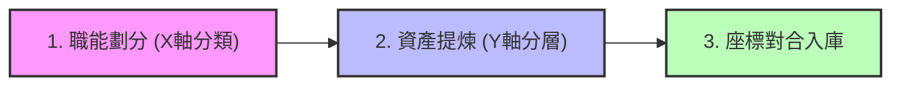

# 《企業生成式 AI 轉型全書：從知識底座到自主代理人的實踐路徑》 (v1.5.1)

## 第 0 章 虛擬企業實踐原型：團隊協作脈絡對合與 AI 賦能實測
- **0.1 演化路徑**：企業賦能的碎形邏輯：個人沙盒為基，人機混編團隊為原型。 [v1.5.1]
- **0.2 協作格律**：人機混編團隊的數位契約與工具對齊指引——建立協作格律。 [v1.5.1]
- **0.3 目錄設計**：管理 Repo 的物理架構與管理 OS。
- **0.4 數位幕僚長 (SyncHub)**：基於 Git 與 Discord 的對合中樞規格與實踐。
- **0.5 接入協議**：個人 AI 賦能沙盒轉向團隊對合的操作程序。

## 第 1 章 戰略為何而戰：GenAI 與 Agentic AI 的商業本質
- **1.1 競爭範式移轉**：從「提升效率」到「重構邊際成本」，分析智力勞動成本趨零的衝擊。
- **1.2 辨識戰位：二維轉型矩陣**：合規風險 vs 資料資產的矩陣分析。加入「羅盤與載體」對合論述。 [v1.3.0]
- **1.3 企業 AI 遺傳密碼 (Genetic Code)**：五大維度偵測與 **L0-L4 團隊級層次化賦能架構**。 [v1.5.1]
- **1.4 智力資產盤點與知識缺口審計 (Gap Audit) 方法論**：盤點現有 L1-L3 知識並找出與應用痛點之間的缺口。 [v1.5.0]
- **1.5 評測先行 (Evaluation-First)**：以「專屬考卷」釐清需求，建立抗模型歸零的企業知識資產。
- **1.6 回報評估與成效驗證**：四大頂層指標如何量化轉型成效，對接 CEO 儀表板。
- **1.7 本章回顧與自測**：戰略思維的起點與核心關鍵字回顧。 [v1.3.0]

## 第 2 章 知識工程：建構 AI 代理人的「企業大腦」
- **2.1 資料資產化**：資料資產化與 **Agent 導向之知識體系規劃 (Agent-Oriented Knowledge Architecture)**。 [v1.5.1]
- **2.2 二維職能知識矩陣與建構流程**：從原始混亂檔案到機器可讀知識（L0 到 L3）的提煉、清洗與落庫步驟。 [v1.5.1]
- **2.3 RAG 與脈絡堆疊 (Context Stacking)**：L0-L4 實體掛載機制，解決 Agent 的業務規則與決策邊界。 [v1.3.0]
- **2.4 三位一體知識工程與結構化 Facts SQL 定錨術**：書-DB-虛擬企業架構，以結構化去識別化事實資料庫消除 RAG 數值隨機幻覺。 [v1.5.0]
- **2.5 知識治理與隱私堡壘**：權限分配、敏感資料去識別化與 AI 倫理的安全框架。
- **2.6 本章回顧與自測**：檢查對 RAG 技術架構與企業知識數位化路徑的掌握。 [v1.5.1]

## 第 3 章 自主代理 (Agentic AI)：從對話轉向任務執行
- **3.1 代理人架計設計**：推理鏈 (ReAct)、長短期記憶與自我檢視 (Self-Reflection) 機制。（修正錯字：架計->架構） [v1.5.1]
- **3.2 工具化 (Toolification)**：將企業現有 ERP/CRM/API 轉化為 Agent 可調用的「肢體」。
- **3.3 多代理系統 (MAS) 協作**：多代理系統 (MAS) 與人機混編團隊的協作機制——虛擬數位部門的分工與人類對合。 [v1.5.1]
- **3.4 高效代理人編排 (Orchestration) 與通訊格律**：防止協作死鎖、收斂對話路徑與控制 Token 浪費的實踐路徑。 [v1.5.1]
- **3.5 本章回顧與自測**：檢驗對於自動化代理推理邏輯與多機協作概念認知的程度。 [v1.5.1]

## 第 4 章 落地運維與安全治理：AgentOps 的挑戰
- **4.1 混合架構選擇**：閉源商用 (OpenAI/Claude) 與開源私有化 (Llama) 的權衡與部署。
- **4.2 AgentOps 與效能監控**：AgentOps 與效能監控：**團隊協作流監控 (Collaborative Flow)**、思考路徑審計與成本控管。 [v1.5.1]
- **4.3 法律認信與責任歸屬**：當 Agent 代表企業與外部進行商業決策時的法規應對方案。
- **4.4 本章回顧與自測**：評估對企業級部署架構與 AI 治理風險的分析能力。

## 第 5 章 組織變革與人機協作：導入的最大困難與解方
- **5.1 程序再造與實驗哲學**：POC 作為失敗預算，重新發現業務邏輯。導入 **「1+2」先導導入 (MVP) 戰術**。 [v1.5.0]
- **5.2 變革管理與個人賦能**：從怕被取代到 Managers of Agents，共付式激勵與生活先行策略。引入 **虛擬老手建構方法論 (Virtual Expert)** 聲音低摩擦擷取與去識別化反向架構。 [v1.5.0]
- **5.3 雙軌與有機賦能 OS**：Wing Group 演進：**三明治轉型軌道**與戰術轉化器。 [v1.3.0]
- **5.4 指標百科 (Metrics Encyclopedia)**：量化轉型成效的實踐指引與 **PE/ET/DA/OM 規格化指標**。 [v1.3.0]

## 第 6 章 產業場景與企業樣態展開：實戰計畫書
- **6.1 高合規場景 (醫療/金融)**：封閉環境下的自動化審計與精準知識賦能。
- **6.2 高效率場景 (製造/零售)**：全自動化供應鏈調度與品質預測代理人。引入 **影子企業「浮盛流體 (FlowSheng)」全球組織藍圖與六大 AI 應用案例研究**。 [v1.5.0]
- **6.3 數位原生場景 (行銷/軟體)**：全自動化內容產製與軟體研發工廠的範式轉移。
- **6.4 本章回顧與自測**：針對不同產業特性的導入路徑優先序判斷。

## 附錄 A：情境式常見問題 (Scenario-based FAQ)
- **Q1：一家正在數位轉型的製造業，如何同時解決資料混亂與資深員工的技術焦慮？**
- **Q2：為了應對競爭對手全自動化的行銷攻勢，我們該如何建立自有的多代理系統？**
- **Q3：高合規行業(如醫療)想要讓 AI 自主處理病歷摘要與處方建議，架構如何設計？**
- **Q4：企業 CIO 如何說服董事會，從訂閱轉向投資自主代理人的基礎設施？**
- **Q5：企業啟動 Top-down 轉型太慢怎麼辦？如何平衡治理與行動力？** [v1.3.0]


---

# 0.1 演化路徑：企業賦能的碎形邏輯：個人沙盒為基，人機混編團隊為原型

## 戰略前提：企業是由「個體」組成的碎形
在探討大規模企業轉型前，我們必須承認一個事實：**企業的每一項決策、每一行程式碼、每一份報告，最終都源於某位特定個體的智力產出。** 

以往的企業數位化嘗試（如 ERP, CRM）往往採取「由上而下 (Top-down)」的程序鎖定，這在確定性高的工業時代有效，但在生成式 AI 時代，這種模式會窒息個人 AI 的探索空間。

### 賦能的遞進層次
為了實現真正的「虛擬企業」，我們定義了以下三個遞進的賦能階段：

#### 1. 個人 AI 賦能 (Foundation) —— 企業的地基
*   **核心目標**：讓每一位員工掌握「解構問題 -> 調度模型 -> 裁決產出」的能力。
*   **實踐形態**：個人 AI 沙盒 (PA Sandbox)。
*   **關鍵論點**：如果個體不具備 AI 裁決權，企業引入再強大的 Agent 都只是在「自動化地產生垃圾」。個人沙盒是組織賦能的最小單位與安全邊界。

#### 2. 團隊 AI 賦能 (Prototype) —— 轉型的原型
*   **核心目標**：解決個體賦能後的「資訊孤島」問題，實現「脈絡對合 (Context Sync)」。
*   **實踐形態**：人機混編小組 (Human-AI Teaming Nano-Squad) 與 團隊對合中樞 (SyncHub)。
*   **關鍵論點**：由人類員工與多個專屬 AI 代理人組成的人機混編小組是企業賦能的「實踐原型」。在此規模中，人機協作契約最為緊密、溝通與執行摩擦最容易被量化。這是驗證虛擬企業 OS 的最佳實驗場。

#### 3. 企業 AI 賦能 (Scaling) —— 組織的規模化
*   **核心目標**：將成功的人機混編與團隊對合模式碎形擴散。
*   **實踐形態**：多代理系統 (MAS) 與人機協同決策網絡。
*   **關鍵論點**：當所有的混編團隊都具備標準化的對合格律與座標化知識底座時，企業級的高效自動化便水到渠成。

## 為什麼從「人機混編團隊」開始實踐？
很多人認為應該先有「企業級戰略」，再有「團隊動作」。但在 AI 時代，**戰術的演化速度遠超戰略的規劃速度**。

我們選擇從人機混編團隊（Nano-Squad）切入，是因為：
1.  **低容錯成本**：一個小組的對合失敗，不會動搖企業根基。
2.  **高頻對撞**：小組成員（人類與 Agent）間的高頻互動，能最快暴露出個人 AI 產出與系統事實間的語意衝突。
3.  **可複製性**：一旦定義出「個人沙盒如何轉入人機團隊對合」的協議，這個模組就可以被無限複製。

本章後續將詳細展開這套「團隊協作對合」的具體操作與規格。


---

# 0.2 協作格律：人機混編團隊的數位契約與工具對齊指引——建立協作格律

在人機混編的 Nano-Squad 中，我們不靠「默契」工作，而是靠「數位契約」。人與 AI 協同的第一步是物理建立 **團隊運作說明書 (TEAM_HANDBOOK)** 與 **工具使用指引 (TEAM_TOOLS_GUIDE)**，定義人機協作的格律與界線。

🔗 **實踐範本**：[`TEAM_HANDBOOK_TEMPLATE.md`](./templates/TEAM_HANDBOOK_TEMPLATE.md) 及 [`TEAM_TOOLS_GUIDE.md`](./templates/TEAM_TOOLS_GUIDE.md)

---

## 0.2.1 數位契約：團隊運作說明書 (TEAM_HANDBOOK)

這份檔案是混編團隊的「憲法」，規範了人類與 AI 代理人的角色邊界，主要包含：
1.  **定義守備範圍與職能代號**：清楚定義人類成員與各個職能 Agent (如研發設計 `RD`、生產製造 `MFG`、行銷銷售 `MKT`) 的任務權責。當 AI 發現資料超標或合規風險時，能精確「召喚」對應的職能負責人。
2.  **人機協作對合機制**：明確攤開對合頻率與成功定義，特別是 Agent 在什麼情況下必須暫停 (HALT) 並向人類管理者 (Manager of Agents) 請求確認。
3.  **定錨單一事實來源 (SSOT)**：規定 **GitHub 是所有資產的物理基座**，所有程式、SOP 與事實資料庫均在此對合。

---

## 0.2.2 操作格律：工具使用與對齊指引 (TEAM_TOOLS_GUIDE)

有了「契約 (Handbook)」，接著需要「度量衡」。指引規範了具體的操作手感，確保人與 AI 在同一個數位世界中使用相同的語意語法。

### 核心基礎設施定位
*   **GitHub (資產與程式碼基座)**：所有 .md 檔案、程式碼、Facts 資料庫的最終歸宿。Git 的 Commit 歷史就是混編團隊的「運作日誌」。
*   **Discord/Teams (通訊與對合中樞)**：成員討論的場所，也是 **SyncHub (團隊數位幕僚長)** 自動發布「對合小報」與異常警告的戰情室。

### 為什麼「格式」就是「人機介面」？
在 AI 協作組織中，**格式就是 AI 的接入介面**。當團隊遵循 Markdown 與 YAML 規範時：
1.  **AI 能自動掃描與理解**：SyncHub 可以精準解析 Wlog，自動提取進度並更新 Repo 狀態。
2.  **無痛脈絡對齊**：人類成員可直接閱讀 AI 提煉過的語意摘要與 coordinates 座標對錨，降低人機溝通的隱性摩擦。

下一節我們將探討支撑這些格律運作的物理設施：**團隊管理 Repo 的架構設計**。


---

# 0.3 目錄設計：管理 Repo 的物理架構與管理 OS

## 物理底座：管理 Repo 的架構設計 (Repository Architecture)
為了支援團隊的高頻對合，團隊共享的「管理 Repo」必須具備清晰的功能分區。這套結構模仿了企業的「管理 OS」，將「當前執行、會議決策、組織資產、成員沙盒」進行徹底分離。

### 核心目錄架構與職責：
```text
.
├── workmgr/              # [執行指揮部]
│   ├── tasks/            # 任務中樞：存放全隊唯一的 TASKS.md 總帳
│   ├── work-logs/        # 脈絡對合點：成員推送每日 Wlog 的地方
│   └── task-reports/     # 成果認列：結構化的任務完成報告 (TR)
├── meeting/              # [共識提煉區] 會議紀錄、逐字稿與決策對合表
├── events/               # [里程碑日誌] 專案重大變更與外部交流歷史
├── decisions/            # [決策封裝區] 已簽核的決策紀錄 (SSOT)
├── strategic-roadmap/    # [演化羅盤] 定義團隊長期方向的策略文件
└── members/              # [成員對合空間] 個人沙盒與團隊大腦的緩衝區
    └── {member_id}/      # 每位成員的對合視窗 (inbound, outbound, staging)
```

---

## 管理 OS 的實務應用
這種目錄設計不僅是為了存放檔案，它定義了智力生產的「流水線」。
*   **隔離度**：確保個人沙盒 (`/members/`) 與團隊共識 (`/decisions/`) 互不干擾，但在物理上又在同一個 Git 基座上。
*   **可溯源性**：所有決策路徑都是可見的，從 Wlog 到任務狀態再到 TR，形成一條完整的證據鏈。
*   **機器可讀性**：這種層級分明的結構，是為了下一節要介紹的 **SyncHub (團隊 AI)** 能以最低成本對全隊進度進行「空間定位」。

下一節我們將深入探討這套管理 OS 的「自動化靈魂」：**0.4 數位幕僚長 (SyncHub) 的規格與實踐**。


---

# 0.4 數位幕僚長 (SyncHub)：規格與實踐

## 執行官：SyncHub 的願景
如果 0.3 節定義的是虛擬企業的「物理骨架」，那麼 **SyncHub (數位幕僚長)** 就是賦予這套骨架生命的「神經系統」。

SyncHub 是一個中立的團隊 AI 角色，它的使命不是去寫程式碼或寫文案，而是專注於「確保成員都在同一個頻道上」，實現高頻、低摩擦的智力產出對齊。

---

## 核心職責：順暢接力與脈絡導航
在傳統團隊中，專案經理 (PM) 花費大量時間在「追蹤進度」與「確認狀態」。在虛擬企業中，SyncHub 透過掃描 `/workmgr/` 自動完成這一切：

*   **脈絡對齊 (Context Synthesis)**：自動總結各成員推送到共享 Repo 的日誌，並產出「對合小報」。
*   **智慧接棒**：
    *   *案例*：當成員 A 在 Wlog 中回報「資料清理完成」時，SyncHub 會偵測到其守備範圍的邊界，並主動在接手的成員 B 之 `inbound/` 目錄下放置導航訊息，標註相關檔案路徑。
*   **單一事實來源 (SSOT) 的守護者**：SyncHub 會自動檢查 GitHub 中的檔案是否與討論共識對齊，提醒成員更新決策紀錄。

---

## 實踐機制：Git 事件驅動與 Discord 互動
SyncHub 並非一個需要人類主動「餵 Prompt」的對白框，它是一個 **「無頭 AI (Headless AI)」**，在背景默默運作：

1.  **Git 觸發**：當成員執行 `git push` 到團隊 Repo 時，SyncHub 被動啟動，開始對日誌進行語法與邏輯檢查。
2.  **Discord 廣播**：
    *   **`#synchub-pulse` 頻道**：這是團隊的「數位黑板」，由 SyncHub 存放自動產出的進度更新、任務狀態與小報摘要。成員可按需查閱，避免訊息干擾。
    *   **主動預警**：僅在發現重大任務延遲或邏輯衝突（對合碰撞）時，才會在公眾討論區標註執行人。

---

## 數位管家：貼心提醒而非嚴格懲罰
我們不再將 AI 視為「數位憲兵」，而是 **「數位管家」**。
它會根據 `TEAM_TOOLS_GUIDE` 給予微調建議（如提醒 YAML 元資料格式）。這種低階錯誤的「冷排查」，釋放了人類的腦力，讓成員能將精力集中在更高層級的創造與關鍵決策。

透過這套「執行官」規格，團隊達成了一種 **「準實時同步」**：成員只需專注於產出並推送，其餘的脈絡同步與成果合成，交由 SyncHub 自動完成。

下一節將介紹個人如何正式接入這套高度自動化的系統：**0.5 接入協議：從個人沙盒到團隊對合**。


---

# 0.5 接入協議：個人 AI 賦能沙盒轉向團隊對合的操作程序

## 接入：將個人能量「投影」到團隊地圖
當個體具備了強大的個人 AI 賦能後，面臨的最大挑戰是如何將產出「插入」團隊流。這不是簡單的程式碼提交，而是 **「智力脈絡的交接」**。

為了實現無痛對合，我們在共享 Repo 中為每個人設立了標準化的 **「成員對合空間 (/members/{id})」**。

### 1. 成員對合區域的運動規律
每個成員目錄都具備三種特性的資料流向：

*   **`inbound/` (情報讀取區)**：這是你的「團隊視野」。
    SyncHub 會將團隊決策、別人的進度、或是分配給你的標示性訊號 (Signals) 放在這裡。開工前，你的個人 AI 應該先掃描此處，將團隊最新背景「併入」目前的會話脈絡。
*   **`outbound/` (成果輸出與訊號通報區)**：這是你的「產出窗口」。
    將完成的日誌 (Wlog)、報告 (TR) 放置於此。**更重要的是「訊號通報 (Signals)」**：如果你完成了一個讓別人能開工的關鍵動作，要在這裡放置通知訊息，由 SyncHub 轉發。
*   **`staging/` (衝突交涉桌)**：這是「對合衝突」的暫存區。
    當你 Push 的內容與他人衝突時，SyncHub 會在此產出「對比分析報告」。這是一個安全的緩衝空間，讓衝突在被併入主幹前，先在此處進行人工裁決。

---

## 2. 接入協議 (Plugging Protocol) 三步曲
一名「合格的個人 AI 使用者」轉型為「高效團隊成員」的標準程序如下：

#### 第一步：領取認知格律 (Cognitive Alignment)
下載並將 `TEAM_HANDBOOK` 與 `TEAM_TOOLS_GUIDE` 掛載到個人 AI 的底層知識庫中。
> *動作*：告訴你的 AI：「從現在起，所有的 Markdown 產出必須包含特定的 YAML 元資料，並嚴格遵守相對路徑原則。」

#### 第二步：初始化空間對接 (Path Handshake)
在共享 Repo 的 `/members/` 下領用目錄，建立範本結構。
🔗 **參考範本**：[`MEMBER_WORKSPACE_TEMPLATE.md`](./templates/MEMBER_WORKSPACE_TEMPLATE.md)

#### 第三步：執行首次對合 (Warm-up Sync)
*   **讀取情資**：從 `inbound/` 領取第一個任務。
*   **宣告就位**：在 `outbound/signals/` 發送「成員 X 已掛載完畢」的訊息。
*   **對合驗證**：推送第一份細小的 Work-log，觀察 SyncHub 的檢查結果，確保個人 AI 的格律輸出完全符合團隊要求。

---

## 結論：碎形賦能的終點，虛擬企業的起點
至此，我們完成了本全書最核心、也最基礎的建設：**建立了「人機一體」的微型組織原型。**

透過第 0 章定義的格律與 AI 中樞，個人主權在不被稀釋的前提下，精確地投影到團隊的共識地圖上。這種「低摩擦、高對合」的模式，正是後續章節探討「大規模知識工程」與「企業級 AI 治理」的唯一物理物理基礎。

現在，我們準備好進入更宏觀的轉型戰位分析。


---

# 1.1 競爭範式移轉：從「提升效率」到「重構邊際成本」

在過去的數十年間，企業數位化轉型的主旋律始終是「數位最佳化 (Optimization)」——也就是利用軟體讓原有的工作做得更快、更好、更省力。然而，生成式 AI (GenAI) 尤其是自主代理人 (Agentic AI) 的出現，宣告了數位化進入了「範式移轉 (Paradigm Shift)」的新階段。這不再只是關於效率的提升，而是關於**核心成本結構的崩潰與重組**。

### 智力勞動的商品化 (Commoditization of Intellectual Labor)
傳統上，企業的價值鏈中，「決策」與「高階資訊處理」是成本最高、最具稀缺性的部分。一個訓練有素的市場分析師、一位資深的法務人員或一位架構師，他們的智力產出伴隨著高昂的薪酬成本、時間成本與不可避免的人為錯誤。

GenAI 帶來的衝擊，在於它將**「初步具備邏輯的智力勞動」之邊際成本推向了零**。當產出一萬字的高質量摘要、分析一百萬筆財務異常資料、或撰寫數千行基本的程式碼只需要幾美分、幾秒鐘時，原本受限於「人力資源」的業務規模牆被推倒了。

### 從「人力驅動」到「數位代理人密度」
在範式移轉之後，企業的競爭力將不再取決於你擁有多少「頭銜 (FTE)」，而取決於你的**「數位代理人密度」**以及這些代理人調度知識的能力。

1.  **彈性規模化 (Elastic Scaling)**：
    人類員工的擴張是階梯式的，且伴隨著管理沈沒成本。Agentic AI 讓企業能夠在偵測到市場機會的瞬間，啟動一萬個「市場情緒監測代理人」，並在任務結束後立即關閉，實現真正的彈性經營。

2.  **知識資產的自動再產出**：
    過去企業的知識存在於資深員工的腦中，隨著離職而消失。在新的範式下，企業的核心產值在於如何將這些非結構化的經驗，轉化為 AI 代理人可以執行的指令與工作流。

### 對企業主的戰略警示
如果一家企業仍試圖以「減少加班時間」來衡量 AI 的成功，那麼它已經在範式競爭中落後。真正贏家在問的是：**「如果智力處理的成本是零，我能開啟哪些過去因為太貴而無法執行的業務？」**

轉型成功的標誌，是企業能將 AI 視為一種新的「生產要素」，而非僅僅是一個工具程式。這意味著組織必須從「程序 (Process)」導向，轉向「規則與目標 (Objective & Reward)」導向，讓 Agentic AI 在設定的邊界內自主追求最優解。


---

# 1.2 辨識戰位：二維轉型矩陣與「羅盤-載體」對合

在理解了 AI 如何重構邊際成本後，企業主面臨下一個殘酷現實：並非所有的 AI 導入都能創造持久優勢。要制定正確的導入藍圖，首先必須學會辨識企業在 AI 賽局中的「戰位」。

在 v1.3.0 中，我們提出了一個核心對合邏輯：**「矩陣為羅盤，層次為載體」**。

### 1. 二維轉型矩陣：您的戰略羅盤 (The Compass)
透過兩個核心維度，我們可以將企業或特定業務場景放入直角座標系中，定位其轉型重力場：

*   **Y 軸：容錯維度 (Risk & Compliance)**
    *   **頂端（開放創意）**：如行銷文案、腦力激盪、遊戲設計。追求原創與發散，容錯率高。
    *   **底端（嚴謹合規）**：如醫療診斷、合約審計、資金調度。追求精準與一致，誤差零容忍。
*   **X 軸：資料成熟度 (Data Maturity)**
    *   **左側（遺留系統）**：資料散落在紙本、孤島系統或非結構化檔案中。
    *   **右側（數位原生）**：資料已 API 化、Markdown 化，且具備高品質的 Metadata。

### 2. 羅盤與載體的「經緯對合」
這個矩陣不僅是靜態的分類，它更決定了後續 **L0-L4 層次化架構**（見 1.3 節）的參數配置。這就像是導航系統：矩陣告訴我們目的地（羅盤位），而 L0-L4 則是承載這趟轉型的船隻（載體）。

*   **高合規重力場 (Bottom Sector)**：
    *   **對合影響**：自動調高 **L1 (產業層)** 與 **L3 (企業層)** 的權重。在 Prompt Stacking 中，法規邊界將具備最高優先級，過濾掉任何具備幻覺風險的輸出。
*   **高創意重力場 (Top Sector)**：
    *   **對合影響**：調高 **L4 (個人主權層)** 的穿透度。Agent 被允許更多地參考使用者的個人偏好與風格，打破 L3 的標準化框架。

### 3. 進攻型 vs 防禦型策略
座標系也揭示了企業的攻守姿態：

*   **防禦型策略 (Survival Strategy)**：
    *   通常處於「數位遺留」區塊。重點在於利用 AI 降低現有的「程序熵值」，如行政自動化、基本客服。這是為了「不掉隊」。
*   **進攻型策略 (Growth Strategy)**：
    *   通常處於「數位原生」區塊，或正在往該區快速位移。利用獨特資料（L3）與個人品位（L4）建立難以複製的壁壘，如預測性供應鏈、極致個人化服務。這是為了「贏」。

### 結論：定義轉型的「重力」
辨識戰位的意義在於：**不要用開放創意的態度去處理嚴謹合規的業務，反之亦然。** 矩陣提供了宏觀的戰略定位，接下來我們需要更細緻的「工具」來盤點組織 DNA，並將其物理化封裝。

---

---


---

# 1.3 企業 AI 遺傳密碼 (Genetic Code) 與 L0-L4 團隊級層次化賦能架構

在 1.2 節中，我們確立了戰略的方位。然而，要真正將 AI 落地，我們需要一套精確的「封裝格式」，將企業的硬性規則、軟性文化與專家的手感，轉化為 Agent 可以理解與推理的物理脈絡。這就是 v1.5.1 的核心突破：**從單點個體賦能轉向團隊級座標化封裝**。

### 1. 偵測感官：五大遺傳屬性 (The Genetic Sensors)
在封裝脈絡前，我們必須先判讀企業的 DNA。這五個維度決定了轉型的物理邊界與資源配重：

1.  **容錯成本與合規深度 (Risk & Compliance)**：決定了 **L1 (產業與文明)** facts 的定錨強度與過濾要求。
2.  **資料資產熵值與流動性 (Data Entropy)**：決定了 **L3 (企業與真相)** 型錄與公開真相檔案清洗的深度。
3.  **業務工作同質化程度 (Task Homogeneity)**：決定了 **L2 (職能與習慣)** 標準作業程序 (SOP) 的對齊程度。
4.  **協作敏捷度與決策邊界 (Agility)**：決定了 **L0 (型態與資料)** 人機混編與格式介面對合的頻率。
5.  **轉型信仰度與先行者密度 (AI Belief)**：決定了 **L4 (個人與專家)** 隱性心法的提煉難易度與數位遺傳能量。

### 2. 封裝載體：L0-L4 團隊級層次化賦能架構 (The Vessel)
診斷完畢後，我們將結果「樂高化」為以下五層脈絡載體，並沿著橫軸職能 (`RD`, `MFG`, `MKT`, `HR`, `FIN`) 交織成二維座標，實現脈絡的精準遺傳：

*   **L0: 型態與資料層 (Type & File)**
    *   **定義**：底層文檔格式、多媒體檔案等載體形式。如：Markdown 格式規範、PDF 文件、多語對合規範。
*   **L1: 產業與文明層 (Industry & Civilization)**
    *   **定義**：產業標準、基礎學科原理、通用 DDL Facts。如：熱力學公式、ISO 節能標準、基礎會計準則。
*   **L2: 職能與習慣層 (Logic & Function)**
    *   **定義**：企業特定職能 SOP、維修流程與習慣。如：研發設計 SOP、售後異常排除邏輯、客戶常見 FAQ 回覆格律。
*   **L3: 企業與真相層 (Entity & Truth)**
    *   **定義**：公司特有真相檔案與 DDL Facts 庫。如：特單 BOM 規格、機台 MODBUS 暫存器點位與停機閥值（例如 `MFG_L3` 座標定位）。
*   **L4: 個人與專家層 (Individual & Expert)**
    *   **定義**：**這是數位大腦的靈魂與手感**。如：老手現場聽音診斷心法 (`MFG_L4` 座標)、設計師特定公差現場微調經驗、頂尖業務的客戶破冰手感。

### 3. 脈絡堆疊與座標定位 (Stacking & Coordinate Logic)
在 v1.5.1 的技術實作中，我們採用「後項覆蓋前項」的堆疊邏輯，賦予最頂層專家與現場個體最高的裁決權，並以二維座標進行管理：

> **優先級排序：L4 (個人專家) > L3 (企業真相) > L2 (職能習慣) > L1 (產業文明) > L0 (型態資料)**

當一個特定職能的 Agent 啟動時（例如 `RD` 研發 Agent），它會先讀入通用的底座，並沿著 `RD` 橫軸精確掛載 `RD_L1` (壓縮機原理) -> `RD_L2` (設計 SOP) -> `RD_L3` (型線 Facts)，最後在運行中疊加人類專家的 `RD_L4` 靈魂手感。這徹底消滅了 RAG 隨機幻覺，確保 Agent 行動精確且合理。

### 結論
**「五大維度是問診，二維座標是藥帖。」** 透過這套架構，我們讓企業轉型不再是飄渺的口號，而是清清楚楚、可以被 Git 版本控管、可透過 `RD_L3` 或 `MFG_L4` 座標化呼叫的 Markdown 檔案與 Facts SQL 片段。

---
**本章成效驗證對接：** 請參閱《指標百科》中的 ET.02 (脈絡堆疊完整度) 與 ET.03 (L4 決策保真度) 以評估封裝品質。


---

# 1.4 智力資產盤點與知識缺口審計 (Gap Audit) 方法論 [v1.5.0]

在推動企業生成式 AI 轉型時，許多企業最常犯的錯誤是「手中有錘子，看什麼都是釘子」——直接將現有的非結構化資料（如說明書、設計規格、流程文件）塞進 RAG（檢索增強生成）系統中，便指望 AI 能夠自動解答所有業務問題。然而，在面臨精密重工業或高精密業務時，這種粗放的導入方式往往會因為資料缺損或老手經驗未妥善數位化，導致 AI 產出大量幻覺。

為了讓 AI 大腦具備精準的推理能力，我們必須引入 **「知識缺口審計 (Knowledge Gap Audit)」** 方法論。這是一套在專案初期，用以評估「企業現有資料儲備」與「AI 應用 Roadmap 目標」之間是否存在認知鸿溝的系統性工具。

---

## 🧭 1. 為什麼需要進行 Gap Audit？

傳統 IT 的資料審計關注的是「資料是否存在、格式是否正確」；而 AI 知識缺口審計關注的則是 **「大腦的認知完備性」**：
1.  **找出盲區，防範幻覺**：AI 代理人之所以會產生幻覺，往往是因為我們要求它在「缺乏特定黃金事實」的前提下進行判斷。透過 Gap Audit，我們能在開發前預先標記哪些領域的知識是缺損的，避免 AI 硬碰硬猜測。
2.  **定錨 Deep Research 收集方向**：當我們釐清了內部知識缺口（如：缺乏某系列空壓機在特定溫濕度下的比功率修正公式），就能引導 Deep Research 工具有目的地去收集外部公開的國際標準與規格手冊，將缺口點亮。
3.  **精準評估老手經驗（L4）流失度**：評估在核心業務流程中，有多少比例的決策依賴於資深人員腦中的「感官手感（如聽音辨識、避坑心法）」，這將決定我們是否需要啟動「虛擬老手建構」程序。

---

## 🛠️ 2. Gap Audit 執行的三大步驟

知識缺口審計的實踐，圍繞著一個核心提問：**「要讓數位同僚 (AI Agent) 像專家一樣工作，它必須先知道哪些事實與規則？」**

```
   ┌───────────────────────┐       ┌───────────────────────┐       ┌───────────────────────┐
   │ 1. 定義 Roadmap 痛點  │ ───>  │ 2. 盤點 L1-L3 既有資料 │ ───>  │ 3. 診斷認知缺口 (Gap)  │
   │    (例如：圖面檢核)   │       │   (型錄、手冊、標準)  │       │ (產出 Gap Analysis)   │
   └───────────────────────┘       └───────────────────────┘       └───────────────────────┘
```

### 步驟一：對合業務 Roadmap 與痛點場景
首先，明確定義 AI 導入的先導專案場景。例如，生管部門的痛點是「非標特單 BOM 比對慢，採購風險高」。此時，AI 代理人需要的核心智力是：對比新舊 BOM 的物料差異，並根據歷史發包交期與供應商評價進行風險裁決。

### 步驟二：建立既有知識資產目錄
盤點組織內與該痛點直接相關的既有資料儲備，並將其分類至 L1 至 L3 階層：
*   **L1 (通用標準)**：例如比功率熱力學公式、發包交期計算通則。
*   **L2 (職能規範)**：例如採購審批流程文件、BOM 建立 SOP。
*   **L3 (企業事實)**：歷史採購合約、特定型號的 BOM 檔案、供應商名冊。

### 步驟三：診斷認知缺口與防禦性去識別化
將步驟一的「推理所需知識」與步驟二的「既有資料」進行交叉比對，產出 **「Gap 審查報告」**：
*   **事實缺口**：例如缺乏特定關鍵耗材的防錯幾何公差標準，這會導致 AI 無法準確檢核圖面。
*   **安全去識別化防線**：在評估過程中，所有涉及真實商業機密（如供應商真實議價底線）的資料，必須進行安全去識別化。我們以文字定義其邏輯規則，而將其具體數值以影子常數代替，阻斷與母企業的過度連結。

---

## 🚀 3. 利用 Deep Research 點亮缺口

當 Gap Audit 識別出特定知識缺口後，我們能發動 **Deep Research Grounded Prompting**，利用公開情報進行智力補償：
*   **情報偵察**：當缺乏某項國際能效標準的數值常數時，引導 AI 橫掃外部專利局、產業標準協會、與全球技術論壇。
*   **情資轉換**：將搜集到的外部公開黃金事實（EXT-XXX）轉換為影子沙盒的設備常數，用以充實 L3 事實庫，在零洩密風險的前提下，點亮大腦的知識地圖。

---

## 結論

智力資產盤點與知識缺口審計不是一次性的行政作業，而是企業大腦的「體檢表」。透過在導入初期誠實地面對資料缺口，我們能避免盲目開發，確保 AI 代理人的每一項推論，都有 100% 穩固的黃金事實做為定錨。

---
**本章成效驗證對接：** 關於盤點後的知識缺失如何進行外部情資收集，請參閱第二章之 `2.4 全球公開情報偵察實務`；關於缺口診斷之量化指標，請參閱《指標百科》中的 DA.01 (知識覆蓋率)。


---

# 1.5 評測先行 (Evaluation-First)：需求釐清與目標精準化 [v1.1.0]

在企業或政府機關推動 AI 轉型時，最常見的困境不是「沒預算」，而是**「不知道該做什麼」**以及**「不知道怎麼做」**。許多專案在資料庫建置、RAG 開發上投入了巨資，最後卻發現產出的結果與業務需求完全對不上。

為了破解這個痛點，轉型框架在 v1.1.0 中正式引入 **「評測先行 (Evaluation-First)」** 方法論：這是一種以「考卷」來定義「工作內容」的需求分析路徑。

### 1. 為何要評測先行？
傳統做法是「先做系統，再看效果」；評測先行則是**「先定標準，再做系統」**。
- **釐清需求與確認目標**：當部會主管與業務專家共同設計「評測題庫」時，他們必須被迫釐清：AI 到底要解決什麼具體問題？達標的標準是什麼？
- **精準整備資料**：當需求與目標透過題目被具體化後，該整備哪些資料資產 (2.1) 就會變得清晰，避免在無效的資料清理上浪費力氣。
- **降低「LLM 焦慮」**：LLM 模型版本更新飛快，但業務邏輯（考卷）相對穩定。評測集本身就是一種**「數位資產」**，它不會隨著模型改版而歸零，反而成為檢驗新模型是否適用的公正標尺。

### 2. EDRA 模式：評測驅動的需求對齊
**EDRA (Evaluation-Driven Requirement Alignment)** 要求專案啟動的前四週內，必須產出至少 50-100 題的「黃金測試集 (Golden Dataset)」：
1. **情境題設計**：模擬真實業務場景的提問。
2. **標準答案 (Ground Truth)**：由該領域的「老師傅」或資深專家提供或校對的正確回覆。
3. **評分維度**：定義何謂「好」的答案（如：準確性、語氣、合規性）。

### 3. TAIDE 的戰略角色：在地化評測基準
對於台灣的部會或特定產業場景，**TAIDE (Taiwan AI Dialogue Engine)** 具有不可替代的諮詢價值：
- **在地語境校準**：行政用語、法律格式與在地文化習慣，是通用大型模型（如 GPT-4）較難精確掌握的。
- **公部門標準化**：透過與 TAIDE 團隊協作建立的評測基準，可以確保 AI 應用的產出符合台灣公部門的作業規範。
- **模型對抗測試**：將 TAIDE 作為「外部參考系」，用來交叉驗證商業模型是否存在偏見或誤讀。

### 4. 評測即資產：不可代勞的長期價值
評測集是企業或部會**無法被代勞**的部分。即使系統委外開發，這份「驗收考卷」必須掌握在組織手中。
- **從品位到規格 (L4 -> L2)**：這是 v1.3.0 的核心轉化動作。職人的「品位裁決（L4個人層）」透過評測集轉化為企業可以執行的「技術規格（L2職能層）」。
- **持續增值**：隨著業務發展，考卷會不斷修正、擴充，成為組織知識傳承的載體。
- **版本化監控**：在第四章提到的 AgentOps (4.2) 中，這份考卷將轉化為自動化執行的 Benchmark，確保 AI 在快速迭代中不失方向。

### 結論
評測先行不只是一個技術檢測手段，它是企業轉型的「導航座標」。透過在專案初期「自出考卷、自定標準」，您能確保 AI 的發展路徑始終從 **L4 的主觀品位** 成功演化為 **L2 的客觀效能**。

---
**本章成效驗證對接：** 請參閱《指標百科》中的 PE.04 (對位精準度) 以評估評測集對 Agent 表現的導航效果。

---
*本節內容為 v1.1.0 重大更新。*


---

# 1.6 回報評估與投資 ROI：衡量 AI 轉型的真實價值

在企業導入生成式 AI 與 Agentic AI 的過程中，最讓財務長（CFO）與決策者困惑的問題莫過於：「我們投入了高昂的算力成本、軟體授權與人才薪酬，究竟換回了什麼？」傳統的 ROI（投資報酬率）衡量標準在面對具備「自主性」與「學習能力」的 AI 時，往往顯得捉襟見肘。

要精確評估 AI 的回報，我們必須將衡量維度從單一的「節省人力」擴展為三個層次的價值模型：

### 1. 效率回報 (Efficiency ROI)：成本的壓縮
這是最直觀、也最容易量化的層次。它關注的是「做同樣的事，花更少的資源」。
- **量化指標**：工時縮減（FTE 節省）、Token 消耗 vs 人工薪酬對比、業務處理週期的縮短（Lead Time）。
- **實例**：原本需要 5 名員工處理一週的報關檔案，現在由 Agentic AI 在 2 小時內完成初步審核並分類，效率提升了數十倍。
- **評估陷阱**：如果不伴隨著「工作程序再造 (BPR)」，節省下來的人工工時若沒有投入到更高價值的工作上，這部分的 ROI 僅僅是帳面數字，而非實質利潤。

### 2. 品質與決策回報 (Quality & Decision ROI)：能力的解構
這是 GenAI 帶來的隱性價值，關注的是「以前做不到，或做不精準的事」。
- **量化指標**：錯誤率的降低、合規性漏洞的減少、決策成功率的提升。
- **實例**：在高合規要求的醫療或金融場景，AI 代理人能 24/7 不間斷地掃描每一筆交易或診斷紀錄，抓出人類可能因為疲勞而遺漏的「長尾風險」。
- **戰略價值**：這種回報來自於「一致性」。AI 能確保企業在每一分鐘產出的專業服務水平，都維持在組織的最佳標準之上。

### 3. 機會回報 (Opportunity ROI)：增長的解鎖
這是 Agentic AI 最具破壞性的部分，關注的是「規模化智力產出所帶來的全新商業邊際」。
- **量化指標**：新客戶開發成本（CAC）的下降、產品迭代速度、個人化服務帶來的訂單轉化率提升。
- **實例**：一間傳統線上教育公司，利用 AI Agent 為每一位學生提供 24 小時的 1 對 1 個人化指導。這種「極致的個人化」在過去因為人力成本太貴而無法執行，但現在成為了核心產品競爭力。
- **戰略維度**：這部分的 ROI 往往是數倍甚至數十倍，因為它改變了企業的營收邊界。

### 建立「AI 戰後審查機制」
為了持續最佳化投資，企業應建立動態的評估框架：
- **初期**：聚焦於 Proof of Value (PoV) 而非 PoC。測試 AI 是否真的解決了業務痛點。
- **中期**：建立「Token vs Value」監控。如果一個 Agent 跑了幾百美金的 Token 卻沒有產出對應的決策結果，這就是程序失調的信號。
- **長期**：觀察「數位代理人密度」與「人均產值」的相關性。

### 結論
衡量 AI 的 ROI 不應只是看「省了多少錢」，更要看「賺了多少過去賺不到的錢」。如果企業對 AI 的期待僅止於防禦性的成本削減，那麼最終會發現在算力通膨的時代，這部分的獲利將被基礎設施成本蠶食殆盡。真正的投資回報，來自於將 AI 代理化後，所釋放出的企業無窮擴張潛力。

---
**本章成效驗證對接：** 請參閱《指標百科》中的 DA.01 (職能位移率) 與 DA.02 (知識資產化速率) 以獲取具體計算工具。


---

# 1.7 本章回顧與自測：戰略思維的起點

在第一章中，我們探討了生成式 AI 與 Agentic AI 對企業最底層的衝擊。這不只是一次技術升級，更是一次關於「價值創造」與「脈絡封裝」的全面重組。在進入具體的技術實作之前，請確保您已掌握了以下核心觀念。

### 本章核心關鍵字回顧
- **邊際智力成本 (Marginal Cost of Intelligence)**：GenAI 讓初步具備邏輯的資訊處理成本接近於零，迫使企業從「買人力」轉向「配置智力」。
- **羅盤與載體 (Compass & Vessel)**：二維轉型矩陣定義戰略方向（羅盤），L0-L4 架構負責物理執行（載體）。
- **L0-L4 層次化賦能架構**：將企業脈絡拆解為型態、產業、職能、實體與個人五個層次。
- **脈絡堆疊 (Context Stacking)**：後項覆蓋前項的權重邏輯，確保 L4 (個人主權) 具備最終裁決權。
- **三明治轉型軌道 (Sandwich Transformation)**：Top-down 的規則容器與 Bottom-up 的實戰引擎同步發動。
- **評測先行 (Evaluation-First)**：以「專屬考卷」釐清需求，將品位轉化為可執行的規格。

---

### 章節自測題

1. **[架構對位]** 為什麼 v1.3.0 提倡將層次化架構設定為「L4 > L3 > L2 > L1 > L0」？這種權重排序如何保護個人的「職人品位」不受企業平庸化的影響？
2. **[戰位識別]** 假設一家在高合規象限（矩陣底部）的金融公司，在配置其 L0-L4 架構時，哪兩層應該具備最強的「過濾器」？為什麼？
3. **[三明治模型]** 企業若只做 Top-down (L0/L1/L3) 而忽略底層軌道，最可能遇到的瓶頸是什麼？
4. **[診斷映射]** 「業務工作同質化程度」偵測出的結果，主要應該封裝進 L0-L4 中的哪一層？
5. **[回報反思]** 在 Agentic AI 時代，除了節省工時，為什麼「L4 決策保真度 (ET.03)」是衡量長期賦能成功的關鍵指標？

---

### 下一章預告
有了戰略與層次化的思維後，企業面臨的第一個技術實作挑戰就是：**「如何將這五層脈絡載體實體化？」** 第二章我們將深入探討**知識工程**，學習如何處理 RAG 與 Context Stacking，讓 AI 真正擁有一顆「懂企業、更懂你」的大腦。


---

# 2.1 資料資產化與 Agent 導向之知識體系規劃 (Agent-Oriented Knowledge Architecture)

如果說第一章解決了「為何而戰」的想法，那麼第二章則是解決「用什麼打仗」的資源問題。在 AI 時代，企業最核心的資源不再是現金或實體資產，而是**「可被 AI 檢索、推理並精確調用的結構化知識」**。

絕大多數企業在導入 AI 時面臨的第一個噩夢是：擁有海量的檔案，卻處於「資料荒漠」之中。

### 傳統 KM 與 Agent 導向知識工程的本質差異
傳統的企業知識管理 (Knowledge Management, KM) 是「為人類閱讀而設計」的。人類具備極強的上下文推理能力，因此傳統文檔中容許存在大量的語意模糊、版本冗餘、以及排版雜亂。

然而，當這些檔案直接餵給 AI 代理人時，便會發生嚴重的「語意隨機幻覺」或「推理中斷」。**Agent 導向之知識工程 (Agent-Oriented Knowledge Engineering)** 要求對知識進行重新清洗與結構化，使其具備：
1.  **高確定性與邊界清晰**：移除模糊與衝突的語意，精準標定事實。
2.  **物理座標定位**：為每項資產賦予橫軸職能與縱軸深度座標（例如：`RD_L3`），讓 Agent 能精準掛載推理，而非模糊檢索。

### 資料資產化的三大核心挑戰
1.  **非結構化資料的提取 (The Extraction Trap)**：
    PDF 不是一種純文字格式，它是一種視覺排版格式。表格、圖片中的文字、甚至是多欄位的排版，往往會讓傳統的讀取器失效。這需要導入具備視覺理解能力的 OCR 或專門的 Markdown 轉化工具，確保資料的「語義連續性」。
2.  **資料的「時效性」與「衝突性」**：
    同一份產品說明書可能有五個版本，哪一個才是正確的？如果資產化過程中沒有加入座標元資料管理，AI 將會給出過時且危險的建議。
3.  **知識的細粒度分割 (Chunking Strategy)**：
    將一整本 500 頁的手冊直接塞給 AI 是低效的。資產化的關鍵在於如何將知識切割成合適的「區塊 (Chunks)」，每個區塊必須包含完整的語義，且能以 coordinates 座標與周邊上下文保持連結。

> **[Case Study: 龍誠精密 — 傳產紙本的復活術]**
> 在轉型初期，龍誠精密面臨最大的障礙是累積了 30 年的「老師傅筆記」與「機台維修紙本記錄」。
> **實戰心法**：他們並非盲目數位化，而是透過「視覺 LLM + 座標化提取」技術，將紙本記錄轉化為 Markdown 格式並物理定位。這讓 AI 代理人能像一位在工廠待了 30 年的老技師一樣，精確指出某個型號機台在特定座標故障點的成因。

### 具體實作路徑：企業知識洗滌三部曲
1.  **盤點與清理 (Inventory & Cleanup)**：
    不是所有的資料都要餵給 AI。第一步是識別出高品質、具備長久參考價值的「核心知識庫」。刪除重複、過時及具備極端敏感性但無助於決策的垃圾資料。
2.  **標準化轉譯 (Standardized Translation)**：
    將異質格式（PDF, Word, PPT）統一轉化為 **Markdown 格式**。Markdown 是目前 LLM 最易於解析、結構最清晰的格式，特別是在處理標題層級與表格時。
3.  **語義索引編目 (Semantic Indexing)**：
    利用 Embedding 技術，將文字轉化為向量。這就像是給每一條企業知識配上了一組 GPS 座標。這步驟讓 AI 能跨越繁簡、語言、甚至是不同的辭彙表達，找到背後相同的含義。

### 結論
在接下來的 2.2 中，我們將引入二維職能知識矩陣，詳細拆解如何實體建構這些座標化的企業知識體系。


---

# 2.2 二維職能知識矩陣與建構流程：為 Agent 劃定智力地圖

在 2.1 節中，我們確立了「為 Agent 準備知識」的原則。然而，企業知識龐雜且混亂，若沒有一套經緯分明的地圖，AI 代理人將無從定位其思考邊界。為此，我們引入 **二維企業知識矩陣 (2D Enterprise Knowledge Matrix)**，作為軟體定義智力資產的底座。

---

## 2.2.1 經緯交織：二維企業知識矩陣

這套矩陣透過縱軸與橫軸的交織，為企業的每一項智力資產標定唯一的 **物理座標**：

### 1. 縱軸 (Y軸)：L0 - L4 知識階層 (Depth)
定義了知識的「精確度與認知提煉深度」：
*   **`L0` 型態與資料 (Type & File)**：資訊的實體格式規範。如 Markdown 格式規範、PDF 文件、多語審校標準。
*   **`L1` 產業與文明 (Domain & Civilization)**：不隨單一企業改變的產業基礎事實。如基礎熱力學原理、ISO 能效標準、通用會計科目。
*   **`L2` 職能與習慣 (SOP & Flow)**：企業通用的工作流程。如研發製圖 SOP、生產檢驗流程、行銷漏斗回覆格律。
*   **`L3` 企業與真相 (Entity & Facts)**：企業獨有的精密物理參數與真相檔案。如產品特單規格、IoT 暫存器點位與停機閥值 Facts。
*   **`L4` 個人與專家 (Heuristics & Wisdom)**：一線專家的隱性心法與現場經驗。如師傅聽音診斷異音心法、頂尖業務的破冰談判手感。

### 2. 橫軸 (X軸)：產、銷、人、發、財 企業五大職能 (Function)
劃定了知識的「業務範疇與職能邊界」：
*   **發 (`RD`)**：研發與設計。
*   **產 (`MFG`)**：生產與製造。
*   **銷 (`MKT`)**：行銷與銷售。
*   **人 (`HR`)**：人力資源與組織。
*   **財 (`FIN`)**：財務與企劃。

---

## 2.2.2 座標定位系統 (Coordinate Positioning)

透過將縱軸與橫軸結合，我們為每一條知識定義了唯一的座標標示，格式為 `[職能_階層]`。

例如：
*   **`RD_L3`**：研發設計的企業真相（如浮盛流體特定轉子的齒數比與幾何參數）。
*   **`MFG_L4`**：生產製造的專家心法（如空壓機試車房的聽音診斷異音心法）。
*   **`FIN_L2`**：財務會計的職能 SOP（如企業差旅費用核銷流程）。

在大腦事實資料庫 (`flowsheng_knowledge.db`) 中，這些座標被物理儲存為 `assets` 資料表的 `coordinate` 欄位。當對應的 Agent (如研發部的特單檢核 Agent) 啟動時，它只會被掛載並允許讀取帶有 `RD` 相關橫軸或 `RD_L3` 精確座標的智力資產，從物理上限縮其決策邊界，消除越權與幻覺。

---

## 2.2.3 實體建構流程 (Empirical Process)

企業要建構這套矩陣，必須遵循以下標準化建構流程：



1.  **職能劃分 (X軸分類)**：盤點企業目前的 Nano-Squad 部門，將原始資料按 `RD`/`MFG`/`MKT`/`HR`/`FIN` 分類歸檔。
2.  **資產提煉 (Y軸分層)**：
    *   清洗 L0 格式，將 PDF/Word 統一轉化為 Markdown。
    *   過濾 L1 通用知識，將臨界物理 Facts 與 DDL 結構化落庫為 L3。
    *   將資深專家的口述錄音通過 AI 進行去識別化反向架構，提煉為 L4 片段。
3.  **座標對合入庫**：在事實庫中建立對照索引，為每條 Chunks 標註其職能座標 (如 `MFG_L3`)，完成入庫。

### 結論
二維企業知識矩陣是自主代理人得以「順利運行」的數位憲盤。沒有座標，Agent 就如同在迷霧中航行；有了 `RD_L3` 與 `MFG_L4` 的定位，多代理團隊才能如同真實部門般各司其職、高效對合。

在接下來的 2.3 中，我們將探討如何利用這些座標化資產，透過 RAG 與脈絡堆疊（Context Stacking）技術，在運行中動態掛載至 Agent 的決策鏈中。


---

# 2.3 RAG 與脈絡堆疊 (Context Stacking)：為 Agent 準備精確的決策邊界

在 2.2 節中，我們透過二維職能知識矩陣為企業智力資產標定了坐標。然而，擁有座標地圖並不代表能自動解決問題。**RAG (Retrieval-Augmented Generation，檢索增強產出)** 技術與 **脈絡堆疊 (Context Stacking)** 的出現，就是為了在大型語言模型與座標化事實庫之間，搭建一座即時、精確的決策橋樑。

對於企業級應用而言，RAG 的關鍵不在於「全局搜尋」，而在於為 AI 代理人提供特定座標的**「環境脈絡 (Environmental Context)」**。

### 從「問答機器人」到「具備座標邊界的代理人」
當我們進入人機混編團隊時代，RAG 的角色發生了質變：它不再只是為了回覆人類的提問，而是為了告訴 Agent：「根據你的職能座標 (如 `RD_L2`)，你被授權執行哪些 SOP？」以及「目前這個任務的邊界條件是什麼？」

以一個人機混編小組的「特單 BOM 比對 Agent」為例，它被掛載的脈絡堆疊包括：
1. **L1 (產業層)**：通用的材料標準與幾何常識。
2. **L2 (職能層)**：`RD_L2` 規定的 3D 轉 2D 爆炸圖檢核 SOP。
3. **L3 (企業層)**：`RD_L3` 特單幾何規格事實 Facts。
4. **L4 (專家層)**：老師傅對於特定公差與排程的現場判斷心法。

### 脈絡堆疊 (Context Stacking) 運作機制
要讓 RAG 真正支撐起企業級應用，單純的向量關鍵字匹配是不夠的。我們必須引入「脈絡堆疊」機制：
*   **按座標精確撈取**：不再掃描整本 500 頁的手冊，而是依據 Agent 職能，僅撈取橫軸對應 (如 `RD`) 且縱軸對應 (L0-L4) 的 Chunks 檔案，減少 Token 浪費並阻斷無關資訊干擾。
*   **重排序與後項覆蓋 (Re-ranking & Overwrite)**：
    檢索系統依據 `L4 > L3 > L2 > L1 > L0` 的優先級將脈絡由下往上堆疊，高層級（如 L4 專家手感）能動態覆蓋低層級（如 L2 通用流程）的預設規則，賦予 Agent 靈活決策的保真度。
*   **Prompt 結構化約束**：
    在提示詞中明確寫入：「以下為根據你的職能座標所檢索出的真實事實，請僅以此為邊界進行推理，嚴禁產生任何無邊界發揮。」

### 決策邊界的重要性：防止幻覺
企業導入 AI 最怕模型「一本正經地胡說八道」。脈絡堆疊是解決幻覺問題的最有效藥方。透過 RAG，我們將 AI 的角色限制為**「翻閱開卷考題的監考官」**。

如果 RAG 檢索不到對應座標的資訊，系統會自動輸出：「抱歉，在目前座標（如 `RD_L3`） Facts 庫中找不到對應參數，任務暫停並呼叫研發負責人。」這種「承認無知與主動中止」的能力，是企業級安全運作的重要保障。

### 結論
RAG 與脈絡堆疊是讓模型具備「現代理智」的關鍵。它將 AI 從複誦舊知識的工具，轉變為能根據二維矩陣地圖動態掛載決策脈絡的強大盟友。

然而，在處理極致精密的重工業參數時，模糊語意向量檢索的 RAG 仍有出錯的概率。在下一節 2.4 中，我們將探討如何利用「三位一體事實定錨術」將精準數值寫入 SQLite，徹底物理阻斷數值幻覺。


---

# 2.4 三位一體知識工程與結構化 Facts SQL 定錨術 [v1.5.1]

在建構企業 AI 代理人（Agent）的過程中，多數工程師習慣採用基於向量檢索的 RAG（檢索增強生成）架構，將所有的 PDF 手冊切片後建立索引。然而，在面對精密製造、重工業或高合規工況時，這種做法會遭遇致命的挑戰：大語言模型（LLM）處理非結構化文字時，對於臨界物理數值（如最大排氣壓力 13.0 bar、轉子排氣間隙 5 微米、或是 MODBUS 暫存器位址 40001 與 40010）極易發生微小卻會引發系統跳脫的「語意隨機性幻覺」。

為了解決這一點，本章引入 **「三位一體 (The Triad)」** 知識工程框架，並結合 **「二維座標定位系統」**，利用 **「結構化 Facts SQL 定錨術」** 建立 100% 精確的物理 Truth 認知底座。

---

## 🌪️ 1. 三位一體 (The Triad) 知識工程框架

轉型全書在實踐層面，倡導將知識工程進行「書 ─ DB ─ 虛擬企業」的強咬合設計：

```
                               ┌───────────────────────────┐
                               │            書             │
                               │ 企業 AI 導入與手冊 (教材) │
                               └─────────────┬─────────────┘
                                             │
                    ┌───────────────────────┴───────────────────────┐
                    ▼                                               ▼
     ┌───────────────────────────┐                   ┌───────────────────────────┐
     │            DB             │                   │         虛擬企業          │
     │   (flowsheng_knowledge)   │                   │   (影子沙盒 Shadow Sandbox)│
     │ 結構化 Facts DDL 事實庫   │                   │ 全球組織、專家與 AI 應用  │
     └───────────────────────────┘                   └───────────────────────────┘
```

1.  **書（方法論與教材）**：定義轉型的二維矩陣（縱軸 L0-L4、橫軸 RD/MFG/MKT/HR/FIN）與落地 SOP。
2.  **DB（實體 DDL Facts 事實庫）**：將設備規格、標準暫存器點位、物理常數以關係型資料（如 SQLite）的形式實體化，並標註座標（如 `RD_L3`, `MFG_L3`）。
3.  **虛擬企業（模擬操場）**：以去識別化的影子孿生企業「**浮盛流體 (FlowSheng)**」為情境，讓 AI 代理人在座標化沙盒中進行實戰對撞，快速驗證應用。

---

## 💾 2. 結構化 SQL 定錨：杜絕 RAG 數值隨機幻覺

為什麼要把設備的物理規格和暫存器位址，從 PDF 文件中提取出來寫入 SQLite 資料庫？這看似違反了 IT 架構中「細部工程常數保持在個別 PLM/ERP 系統中」的解耦原則。但從 AI 的認知架構來看，這是確保 AI 診斷數值 100% 精確的唯一解法。

### 向量 RAG 的數值幻覺痛點
In 處理非結構化 PDF 時，向量檢索（Embedding）是依賴「語意相似度」來抓取片段。當 AI 被問到「某噴油螺桿主機所需的滑油運動黏度為多少」時，AI 可能在 PDF 中抓到好幾個溫度下的黏度（如 40℃ 下的 46 cSt 與 100℃ 下的 7.8 cSt），在合成回覆時，極易將其混淆為「46℃ 下的 7.8 cSt」或產生「46cSt 還是 64cSt」的讀數錯誤。

### SQL 定錨的運作機制
我們將設備的硬物理 Facts 結構化為 SQLite 資料表，並對錨在二維座標上。
*   當研發 Agent（掛載座標 `RD_L3`）或製造 Agent（掛載座標 `MFG_L3`）被賦予 **`execute_sql`** 的工具調用能力時：
*   AI 代理人不再去翻找模糊的 PDF 向量切片，而是依據其職能權限，將提問翻譯為精確的 SQL Select 語句，並在對應的座標資料中檢索：
    `SELECT viscosity_40c_cst FROM lubricant_physics WHERE lubricant_code = 'SC-46';`
*   資料庫直接回傳 `46.0` 數值。這能確保 AI 獲取的物理參數是 100% 絕對正確的 Truth。

---

## 🛡️ 3. 座標化影子沙盒的安全防線

將硬事實寫入 SQLite 的另一個核心戰略考量，是建立 **「座標化影子沙盒 (Shadow Sandbox)」** 屏障。

真實企業的 PLM、ERP 或 SCADA 系統資料庫含有高度敏感的營業秘密與網路控制權限。在轉型實務中，我們不能讓 AI 代理人直接在高權限下連線並掃描真實庫。

我們在 SQLite 中建立一個 **「去識別化的影子常數與標準暫存器複製版」**（如 `flowsheng_knowledge.db`，包含 `RD_L3` 轉子幾何 specs、`MFG_L3` IoT telemetry 暫存器對照表）：
*   所有真實品牌與專利參數均進行虛擬化與座標標註。
*   讓 AI 代理人在 100% 安全無毒的影子沙盒中進行邏輯演練，驗證無誤後，再著陸到真實環境，從而保護了底層生產系統的安全。

---

## 結論

結構化 SQL 定錨術是重工業主權大腦的核心底座。透過將「非結構化檔案」轉換為「座標化 DDL 事實庫」，我們不僅徹底消滅了大語言模型的數值幻覺，更為 AI 建構了一個安全、可控且便於進行 CI/CD 演進的去識別化影子沙盒。

---
**本章成效驗證對接：** 關於影子資料庫在製造業場景的具體資料表設計與欄位規劃，請參閱第六章的 `6.2 案例研究：影子企業「浮盛流體」之全球組織藍圖與跨部門多 Agent 團隊協作與對合實踐`；關於數值與流程幻覺的監控，請參閱第四章之 `4.2 AgentOps 與效能監控`。


---

# 2.5 知識治理與隱私堡壘：權限分配、資料去識別化與安全框架

當企業開始將資料資產化（2.1）並透過座標化 RAG 讓 AI 隨時檢索（2.3）時，一個巨大的幽靈隨之而來：**安全性與隱私問題**。如果一個基層員工透過 AI「不經意地」問出了全公司的高層薪資結構，或是 AI 在回覆客戶詢問時意外洩露了另一位客戶的採購清單，這對企業來說將是災難性的。

因此，在知識工程的最後一哩路，我們必須建立一套嚴謹的**「知識治理 (Knowledge Governance)」**機制。

### 1. 權限邊界的數位化：誰能看到什麼？
傳統企業的權限管理是基於資料夾或伺服器的，但 AI 時代的權限管理必須精細到「語義層級」。
- **檢索前過濾 (Pre-retrieval filtering)**：在 RAG 檢索前，系統必須先確認該使用者的身份（Identity）。只有當使用者俱備該檔案的「已授權標籤 (Identity Tags)」時，向量資料庫才會將該知識區塊返回。
- **Agent 的身分限制**：不只是人，連 Agent 都應該有權限。例如，負責「對外行銷」的 Agent，其知識庫路徑應該完全隔離於「研發機密」之外。

### 2. 資料去識別化與去識別化 (Data Masking & PII Redaction)
在將資料存入向量庫或發送給公有雲模型（如 OpenAI）之前，必須經過一道「洗滌」程序。
- **敏感資訊掃描 (PII Scanning)**：自動識別並遮蔽姓名、身分證字號、信用卡號或特定的商業程式碼。
- **語義保留去識別化**：進階的去識別化技術會將敏感資訊轉化為佔位符（如：[CLIENT_NAME_A]），這樣 AI 仍能理解其中的邏輯關係（如：訂單金額、履約日期），但不會知曉具體的主體是誰。

### 3. AI 倫理與邊界設定 (Safety Guardrails)
除了隱私，企業還必須設定 AI 的「言論防護欄」。
- **輸出過濾 (Output Guardrails)**：利用專門的模型（如 Llama Guard 或特定的安全插件）來檢測 AI 的回覆。如果 AI 被引導去評論政治、競爭對手，或是給出未經授權的法律建議，系統應在輸出抵達使用者端前進行截斷。
- **可解釋性與審計追蹤 (Audit Trail)**：對於 Agent 做的每一項決定，系統都必須記錄：它檢索了哪些參考檔案？它的推理路徑為何？這對於日後的錯誤排查與法律合規審查至關重要。

### 4. 混合雲與本地部署的抉擇 (Hybrid Security Strategy)
對於極度敏感的核心知識（如專利、軍工、金融交易核心），企業應考慮將「Embedding 運算」與「向量存儲」放在本地（On-premise），僅將去識別化後的 Prompt 發送到雲端模型，或者直接使用本地部署的開源模型（如 Llama 3 8B/70B）。

### 結論
知識治理不應該是創新的絆腳石，而是創新的保險絲。一個缺乏治理的 AI 系統就像是一個隨時會洩密的實習生，沒人敢真正賦予它重任。只有建立了「權限分明、運算透明、資料安全」的隱私堡壘，企業才能放心地將核心業務交給 AI 代理人去執行。

下一節 2.4，我們將針對這整章的技術底座進行一次總結自測，確保您的企業腦袋已經「裝修完成」。


---

# 2.6 本章回顧與自測：打造堅實的企業大腦

在第二章中，我們深入探討了企業導入 AI 的「燃料」——知識工程。沒有高品質、結構化、座標化且受控的資料，再強大的模型也無法產生真正的商業價值。本章的核心在於將企業的數位資產從「可見但不可用」轉化為「可被代理人演繹與執行的座標化智慧」。

### 本章核心關鍵字回顧
- **Agent 導向之知識工程 (Agent-Oriented KM)**：拋棄傳統為人類閱讀設計的模糊文檔，專門為 AI 推理洗滌並建構高精確度知識體系。
- **二維職能知識矩陣 (2D Knowledge Matrix)**：以 L0-L4 階層為縱軸、產銷人發財（RD/MFG/MKT/HR/FIN）為橫軸的企業智力資產地圖。
- **座標定位系統 (Coordinate Positioning)**：以如 `RD_L3`、`MFG_L4` 等二維代號唯一標示智力資產，供 SQL 事實庫與 Agent 精確定錨與調用。
- **RAG 與脈絡堆疊 (Context Stacking)**：依據 Agent 職能，按 `L4 > L3 > L2 > L1 > L0` 優先級由下往上動態掛載決策脈絡。
- **三位一體 Facts SQL 定錨術**：將精密設備參數寫入去識別化的 SQLite 影子沙盒中，讓 Agent 以執行 SQL 查詢獲取絕對 Truth，杜絕數值隨機幻覺。
- **知識治理 (Knowledge Governance)**：確保 AI 在檢索與產出過程中遵守權限、隱私保護與倫理規範的管控機制。

---

### 章節自測題

請思考並回答以下問題，以確認您已掌握企業知識架構的核心實務：

1. **[架構設計]** 為什麼將 PDF 直接轉為純文字可能不足以支撐高品質的 RAG？Markdown 格式在「知識資產化」的過程中扮演了什麼樣的角色？
2. **[場景預演]** 如果您的 AI 代理人在回答客戶問題時「編造」了不存在的折扣，根據 2.2 的內容，您可以透過哪些 RAG 技術手段（如 Hybrid Search, Re-ranking 或 System Prompt）來修正這個問題？
3. **[安全與治理]** 在設計一個「人資專用 AI 助理」時，如果系統需要處理包含員工薪資與私隱的檔案，您會建議採用哪些保護措施（參考 2.3，如 Pre-retrieval filtering 或 Data Masking）？
4. **[綜合思考]** 什麼是「承認無知」的能力？為什麼這種能力對於企業級 AI 應用至關重要？

---

### 下一章預告
現在您的 AI 已經擁有了精確的「大腦」，下一章我們將為它裝上「手腳」與「邏輯」。我們將進入最令人振奮的領域：**第 3 章 自主代理 (Agentic AI)**。我們將學習如何不再只是與 AI 對話，而是讓 AI 開始代表您執行複雜的任務。


---

# 3.1 代理人架構設計：推理鏈 (ReAct)、長短期記憶與自我檢視 (Self-Reflection) 機制

如果說第二章的 RAG 是讓 AI 擁有了「知識」，那麼第三章的 **Agentic AI (自主代理人)** 則是讓 AI 擁有了「邏輯與執行力」。這是從「對話式 AI」邁向「生產力 AI」的關鍵躍遷。企業不再只是詢問 AI 問題，而是將任務授權給一個具備推理、規劃與行動能力的數位代理人。

要構建一個可靠的企業級代理人，其架構設計必須包含以下三個核心支柱：

### 1. 推理引擎：從單次提示到推理鏈 (ReAct Framework)
在傳統的聊天模式中，AI 是直接給出答案；在代理人模式中，AI 遵循的是 **Reasoning + Acting (ReAct)** 的邏輯：
- **思考 (Thought)**：AI 首先分析任務，將大目標拆解為具備邏輯順序的小步驟。
- **行動 (Action)**：根據思考結果，決定調用哪一個工具（例如：查詢資料庫、發送郵件、執行計算）。
- **觀察 (Observation)**：分析工具返回的結果。如果結果不符合預期，進入下一次的「思考」。
這種「循環推理」的能力，讓 AI 能夠在不確定的環境中，像人類一樣逐步逼近目標。

### 2. 記憶管理：長短期記憶的動態平衡
人類的強大來自於我們既記得目前的談話脈絡（短期記憶），也記得過去的專業經驗（長期記憶）。代理人架構亦然：
- **短期記憶 (Short-term Context)**：處理當前任務的對話歷史與中間推理過程。好的架構必須具備「上下文管理」能力，避免因為無謂的資訊堆疊導致模型「忘詞」。
- **長期記憶 (Long-term Persistent Memory)**：透過向量資料庫（如 2.2 提到的 RAG）或知識圖譜，存儲企業的專業知識、客戶偏好與過去的問題解決方案。長期記憶讓代理人具備「成長性」。

### 3. 自我檢視與修正機制 (Self-Reflection)
這是讓 AI 從「平庸」轉向「專業」的秘密武器。一個具備反思能力的代理人，在將答案交給使用者之前，會進行自主檢查：
- **自我反思評估**：「我剛才產出的程式碼是否真的能運作？」、「我的回覆是否違反了公司在 2.3 節中提到的隱私規範？」
- **錯誤修正 (Self-Correction)**：一旦反思發現問題，代理人會自主發起一次新的推理，修復錯誤後再輸出。這大幅降低了企業導入 AI 時最擔心處錯率。

> **[Case Study: 星辰康復 — 醫療級雙代理人校驗]**
> 在醫療場景中，對錯誤的容忍度幾乎為零。星辰康復醫院在設計診斷輔助代理人時，採用了 **「雙代理人迴圈 (Dual-Agent Loop)」** 架構：
> 1. **提案代理人 (The Proposer)**：負責閱讀病歷並提出初步處方建議。
> 2. **審計代理人 (The Auditor)**：扮演「惡魔代言人」，專門尋找提案中的潛在風險或不符合醫學指南的地方。
> 只有當兩者達成共識，這份建議才會送交醫生進行最終簽核。這種「數位對抗」大幅提升了醫療任務的安全等級。

### 企業實戰中的代理人樣圖
一個典型的企業代理人架構如下：
> **核心模型 (Brain)** + **推理框架 (Planner)** + **工具箱庫 (Tools)** + **記憶模組 (Memory)** + **安全過濾器 (Guardrails)**

當企業賦予代理人一個具體目標（例如：「請分析本季度的銷售下滑原因並擬定三種應對方案送交主管審核」）時，這套架構會啟動一系列的推理與動作，而不是僅僅產出一段優雅的文字。

### 結論
代理人架構設計的本質是**「工程化 LLM 的推理過程」**。透過推理鏈、記憶管理與自我反思，我們成功地將一個不穩定的機率模型，轉化為一個可預測、可授權的數位員工。

在下一節 3.2 中，我們將探討如何為這顆大腦配上「手腳」——也就是 **工具化 (Toolification)**。


---

# 3.2 工具化 (Toolification)：將企業現有 ERP/CRM/API 轉化為 AI 的肢體

如果說 3.1 節中的推理鏈是 AI 的「大腦」，那麼 **工具化 (Toolification)** 則是讓 AI 踏出虛擬對話框、進入現實業務操作的「肢體」。在企業環境中，AI 若不能操作現有的 IT 系統，其價值將被侷限在「顧問」而非「執行者」。

工具化的本質，是將企業沉澱多年的軟體資產，重新封裝為 AI 代理人可以看懂、並正確調用的指令。

### 1. 什麼是 Toolification？
對人類來說，操作 ERP 需要登入介面、點選選單、輸入參數；對於 AI 代理人來說，它需要的是一個結構化的介面。Toolification 就是將原有的 API、資料庫查詢、或是自動化腳本，轉化為具備「語義描述」的工具 (Tools)。

每個 AI 工具通常包含三個部分：
- **名稱 (Name)**：清楚標示功能（如：`query_inventory_v2`）。
- **描述 (Description)**：最重要的部分。用自然語言告訴 AI：「什麼時候該用這個工具，以及它能傳回什麼」。
- **參數結構 (Arguments)**：規定 AI 輸入資料的格式（如：產品編號、庫存地點）。

### 2. 讓 AI 能與企業核心系統對接 (Legacy System Integration)
企業導入最常遇到的問題是：舊有的系統（如 10 年前的 SAP 或自研的後台）沒有好用的 API。這時有三種解決策略：
- **API 封裝 (Wrapper)**：針對現有系統，由 IT 團隊開發一層輕量級的 JSON 介面供 AI 調用。
- **資料庫直連與 SQL 產出**：授予 AI「唯讀」的資料庫查詢權限，並讓 AI 自行產出 SQL 指令。
- **RPA 的 AI 化**：利用機器人程序自動化 (RPA) 作為 AI 的肢體，去點擊那些沒有 API 的視窗介面，達成「感知、思考、自動點擊」的閉環。

### 3. 工具調用的安全性與「寫入權限」的管控
當 AI 被賦予「肢體」時，風險也隨之劇增。如果 AI 因為邏輯誤判刪除了一筆珍貴的訂單，企業將難以承受。
- **唯讀保護 (Read-only by default)**：初期導入時，僅賦予 AI 查詢工具，而非操作工具。
- **人類審核機制 (Human-in-the-loop, HITL)**：對於具備修改、刪除、或發款性質的敏感工具（如：`send_payment`），系統架構必須強制執行「人工確認」步驟。AI 擬定好指令，等待人類點擊「確認執行」。
- **參數校驗 (Parameter Validation)**：在 AI 發送參數給後端系統前，先透過一段程式碼進行硬性規則校驗（如：金額是否大於 0），防止 AI 的邏輯漏洞導致系統崩潰。

### 4. 工具化帶來的商業想像：從「人找資料」到「資料找任務」
當所有的企業系統都被工具化後，Agentic AI 就能在不需要人類介入的情況下，完成跨系統的操作。
> **範例**：客訴代理人偵測到不滿意的使用者（感知），自主調用 CRM 查看客戶等級（查詢工具），發現其為 VIP 後，自動在 ERP 產出一筆「補償禮券」（寫入工具），最後透過郵件系統發送給客戶（通訊工具）。

### 結論
工具化讓 AI 真正「具備功能性」。一個成功的企業 AI 轉型，最終會將整間公司的數位工具進行「Agent 友善化」改造。當所有的系統都能被 AI 理解並操控時，企業的運作效率將從「人的步調」提升至「光電的速度」。

下一節 3.3，我們將探討當 AI 同時操作多種工具、且多個 AI 代理人開始彼此協作時，會產生什麼樣的化學反應。


---

# 3.3 多代理系統 (MAS) 與人機混編團隊的協作機制——虛擬數位部門的分工與人類對合

當企業學會了建立單個具備推理邏輯的代理人（3.1）並賦予其操作工具的能力（3.2）之後，下一個進化的次元就是將這些「個體」組織成「人機混編團隊」。這就是**多代理系統 (Multi-Agent Systems, MAS) 與人類對合 (Human Alignment)** 的交會點。在此範式下，企業導入 AI 的目標是打造一個由多位「專家代理人」與「人類主管」組成的「虛擬數位部門」。

### 1. 專業分工：虛擬數位部門的崛起
在 LLM 的實務中，「全能」往往意味著「平庸」且容易出錯。因此，我們必須將任務拆解並分工：
*   **職能專才化 (Specialization)**：讓掛載 `RD_L2` 的「設計檢核 Agent」專注於爆炸圖比對，讓掛載 `MFG_L2` 的「生管 Agent」專注於外包交期。每個 Agent 都有其專屬的職能坐標、提示詞和工具箱，這能大幅提高決策精準度。
*   **人機混編協同 (Human-AI Teaming)**：Agent 不再只是被動調用的工具，而是擁有明確職能代號（如 `RD`, `MFG`, `MKT`）的數位同僚。它們與人類工程師在統一的協作格律（如 Discord 對合中樞）下，以數位契約進行任務接力與交交接。

### 2. 協作中繼：人類對合 (Human Alignment)
多代理系統運行時，必須維持與人類組織的一致性，這被稱為「人類對合」：
*   **人類裁決權 (Human-in-the-loop)**：Agent 負責高併發的資料分析與繁瑣檢索，但在遇到關鍵決策點（如採購金額超限、或特單結構變更）時，必須觸發暫停機制，向人類 Manager of Agents 進行對合匯報，經由人類授權後方可繼續執行。
*   **數位契約格律**：在 `TEAM_HANDBOOK` 中明確定義人機交接時的 Markdown 格式與 YAML 元資料，防止 Agent 輸出的語意雜訊干擾人類的決策。

### 3. 動態編組 (Scale on Demand)
在人機混編的部門中，智力資源的配置是彈性的：
*   在業務高峰期（如空壓機特單潮），企業不需增加臨時編制，而是可以瞬間啟動多個「`MFG` 協作代理人群組」進行特單 BOM 的並行比對，任務完成後立即釋放，大幅重構企業的邊界營運成本。

### 結論
多代理系統與人機協力代表了企業組織資源的革命。它讓「智力產出」不再受限於單一人類大腦的併發數。當企業能夠熟練編排數以百計的專業代理人與人類協作時，數位化轉型就真正進入了「人機合一、有機演進」的時代。

在下一節 3.4 中，我們將探討如何精確編排這些多代理團隊的通訊格律，防範系統陷入死鎖與 Token 浪費。


---

# 3.4 高效代理人編排 (Orchestration) 與通訊格律：阻斷無效 Token 浪費

在 3.3 節中，我們實現了多代理人與人類的團隊協作編組。然而，當多個具備自主行動能力的 Agent 在同一個虛擬部門運行時，如果沒有明確的編排規則與通訊協定，系統極易陷入「無效對話循環」或「死鎖（Deadlock）」，在幾分鐘內耗盡數百萬 Token，卻無法產出任何實際結果。本節將探討如何物理實踐高效的代理人編排與收斂。

---

## 3.4.1 編排模式：集中式 (Orchestration) 與分散式 (Choreography)

在多代理團隊中，控制流的調度主要有兩種模式：

### 1. 集中式編排 (Orchestration) ——「總指揮官」模式
*   **機制**：由一個專屬的 **Orchestrator Agent** 控制全局。它接收任務，拆解為子任務，分派給特定的職能 Agent（如 `RD` 或 `MFG`），並在收集完所有子任務的產出後，進行最後的語意整合。
*   **優勢**：控制流極度確定，容易設定流程邊界（Safety Guardrails），非常適合高合規與流程嚴謹的製造、財務審查場景。

### 2. 分散式編排 (Choreography) ——「舞蹈協調」模式
*   **機制**：沒有單一指揮官。每個 Agent 透過訂閱共同的事件總線（Event Bus）運行。當 `RD_L3` 座標有新專案更新時，會觸發事件，`MFG` Agent 監聽到事件後自動啟動特單比對。
*   **優勢**：彈性高、擴展性強，適合高變動性、探索性的行銷或跨國名詞審校工作。

---

## 3.4.2 通訊格律與防死鎖設計 (Anti-Deadlock Protocols)

為了避免 Agent 之間因為語意不清或回答過長導致的無窮對話，必須在 `TEAM_HANDBOOK` 中物理寫入以下「通訊格律」：

1.  **強制收斂格律 (Forced Convergence)**：
    定義 **最大對話輪次 (Max Rounds = 3)**。Agent A 向 Agent B 請求確認，最多只能來回對答 3 次。若第 3 次仍無法取得共識，必須中斷並將系統狀態標記為 `HALT`，呼叫人類主管介入裁決。
2.  **消息負載結構化 (Structured Payloads)**：
    Agent 之間的通訊禁止發送無格式的冗長文字，必須使用包含 `status` (如 READY, COMPLETED, ERROR) 與 `payload` 的 JSON 格式或結構化 Markdown。這能確保接收方 Agent 能以 100% 準確的欄位讀取資料，降低 LLM 解析語意的運算負擔。
3.  **異步非阻塞通訊 (Asynchronous Non-blocking)**：
    當一個 Agent 調用耗時較長的 API（如 3D 轉 2D 圖面爆炸圖生成）時，必須將任務發送至後台，並將狀態標為 `PENDING`，釋放控制流，防止其他 Agent 處於無效等待（Busy-waiting）狀態，引發整個部門的協作死鎖。

---

## 結論

高效的編排與通訊格律，是多代理系統從「技術玩具」邁向「企業級生產力工具」的關鍵分水嶺。透過明確的集中式指揮與強制性的通訊格律，企業能以最低的 Token 成本，換取最高精確度的團隊協同產出。

在下一節 3.5 中，我們將對本章關於自主代理人的邏輯、工具、多代理協作與編排進行整體的回顧與自我測驗。


---

# 3.5 本章回顧與自測：邁向自主執行的時代

在第三章中，我們完成了從「對話」到「行動」的關鍵跨越。透過代理人架構設計（Brain）、工具化封裝（Body）、人機混編團隊協作（Team）與高效編排格律，我們定義了企業級 AI 應用的最高形態：一個具備專業分工、自我修復且能與現有 IT 系統座標化對接的數位動能系統。

### 本章核心關鍵字回顧
- **推理鏈 (ReAct)**：整合「思考」與「行動」的循環邏輯，使 AI 具備解決複雜、多步驟問題的能力。
- **工具化 (Toolification)**：將企業系統（ERP/CRM/API）語義化封裝，使其成為 AI 可調用的肢體。
- **人機混編團隊 (Human-AI Teaming)**：人類員工與多個具備職能代號（RD/MFG/MKT）的 Agent 在統一協作格律下工作的實踐原型。
- **代理人編排 (Orchestration)**：透過集中式（Orchestrator）控制流調度多代理團隊任務，確保執行確定性。
- **通訊格律與防死鎖 (Communication Protocols)**：強制對話收斂（Max Rounds）、結構化負載與異步非阻塞通訊，阻斷 Token 浪費與系統死鎖。
- **人類在環 (Human-in-the-loop, HITL)**：在 Agentic AI 自主執行的過程中，預留人類 Manager of Agents 審核關鍵決策的對合機制。

---

### 章節自測題

請回答以下問題，評估您對「自主代理」實務的理解：

1. **[邏輯辨析]** 一個只會根據 PDF 回答問題的機器人，跟一個具備「推理鏈 (ReAct)」的代理人，在處理「退貨申請」時的表現有何本質上的差異？
2. **[架構挑戰]** 在進行「工具化 (Toolification)」時，為什麼「工具描述 (Description)」的撰寫對於代理人的成功至關重要？如果描述寫得太模糊會發生什麼事？
3. **[團隊編排]** 假設您要建立一個「自動化法律合規部」，您會如何分配「法律諮詢 Agent」、「檔案對比 Agent」與「經理 Agent」的角色？他們之間應該採用「中心化」還是「分散式」協作？為什麼？
4. **[安全與控制]** 在多代理系統中，如果一個 Agent 的任務路徑出現無限循環（例如不斷詢問另一個 Agent 同一個問題），您可以設計什麼樣的機制（參考 3.1 記憶或 3.3 編排）來制止這種行為？

---

### 下一章預告
現在您已經擁有了大腦（知識）與手腳（代理人），下一個問題是：**「如何讓這套系統在企業內部穩定運作？」** 第四章我們將深入探討 **落地運維與安全治理 (AgentOps)**，學習如何在算力成本、模型更新與法律責任的挑戰下，建立長治久安的 AI 運作體系。


---

# 4.1 混合架構選擇：閉源商用與開源私有化的權衡佈局

當企業從實驗室階段進入大規模落地時，「模型選型」不再只是看誰的評分高，而是一場關於**成本、隱私、控制力與效能**的綜合博弈。在 Agentic AI 的架構下，企業往往不需要「最強」的模型應對所有任務，而是需要「最合適」的模型組合。

目前企業主流的選型路徑主要分為「雲端閉源」與「私有開源」兩大陣營，而成熟的企業通常會採用**混合架構 (Hybrid Architecture)**。

### 1. 雲端閉源模型 (OpenAI, Claude, Gemini)
**優勢**：
- **頂尖性能**：在處理極端複雜、需要高度邏輯推理的「編排 (Orchestration)」與「規劃 (Planning)」任務時，旗艦級閉源模型目前仍具備明顯優勢。
- **維護零成本**：企業無需管理基礎設施，透過 API 即可快速擴張。
- **安全性更新**：供應商負責模型的核心過濾（Safety Alignment）。

**劣勢**：
- **隱私疑慮**：雖然有企業級版協議保障資料不被訓練，但敏感資料離開企業內網仍是許多高合規產業的紅線。
- **成本不確定性**：採 Token 計費，當 Agent 頻繁反思、檢索時，成本難以精確預測。
- **模型漂移**：供應商隨時修更模型，可能導致原本穩定的 Agent 工具調用邏輯失效。

### 2. 開源私有化模型 (Llama 3, Mistral, Qwen)
**優勢**：
- **絕對資料產權**：模型部署於企業私有雲或地端環境，資料不出內網，徹底解決隱私障礙。
- **深度微調 (Fine-tuning)**：企業可以針對特定產業資料對模型進行微調，讓 8B 或 70B 的小模型在特定場景下勝過通用的大模型。
- **成本結構可預測**：投入的是算力建置費，長期大規模調用時，邊際成本低於 API。

**劣勢**：
- **算力門檻高**：需要管理昂貴的 GPU 資源（如 H100/A100）。
- **推理能力上限**：雖然開源模型進步神速，但在極其複雜的多步驟思維任務上，仍略遜於頂尖閉源模型。

### 3. 企業級混合架構建議：按任務屬性分流
我們建議企業不要在單一模型上「孤注一擲」，而是建立一套**模型路由器 (Model Router)**：

- **「大腦」任務 (Router/Planner)**：由 OpenAI GPT-4o 或 Claude 3.5 Sonnet 擔任。負責分析使用者意圖、拆解複雜任務、決定調用哪些代理人。
- **「肢體」任務 (Execution/Worker)**：由私有化部署的開源模型（如 Llama 3）擔任。負責簡單的資料提取、格式轉換、內容摘要或特定 API 的調用。
- **「備援與驗證」任務**：當主模型無法給出確定答案時，調用另一個家族的模型進行相互驗證（Cross-validation）。

### 4. 落地部署的關鍵技術：量化與精簡
在私有化部署時，企業應導入以下技術以降低成本：
- **量化 (Quantization)**：將原始模型進行壓縮（如從 FP16 轉為 4-bit），在極低損耗下大幅提升推理速度並降低記憶體佔用。
- **推理加速器 (vLLM/Triton)**：最佳化 GPU 的輸出效率，讓同一張顯卡能同時服務更多代理人。

### 結論
模型的演進就像是「算力與智力的通膨」，企業不應追求追逐最新的模型，而應建立一套**「模型中立」的架構**。透過混合部署，讓昂貴的旗艦模型處理關鍵策略，讓便宜且受控的私有模型處理日常任務。這種策略能讓企業在保護資料主權的同時，兼顧成本效益與技術領先。

下一節 4.2，我們將探討這種多模型架構下，如何進行效能監控與 AgentOps。


---

# 4.2 AgentOps 與效能監控：團隊協作流監控 (Collaborative Flow) 與成本控管 [v1.5.1]

當企業在生產環境中部署了人機混編團隊與多代理系統後，維運面臨前所未有的挑戰：**「我們如何知道多個 Agent 正在進行高效協作，且消息傳遞沒有陷入死鎖？」** 這要求 AgentOps 從監控單一 Agent 的思考路徑，升級為監控整個 **「團隊協作流 (Collaborative Flow)」** 的運作效率與成本。

---

## 4.2.1 協作流追蹤與死鎖監控 (Collaborative Flow & Deadlock Tracking)

不同於單一 AI 的機率性行為，多代理協作的交互路徑是網狀且動態的：
1.  **交棒路徑追蹤 (Handoff Traceability)**：記錄任務從人類管理者分配給 Orchestrator，再分派給特定職能 Agent (如 `RD_L3`)，最後交棒給 `MFG_L2` 品檢 Agent 的完整路徑。這能讓管理者在流程卡住時，精確定位是哪一個環節的語意對合出了問題。
2.  **死鎖偵測 (Deadlock Detection)**：監控 Agent 之間的通訊，若發現 A 與 B 之間針對同一任務的交互次數超過通訊格律限制 (如 Max Rounds = 3) 仍未收斂，必須即時觸發 `HALT` 警報，防止雲端算力空轉。

---

## 4.2.2 品質評估與座標化基準測試

AI 的精準度會隨時間、事實庫更新或 Prompt 修改而產生漂移：
*   **座標化測試集 (Coordinate Benchmarks)**：針對不同的二維座標設計專屬的 Evals 測試集（例如為 `RD_L3` 設計物理數值專用考卷，為 `MFG_L2` 設計 SOP 程序考卷）。
*   **人類反饋對合**：在運維界面上提供人類 Manager of Agents 的「讚/倒讚」與即時修正功能，這些反饋會直接被作為後續最佳化對合模型的黃金樣本。

---

## 4.2.3 成本控管與 Token 燃燒監測

多 Agent 併行任務是極其消耗算力的：
*   **Token 熔斷與輪次限額**：除了任務總 Token 預算限制，還必須限制協作的最大對話輪次。一旦 Agent 陷入邏輯死循環或嘗試無效工具調用，強制熔斷並呼叫人類主管。
*   **通量與延遲最佳化**：監控多代理協作中「總任務完成時間」與單個 Agent 推理延遲，最佳化異步非阻塞通訊路徑。

---

## 結論

沒有協作流監控的 AgentOps 就像是沒有塔台的機場，多架飛機並行起降隨時有相撞或空轉的風險。透過建立「座標化基準測試、死鎖熔斷、與協作流追蹤」的維運體系，企業才能真正放心地實現規模化人機混編的有機賦能。

在下一節 4.3 中，我們將探討這種自動化決策背後的法律與合規責任：**當 AI 團隊下錯決定時，誰該負責？**


---

# 4.3 法律認信與責任歸屬：當 AI 下錯決定時，誰該負責？

隨著企業從「對話式 AI」轉向「Agentic AI」，一個法律上的深水區問題浮出水面：當一個具备自主決策能力的代理人，代表企業發送了一封具備法律效力的報價單、簽署了一份自動化合約，或者因為邏輯謬誤給出了錯誤的專業建議導致客戶損失時，**法律責任該如何歸屬？**

這不僅是技術問題，更是企業在治理（Governance）與合規（Compliance）上的核心挑戰。

### 1. 「電子代理人 (Electronic Agent)」的法律地位
在多數國家的現行法律中，AI 並不具備獨立的人格，因此它無法承載法律義務。企業必須意識到：**Agent 做出的行為，在法律上通常被視為「企業本身」的行為。**
- **合約效力**：根據許多數位貿易法規（如美國的 UETA 或 UNCITRAL 模型法），由電子代理人自動產出的交易通常被視為有效。這意味著如果您的 Agent 因為邏輯漏洞給出了 0.1 折的優惠，且客戶接受了，企業可能必須履行該合約。
- **認信機制**：企業必須明確定義哪些行為是 Agent 可以「最終決定」的，哪些則僅是「建議」。

### 2. 「人機協作 (Human-in-the-loop)」作為法律護城河
為了降低法律成本，企業不應追求「100% 的無人化」，而應將人類設計為**「最後的防線」**。
- **責任錨點**：在涉及重大財務、人身安全或法律承諾的節點，強制加入「人類簽核」。這在法律上確立了人類的「主動意志」，一旦出事，企業可以證明已盡到監督責任（Duty of Care）。
- **審核紀錄的證據力**：如 4.2 節所述，AgentOps 記錄的「思考鏈」在法律訴訟中至關重要。它可以作為證據，說明企業在設定代理人時已加入了必要的「合規邊界（Guardrails）」，即使結果出錯，也屬於技術意外而非主動惡意。

> **[Case Study: 星辰康復 — 醫療決策的「證據鏈」保存]**
> 星辰康復醫院在導入 AI 輔助診斷時，法律顧問介入甚深。
> **實作關鍵**：系統不僅記錄 AI 的結論，更將 AI 當時調用的醫療手冊章節（RAG 來源）與兩位 Agent 辯論的過程（思考鏈）一併存入不可篡改的日誌。這在法律上形成了完整的「證據鏈」，確保在產生醫療爭議時，醫院能證明其決策過程符合當下的醫療專業水準。

### 3. AI 帶來的專業責任與侵權風險
- **專業過失 (Professional Malpractice)**：在醫療、會計或法律諮詢領域，如果 AI 代理人給出了錯誤建議，責任通常由「提供該服務的法人單位」承擔。
- **智慧財產權侵權**：如果 Agent 在自主產出內容或程式碼的過程中，侵犯了第三方的著作權，企業作為「獲益者」通常無法免除賠償責任。
- **資料隱私違規**：如果 Agent 因為邏輯判斷錯誤，將 A 客戶的資料發給了 B 客戶，這將直接觸發 GDPR 或各國個資法的重罰。

### 4. 損害控管策略：保險與合約免責
面對 AI 代理人的不確定性，企業應採取以下三種策略來轉嫁風險：
- **AI 責任保險**：與保險公司合作，針對「自動化決策錯誤」導致的損失進行投保。
- **合約條款更新**：在與客戶或供應商的合約中，明確定義「由 AI 產出之建議」的免責範圍，或設定賠償上限（Limit of Liability）。
- **算法品質保證 (QA)**：建立常態化的「壓力測試」，證明企業已採取當時技術水平下最合理的防護措施，這在法庭上是減輕處罰的重要依據。

### 結論
法律認信與責任歸屬是企業賦予 AI「自主權」時必須支付的溢價。企業不能期待技術能解決所有的法律風險；相反地，技術越先進，對**「透明度」與「人為審核機制」**的要求就越高。只有在法律框架內安全航行的 AI，才是企業長治久安的資產。

下一節 4.4，我們將針對這章關於架構、運維與法律的內容進行總結，自測您是否已準備好將 AI 推上生產線。


---

# 4.4 本章回顧與自測：從實驗室邁向生產線的治理挑戰

在第四章中，我們探討了企業導入 AI 最「紮手」的現實環節：落地。這不只是關於模型效能，更是關於如何在預算可控、資料安全且法律合規的前提下，建立一套可持續運作的「AgentOPS」體系。成功的企業導入，必須在「技術的奔放」與「治理的嚴謹」之間取得動態平衡。

### 本章核心關鍵字回顧
- **混合架構 (Hybrid Architecture)**：結合雲端閉源模型（強推理）與在地開源模型（高隱私、低成本）的部署策略。
- **模型路由器 (Model Router)**：根據任務複雜度自動分流行動，以最佳化 Token 成本與反應速度。
- **AgentOps**：追蹤代理人思考鏈、管理運作成本與進行自動化品質評估 (Eval) 的運維體系。
- **Token 熔斷 (Token Quota)**：防止 AI 代理人陷入邏輯死循環導致成本失控的安全機制。
- **人機協作 (Human-in-the-loop)**：在關鍵決策節點加入人類審核，既是品質保證，也是法律責任的防禦機制。

---

### 章節自測題

請思考並回答以下問題，評估您是否已準備好處理企業級 AI 的運維與治理：

1. **[架構決策]** 如果您的企業開發了一個處理「員工福利諮詢」的 Agent，資料包含高度敏感的個人隱私，但需要極強的自然語言理解力。您會如何設計其「混合架構」路徑？（提示：參考 4.1 關於 PII 去識別化與路由器設計）。
2. **[運維實務]** 在 AgentOps 的儀表板中，如果您發現某個「市場分析 Agent」的 Token 消耗量在過去一小時內上升了 500%，但產出結果數量並未增加，這代表發生了什麼問題？您該如何設定攔截？
3. **[法律與合規]** 公司打算開發一個「全自動採購代理人」，它能自主在電子商務平台上比價並下單。為了避免因 AI 判斷錯誤（如：誤將 100 萬台電腦當作 100 台購買）導致企業破產，根據 4.3，您應該在程序中加入哪些控制點（Guardrails）？
4. **[成本分析]** 為什麼追求「100% 準確率」的 AI 系統，在模型選型與運維成本上往往會導致 ROI 的負擔過重？合理的權衡策略應該是什麼？

---

### 下一章預告
現在您已經解決了技術、資料、代理人設計以及運維治理的問題。但這一切能否成功落地，最終取決於「人」。下一章我們將進入 **第 5 章：組織變革與人機協作**，探討如何處理員工的恐懼、重新定義工作流，並建立一個支撐 AI 長遠發展的組織架構。


---

# 5.1 程序再造：從「人做 AI 看」到「AI 做人看」的典範轉移

在企業導入 AI 的初期，最常見的錯誤是將 AI 塞進特有的工作程序中，試圖讓 AI 模仿人類的所有動作。然而，真正的轉型在於**程序再造 (Business Process Reengineering, BPR)**。在 Agentic AI 普及的未來，工作流的本質將發生從「人力執行」到「數位管理」的根本性翻轉。

我們必須重新定義「人」與「AI」在任務鏈結中的位置。

### 1. 傳統程序的侷限：以人為中心的線性結構
傳統程序是設計給人類的：因為人的記憶力有限，所以我們需要繁瑣的階層審核；因為人的處理速度有限，所以我們設計了高度分工。當你只是把 AI 放在這條線性鏈結的一個節點時，AI 的潛力會被前後節點的人類效率所限制，形成「自動化孤島」。

### 2. AI 時代的程序再造：非線性與自主並行
在重新設計程序時，企業應採取以下轉變：
- **從「步驟驅動」到「目標驅動」**：不再要求 AI 執行步驟 A、B、C。取而代之的是賦予 AI 代理人一個「期望結果」與一組「工具約束」，讓代理人在後台自主嘗試最優路徑。
- **異步處理 (Asynchronous Execution)**：AI 可以在深夜、在人類休息時，同時開啟數百個進程處理資料，待人類上班時，呈上的已是高度精煉的決策建議清單。

### 3. Human-in-the-loop (HITL) 的結構化設計
為了兼顧效率與安全（如 4.3 提及的法律責任），程序中必須明確區分三種角色的互動模式：
- **AI 執行，人審議 (AI-Oriented)**：適用於海量、低風險任務（如：初級合約分類）。AI 處理 100 筆，人僅抽檢 5 筆。
- **人發起，AI 協助 (Human-Oriented)**：適用於高度創意或策略性任務（如：新產品開發）。人類定出框架，AI 負責資料蒐集、原型設計並反覆修正。
- **雙向校驗 (Double-check)**：在關鍵路徑（如：大額撥款），系統強制要求 AI 代理人提出建議，且必須由兩位不同權限的人類點擊確認，達成「數位與人性的相互制衡」。

> **[Case Study: 龍誠精密 — 零件採購程序的 AI 再造]**
> 原本龍誠的採購程序高度依賴人工詢價與比價。
> **再造後**：由 AI Agent 同時向 20 家供應商發起詢價、自動對比歷史訂單價格、評估供應商信用與天氣對物流的影響，最後產出一份「建議採購清單」給採購主管。
> **典範轉移**：採購員從「打電話詢價」變成了「審核建議與開發新供應商」。這種從「人做 AI 看」到「AI 做人看」的轉變，讓採購部門的決策速度提升了 5 倍，且不再受資深人員離職的影響。

### 4. 「1+2」先導導入 (MVP) 戰術
程序再造雖然具有巨大的長遠效益，但如果在轉型初期盲目進行全公司、跨部門的流程大改，往往會因為架構過於複雜、阻力過大而胎死腹中。因此，在實踐上，我們倡導 **「1+2 MVP 先導戰術」**——挑選 3 個核心題目作為第一波先導專案（Pilot Projects），在影子沙盒中快速收斂：
- **「1」個通用高產能題目 (Horizontal MVP)**：例如「跨國技術文件多語手冊翻譯與術語審校」。此類任務的技術不確定性低、受眾廣泛，能讓全公司員工在極低門檻下體驗 AI 帶來的即時產能提升，建立轉型的信心。
- **「2」個高價值產業痛點題目 (Vertical MVP)**：挑選 2 個直接切入核心業務價值鏈的關鍵痛點。例如在製造業中，可選擇「研發 3D 轉 2D 爆炸圖檢核 Agent」與「生管非標特單 BOM 比對 Agent」。這類題目難度高，但一旦在影子沙盒中驗證成功，能直接對接經營指標（如縮短開發時間、降低採購成本），向決策層證明 AI 的硬核實力。

透過這種「1+2」的點狀突圍，企業能以最少的資源在四週內完成 POC，快速建立成功典範，為後續的全面程序再造掃除心理障礙。

### 5. 重新定義產值：衡量「規模化智力」而非「工時」
當程序再造完成後，衡量員工價值的標準將從「你今天做了多少事」轉向**「你今天最佳化了多少個 AI 代理人的表現」**。
- **知識輸入者的價值**：能將資深經驗轉化為高品質 RAG 資料 or 精準 Prompt 的員工，將成為組織的核心資產。
- **例外處理者的價值**：在 95% 的自動化程序外，那 5% 複雜、充滿情感與倫理糾結的例外案例，才是發揮人類獨特價值的地方。

### 結論
程序再造不是為了消滅人類的工作，而是為了把人類從「重複性計算」中解放出來，投入到「例外管理」與「策略創新」中。當企業能夠接受「AI 做、人看」的程序範式時，組織的運作速度將不再被人的生理限制所拖累，實現真正的指數級增長。

下一節 5.2，我們將探討這種劇烈的角色轉變帶來的心理衝擊：**如何消除員工對 AI 的恐慮？**


---

# 5.2 變革管理與個人編組：引導員工轉型為 AI 團隊管理者 (Managers of Agents)，並透過聲音採集實現 L4 隱性心法的數位遺傳 [v1.5.1]

在企業轉型中，技術的導入只需數月，但人性的適應卻需數年。Agentic AI 帶來的「智力自動化」，引發了職業焦慮。如果管理者不處理好員工的**心理安全感 (Psychological Safety)**，這場轉型將在暗處遭遇強大阻力。

成功的變革管理必須引導員工完成從「勞動力」到「引導與管理力」的角色重生。

### 1. 角色轉型：從執行者到「Manager of Agents」
企業應建立明確的職涯晉升路徑，讓員工看見在人機混編時代的未來：
*   **AI 團隊管理者 (Managers of Agents)**：這將是未來基層管理者的核心職責。他們不直接操作複雜的軟體，而是管理一個由數個職能 Agent (如 `RD`, `MFG`, `MKT`) 組成的虛擬數位小組，監控其協作流（Collaborative Flow）、處理 `HALT` 暫存例外狀況，並協調橫軸與縱軸的座標資產。
*   **AI 知識對合者 (Knowledge Aligners)**：負責定義問題，將業務的真實狀況提煉為精確的 DDL Facts 與二維座標資產（如 `RD_L3`），為 Agent 提供高質量的燃料。

### 2. 持續賦能：建立組織內部的「AI 素養」
組織轉型成功的標誌，是全員具備基本的操作能力。
*   **Prompt 工程與邏輯訓練**：教導員工如何以數位契約與 Agent 溝通，實質上是訓練其清晰拆解業務 SOP 的能力。
*   **生活先行與「共付式」補助法**：
    1.  **生活中間化**：鼓勵員工先在旅遊規劃、個人學習等「無工作限制」的生活場景使用 AI，將能力自然遷移至工作中。
    2.  **共付模式 (Skin in the Game)**：企業定額補助（如 50%），讓員工自選工具。這種「自己也要出錢」的心理設計，確保員工只會訂閱自己「真的需要且能提升效率」的工具，主動跨出嘗試的第一步。

### 3. 虛擬老手建構方法論 (Virtual Expert) 與數位遺傳
在精密製造業中，變革管理面臨的最大死角是「老手危機」。資深師傅腦中累積了數十年的 L4 隱性經驗（如聽音診斷、現場手感），往往因為擔心「教會徒弟，打死師父」而產生極高防禦心理。為此，必須引入 **「虛擬老手建構方法論」**：
1.  **不重複建設原則**：在採集老手智慧前，明確告知「不需提供基礎科學或現有型錄知識」（Agent 已具備 L1 產業文明與 L3 企業真相知識）。這能消除老手被「考問基本功」的焦慮，讓其專注於分享 L4 的「現場避坑與感官判斷心法」。
2.  **聲音即智慧 (Audio-to-Wisdom) 的低摩擦採集**：採用低摩擦的隨身錄音方式，在老手喝咖啡閒談、或現場帶徒弟示範、排除故障時，錄下 3-5 分鐘的口述音檔。
3.  **座標化反向架構與數位遺傳**：AI 將對話逐字稿進行去識別化處理，提取出技巧與流程碎片，物理標記為 `[職能_L4]` 座標（例如 `MFG_L4`），掛載至 Facts 事實庫。這能讓老手意識到，數位遺傳不是被取代，而是讓自己的智慧在影子沙盒中「永續遺傳」並成為組織共用資產。

### 結論
變革管理不是要去戰勝人性，而是擁抱人性中的不安。當企業能將 AI 定位為員工的「超能力擴充包」，並提供 Managers of Agents 的轉型路徑時，員工將會從「抗拒者」變成「轉型的動力源」。

在下一節 5.3 中，我們將探討如何利用一個有系統的變革框架——**有機賦能作業系統 (Empowerment OS)**，來制度化驅動這種人機混編的有機演進。


---

# 5.3 有機賦能作業系統 (Empowerment OS)：雙軌變革、三明治轉型軌道與戰術轉化器 [v1.5.1]

在企業轉型的實戰中，最常見的失敗模式有兩種：一種是過度頂層計畫（Top-down），導致規範訂好時市場早已天翻地覆，基層則消極抵抗；另一種是純粹底層發起（Bottom-up），導致無數的數位孤島與資安風險。

我們正式提出 **「三明治轉型軌道 (Sandwich Transformation)」**，這是「有機賦能作業系統 (Empowerment OS)」的核心演化模型，讓「規則邊界」與「一線智慧」在中間層高效對合。

---

## 5.3.1 雙軌並進：三明治的上下層

三明治模型將 L0-L4 的層次化知識架構，分配到兩條平行的軌道上同時發動：

*   **頂層軌道 (Top-down) —— 打造「容器與事實邊界」**：
    *   **核心目標**：由 CoE 負責 `L0` (型態與資料)、`L1` (產業與文明) 與 `L3` (企業與真相) 的建設。
    *   **關鍵動作**：確立人機混編的非同步協作格律、鎖定法規過濾器、盤點並物理結構化 `RD_L3` 或 `MFG_L3` 等企業的核心 DDL Facts 事實庫。
    *   **價值**：確保所有的 AI 代理人都在具備「安全邊界」與「絕對真實 Facts」的框架內運作，防止幻覺失控。
*   **底層軌道 (Bottom-up) —— 發動「引擎與演化」**：
    *   **核心目標**：由一線員工與 WG (Wing Group) 先行者從 `L4` (個人與專家) 的隱性手感出發，在 `L2` (職能與習慣) 的 SOP 層面進行實戰實驗。
    *   **關鍵動作**：啟動 **個人助理沙盒 (PA Sandbox)**，鼓勵員工先用 AI 奪回自己的時間主權，並透過低摩擦聲音採集，將一線師傅的 L4 經驗碎片化。
    *   **價值**：**即刻行動 (Immediate Action)**。賦能不需等待全系統建置，今天就能在個人沙盒發動。

---

## 5.3.2 中間對合層：Wing Group 作為「戰術轉化器」

三明治最美味的部分在中間。這就是 **對合層**，負責將一線的 L4 心法與 L2 流程，對合回企業的矩陣座標中：

Wing Group 不再僅是分享會，而是一個 **「戰術轉化器 (Tactical Transformer)」**：
1.  **黑科技偵測**：主動捕捉一線員工在個人沙盒中實踐出的「私人指令」或「高效工作流」。
2.  **座標化過濾與去識別化**：對照頂層定義的 L1/L3 安全規範，對一線技術與訪談錄音進行去識別化，提取無害的技巧碎片。
3.  **T-Pattern 座標回填**：將驗證有效的個人手感，物理標記對應的二維座標（如 `MFG_L4` 或 `RD_L2`），回填至企業的 Facts 資料底座中。

---

## 5.3.3 有機賦能 OS 的演進節奏

這種雙軌結構形成了一個持續自我進化的作業系統：
*   **聲音即智慧 (Audio-to-Wisdom)**：透過口述錄音進行低摩擦採集，消除老手的焦慮，建立組織內的「非同步知識脈衝」。
*   **座標化遺傳**：當基層優秀實踐轉化為帶有座標代號（如 `RD_L2`）的資產並回填事實庫後，整家公司該職能 Agent 的「智力矩陣」便完成了集體進化。

### 結論
三明治模型解決了轉型中「治理」與「速度」的矛盾。**「頂層定方向，底層出戰術」**。CoE 卓越中心不需代替基層撰寫 Prompt，只需物理建立好二維矩陣與戰術轉化機制，讓 WG 成員在第一線將實戰出的智慧，源源不絕地灌溉進入企業的主權大腦。

---
**本章成效驗證對接：** 請參閱《指標百科》中的 WG 系列指標（WG.01-WG.04），用以量化您變革引擎的傳導效率。


---

# 5.4 指標百科 (Metrics Encyclopedia)：量化轉型成效的實務指引

在完成了戰略診斷、技術落地與「三明治雙軌」組織變革後，企業主最終關心的問題始終是：「我們真的變強了嗎？」本章節提供一套規格化的指令集，將轉型成效從朦朧的感覺轉化為精準的 **PE/ET/DA/OM 指標體系**。

### 1. 規格化指標體系 (Standardized Metadata)
在 v1.3.0 中，我們建議企業採用統一的程式碼來紀錄轉型腳印：

*   **PE 系列 (Personal Empowerment)**：個人層次的地基指標。關注「工具點火率 (PE.01)」與「主權奪回 (PE.03)」。
*   **ET 系列 (Evolutionary Transformation)**：組織層次的演化指標。關注「戰術轉化 (ET.01)」與「脈絡堆疊完整度 (ET.02)」。
*   **DA 系列 (Displacement & Assetization)**：生產力層次的位移指標。關注「職能位移率 (DA.01)」與「資產化速率 (DA.02)」。
*   **OM 系列 (Operational Metrics)**：技術與運維層次的健康指標。關注「幻覺攔截 (OM.02)」與「先行者密度 (OM.03)」。

### 2. 指標的「動態啟動機制」
指標不應全面鋪開，而應根據 1.2 節中 **「二維轉型矩陣」的座標** 進行動態啟動：

*   **位於「高合規象限 (嚴謹/遺留)」的企業**：
    *   **核心觀測**：應優先啟用 **OM.02 (幻覺攔截)** 與 **ET.02 (脈絡完整度)**。對這些企業而言，「安全與準確」就是最高價值。
*   **位於「高創意象限 (開放/數位)」的企業**：
    *   **核心觀測**：應優先啟用 **ET.01 (戰術轉化)** 與 **PE.04 (對位精準度)**。對這些企業而言，「演化的轉速」決定了未來的市場位置。

### 3. 指標的解讀：從資料到變革洞察
資料的價值在於發現「阻塞點」：
- 如果 **PE.01 (點火率)** 高但 **DA.01 (位移率)** 低，說明員工雖然在用 AI，但舊的工作程序並未減少。
- 如果 **WG.01 (偵測頻譜)** 高但 **ET.01 (轉化率)** 低，說明 Wing Group 發現了很多好點子，但轉化為企業資產的能力不足（中間層阻塞）。

### 結論
指標百科不是用來考核員工的 KPI，而是用來校準轉型羅盤的儀表板。透過 PE/ET/DA/OM 的規格化追蹤，CoE 主張能清楚看見轉型引擎在哪個環節發熱，在哪個層次漏油。

---

## 5.5 本章回顧與自測
*   **[轉型策略]** 為什麼「生活先行」能顯著提升第零階段的 **PE.01 (工具點火率)**？
*   **[三明治路徑]** 試述 Wing Group 在 **ET.01 (戰術轉化)** 過渡中的核心角色。
*   **[指標對位]** 對於一家資料極度混亂的傳統製造業，在轉型初期，為什麼 **DA.02 (資產化速率)** 的順位應排在所有 AI 應用之前？

---

### 下一章預告
現在您已經具備了戰略、技術、運維、組織與規格化指標的全景視野。第 6 章我們將進入**實戰場景展開**，具體展示如何將這些指標與 L0-L4 架構應用於醫療、製造與數位原生等不同企業樣態中。


---

# 6.1 高合規場景 (醫療/金融)：封閉環境下的自動化審計與精準知識賦能

在醫療與金融產業，AI 的導入並非「快」就好，而是必須做到「絕對的精準」與「極致的合規」。這類產業面對的是極高的法律監管、資料私隱要求以及錯誤成本。因此，其實戰計畫書的核心在於：**在封閉的環境中，利用 Agentic AI 建立一套可審計的智慧化程序。**

### 1. 痛點診斷：信任與安全的拉鋸
- **資料孤島與隱私保護**：病歷資料與交易資料絕對不能離開內網。
- **錯誤代價高昂**：一個錯誤的處方建議或一筆錯誤的信用風險評估，都可能引發法律訴訟或品牌危機。
- **審計繁瑣**：過去的人工審計效率低下，難以做到 100% 的全面覆蓋。

### 2. 實戰解決方案：私有化代理人部隊
針對高合規場景，我們建議構建以下的「全封閉 Agentic 體系」：

- **架構佈署 (4.1/4.3)**：採用 **On-premise (地端) 佈署開源模型**（如 Llama 3 70B 或特定的醫療/金融微調模型）。所有 API 調用皆不經過外網，並配合 **硬體級的安全隔離 (Tee/Enclave)**。
- **知識資產化 (2.1/2.2)**：將數十年的紙本或異構系統檔案轉為高質量的 Markdown 格式。特別強化「元資料 (Metadata)」管理，確保每條引用知識皆具備法律效力或醫學論證來源。
- **雙代理審核機制 (3.3/4.2)**：
    - **執行代理人 (Execution Agent)**：負責初步的病歷摘要撰寫或貸款申請初審。
    - **合規代理人 (Compliance Agent)**：專職挑錯。它不參與產出答案，而是根據法規庫對執行代理人的產出進行跨章節比對與事實檢查，並自動標註「潛在風險點」。

### 3. 殺手級應用案例：高壓場景下的實務演練

#### 案例一：金融業授信審核
1. **資料抓取**：AI 代理人自主調用 ERP 與外部信用資料（工具化 3.2）。
2. **初步分析**：根據 2.2 的環境上下文（銀行授信規則），給出評分與建議。
3. **合規自測 (Reflection 3.1)**：代理人自問是否符合金管會最新反洗錢規範。
4. **人機簽核 (HITL 5.1)**：將具備完整「推理鏈」與「證據引用鏈」的報告呈交主管。主管只需審閱 AI 標註的風險點，審核時間從 3 天壓縮至 30 分鐘。

#### 案例二：星辰醫院：手術室耗材異常審計實戰 [v1.3.0 實體化示範]
本案例演示了 **「層次化遞迴賦能 (L0-L4)」** 如何在真實醫療環境中運作：

- **(1) 協議初始化 (Compass & Vessel)**：Agent 讀取任務清單與 `Session_Manifest`，自動掛載 L1 醫療合規層（地線）與 L4 首席審計師陳大文的職人手感（層）。
- **(2) 隱私即時攔截 (L1 Guard)**：原始手術耗材 CSV 進入系統時，L1 載體自動將具備個資風險的 `Patient_Name` 映射為 `[MASK_XXX]`，確保後續 LLM 推理過程不洩漏病患隱私。
- **(3) 指標與特殊政策勾稽 (L2/L3 Mapping)**：Agent 同時檢索 L2 的異常偵測戰術與 L3 的院內最新專案公告（如：DRUG-99 針劑之季末核銷異常），精確抓出兩筆申報量與實用量落差 100% 的異常記錄。
- **(4) 職人手感與決策產出 (L4 Overlay)**：Agent 偵測到其中一筆紀錄發生於年度結算當日。根據 L4 載體中陳大文對「預算調撥」的高度敏感性，Agent 自動將語氣轉為嚴厲，並直接於簽呈摘要中標註：「高度疑似跨年度核銷，建議調閱監視紀錄」。
- **(5) 演化循環 (Evolution Loop)**：此次成功的偵測經驗，由 Wing Group 提煉為「T-Audit-03 戰術」，回填至全院 L2 職能庫，完成組織智慧的遺傳進化。

### 4. 變革管理建議 (5.2/5.3)
- **職位賦能**：將原本處理繁雜文書的初階人員訓練為「AI 輸出品質查核員」。
- **成立合規型 CoE**：由法務部與資安部領頭，定義 AI 的邊界防護欄 (Guardrails)，確保技術創新不越紅線。

### 結論
對於高合規產業，AI 不是要取代專家的決策，而是要成為專家的「數位防火牆」與「倍增器」。透過在受控環境下部署具備「自我反思與證據追蹤」能力的代理人，企業能在降低人力負擔的同時，建立起比人工操作更嚴密、更透明的風險控管體系。

下一節 6.2，我們將轉向追求極致效率的場景：**製造與零售業**，看 AI 如何在動態環境下進行精準調度。


---

# 6.2 高效率場景 (製造/零售)：案例研究：影子企業「浮盛流體」之全球組織藍圖與跨部門多 Agent 團隊協作與對合實踐 [v1.5.1]

製造業與零售業的競爭核心在於「速度」與「成本」。本計畫書以 100% 去識別化、安全的影子企業「**浮盛流體 (FlowSheng)**」為模擬沙盒，展示人機混編團隊如何在二維座標化知識體系與高效編排下，開展跨部門的多 Agent 團隊協作。

---

## 6.2.1 浮盛流體全球影子藍圖 (去識別化組織足跡)

影子企業「浮盛流體」在全球擁有 2,500 人規模的精密重工本體，全球職能分工配置如下，為 AI 提供了多語系與分布式協作的沙盒：
*   **總部與核心研發 (`RD` - 850 人)**：設於台灣，負責流體力學幾何型線研發與精密鑄造測試。
*   **歐洲高階技術中心 (`RD` - 250 人)**：設於德國，負責高階變頻驅動與水潤滑無油技術開發，保持嚴謹的工程規範。
*   **美洲渦輪動力事業部 (`RD` - 350 人)**：設於美國，專攻晶圓廠所需的大型離心式空壓機，對齊 API 672 標準。
*   **亞洲組裝與售後中心 (`MFG`/`MKT` - 650 人)**：設於上海，負責批量化組裝與數萬台設備的物聯網（IoT）診斷運維。
*   **東新興基地 (`MFG` - 400 人)**：設於越南，應對供應鏈移轉與現地售後服務。

---

## 6.2.2 座標化知識矩陣在影子企業的實踐

在該影子企業的事實資料庫 (`flowsheng_knowledge.db`) 中，物理定錨了以下縱軸與橫軸的座標資產：
*   **`RD_L3` (研發真相)**：產品的專利型線規格、精密齒數比 DDL Facts。
*   **`MFG_L3` (製造真相)**：空壓機 MODBUS 暫存器位址、物理傳感器對照表與停機臨界跳脫值。
*   **`MFG_L4` (製造專家)**：老技師在出廠試車房的「聽音避坑診斷異音心法」錄音去識別化碎片。
*   **`MKT_L3` (銷售真相)**：全球各型號空壓機的產品型錄與能效規格資料。

---

## 6.2.3 跨部門多 Agent 團隊協作與對合實踐

浮盛流體的六大 AI 應用不再是孤立的問答工具，而是在數位幕僚長 SyncHub 與 Orchestrator 集中編排下，跨部門高效對合的人機混編團隊：

```mermaid
graph TD
    A["1. 特單輸入 (MKT)"] -->|自動比對| B["2. 爆炸圖檢核 (RD_L2/RD_L3)"]
    B -->|特單 BOM 產出| C["3. 採購交期評估 (MFG_L2)"]
    C -->|財務預算審查 (FIN_L3)| D["4. 決策 HALT & 人類對合"]
    style A fill:#f9f,stroke:#333,stroke-width:2px
    style B fill:#bbf,stroke:#333,stroke-width:2px
    style C fill:#bfb,stroke:#333,stroke-width:2px
    style D fill:#fbb,stroke:#333,stroke-width:2px
```

1.  **特單比對與設計檢核 (MKT -> RD)**：
    銷售端傳入非標客製化需求，**銷售 Agent** 讀取 `MKT_L3` 規格後，命令 **研發 Agent**。研發 Agent 自動調用工具解析 3D 模型爆炸圖，依據 `RD_L2` 爆炸圖檢核 SOP，與資料庫 `RD_L3` Facts 進行比對，自動標記零件公差與 Spares ID，完成設計檢核。
2.  **生管採購與發包風險評估 (RD -> MFG)**：
    研發 Agent 完成檢核後，將特單 BOM 資料發送給 **生管 Agent**。生管 Agent 自動調用工具，依據 `MFG_L2` 外包交期調配 SOP，比對標準品與特單 BOM 的物料差異，評估供應商的交期與發包風險。
3.  **異音品檢與售後診斷 (MFG_L4)**：
    在工廠出廠試車房，當新機運轉時，**品檢 Agent** 啟動並掛載 `MFG_L4` 聽音診斷心法。一旦麥克風收集到異常哨聲，AI 代理人透過執行精確 SQL 查詢 `MFG_L3` Telemetry 暫存器事實，判斷是否為預濾網老化或軸承偏心，並自動向生管端發起更換工單。
4.  **防死鎖與人類對合**：
    整套協作流遵循通訊格律，交互限制在 3 輪內。若發生零件規格無法匹配的語意衝突，Orchestrator 觸發 `HALT` 暫停，在 Discord 中繼介面將累積的 coordinates 座標脈絡完整提煉，交由人類「AI 團隊管理者 (Manager of Agents)」進行人工裁決。

### 結論
對於追求效率的製造企業，人機混編團隊不是聊天窗口，而是能夠自主運行的「虛擬生產力矩陣」。當研發、生管與售後能在明確的座標定位與通訊格律下實現跨部門自動對合時，企業便能真正榨取流程效率，實現極致的高效賦能。

在下一節 6.3 中，我們將進入競爭最激烈的**數位原生場景**，看行銷與軟體開發如何被 AI 徹底顛覆。


---

# 6.3 數位原生場景 (行銷/軟體)：全自動化內容產製與軟體研發工廠的範式轉移

對於行銷、廣告、媒體以及電子商務等數位原生產業，生成式 AI 不僅是工具，更是其核心產品的「生產引擎」。在這類場景中，數位資產就是最終商品。實戰計畫書的核心在於：**利用 Agentic AI 實現大規模個人化內容的「自動化流水線」，以及軟體開發程序的「自我演進」。**

### 1. 痛點診斷：智力密集型產業的成長瓶頸
- **創意枯竭與內容通膨**：市場需要針對不同受眾產出無數版本的圖片與文案，單靠人力成本結構難以支撐。
- **研發週期冗長**：從需求提出到程式碼上線，受限於人類工程師的開發與測試速度。
- **個人化成本過高**：雖然資料顯示個人化行銷效果好，但為 10 萬個細分客群設計 10 萬組專屬內容是過去的不可能任務。

### 2. 實戰解決方案：AI 原生研發與行銷工廠
針對數位原生場景，我們建議建立「高頻率、自適應」的代理人架構：

- **創意與執行代理鏈 (3.3/6.3)**：
    - **策劃 Agent**：分析全網爆紅趨勢，提出 10 組不同的創意腳本。
    - **產出 Agent (多模態)**：調用影音與圖片產出工具，根據腳本產出多媒體素材。
    - **適配與分發 Agent**：自主根據不同社群平台的特性（如 Instagram vs. LinkedIn），調整文案語氣與格式並發佈。
- **Agentic Coding 研發工作流 (3.1/3.2)**：
    - **架構 Agent**：接收產品經理 (PM) 的自然語言需求，轉化為系統設計與資料庫架構。
    - **工程 Agent**：負責具體的程式碼實作，並具備「自我修復 (Self-healing)」能力，透過持續運作測試來修正自己的錯誤。
- **進攻型 ROI 與資料循環 (1.2/1.3)**：AI 產出的行銷成效資料應即時回傳給「策劃 Agent」，形成一個無需人工干預的「投放-最佳化-再投放」閉環。

### 3. 殺手級應用案例：全自動精準行銷代理人
> **場景：電商平台的全年度個人化推廣**
> 1. **場景感知**：AI 偵測到某地區氣溫驟降。
> 2. **資產化調用 (2.1)**：代理人從知識庫調用「保暖系列商品」的專業介紹與圖片素材。
> 3. **多代理產出 (MAS 3.3)**：一個代理人寫標題，一個合成情境插圖，一個負責根據客戶過往點擊紀錄調整推薦權重。
> 4. **自動化發佈 (5.1)**：原本需要一個行銷團隊一週的工作量，AI 在 10 分鐘內為 5 萬名不同類型的客戶發出了 5 萬封不同的「暖心推廣信」，達成極致的轉化率。

### 4. 變革管理建議 (5.1/5.2)
- **從「工匠」轉向「編排師」**：設計師與工程師的工作不再是畫每一張圖或寫每一行扣，而是設計「能產出圖與程式碼的代理人系統」。
- **極小團隊、極大產值**：探討 1 人公司或極小規模團隊，透過編排大量的專業代理人，達成以往 100 人團隊的業務規模。

### 結論
對於數位原生企業，GenAI 與 Agentic AI 帶來的不是「輔助」，而是產品開發與市場營銷的「徹底重對接」。當智力產出的邊際成本趨近於零時，企業的勝負關鍵在於**「誰能更快速地實驗、更精準地迭代」**。這是一個「軟體即團隊」的時代，企業的核心競爭力就在於其指揮數位代理人軍團的智慧。

下一章 6.4，我們將為這本轉型專書進行最後的整合與總結。


---

# 6.4 本章回顧與自測：從理論到實戰的終極校驗

在第六章中，我們將前五章的理論「戰略、知識工程、代理人架構、維運治理與變革管理」具體落地到了三種截然不同的產業場景中。這一步驟至關重要，因為它展示了 AI 導入並非一體適用的軟體升級，而是一場需要根據業務特性（合規 vs. 效率 vs. 創意）進行深度客製化的戰術演習。

### 本章核心關鍵字回顧
- **高合規場景 (High-Compliance)**：強調私有化、證據追蹤（Traceability）與雙代理審核機制（執行 vs. 合規）。
- **高效率場景 (High-Efficiency)**：聚焦於工具化（Toolification）系統對接與自組織供應鏈調度。
- **數位原生場景 (Digital-Native)**：推動內容產製的「去人力化」與「AI 原生開發程序」。
- **場景適配 (Scenario Adaptation)**：根據企業的容錯率與競爭維度，選擇合適的 AI 推動優先序。
- **數位代理人密度 (Agent Density)**：在不同產業中，衡量自動化廣度與深度的核心指標。

---

### 章節自測題

請根據本章的三個場景分析，回答以下具備實戰色彩的問題：

1. **[場景選擇]** 如果您是一家擁有 50 年歷史的「食品加工廠」，目前面臨裝置老舊與庫存推積問題。您認為您的實戰路徑應該更參考 6.1 的「審計思維」還是 6.2 的「調度思維」？為什麼？
2. **[架構對應]** 在 6.1 提及的醫療系統中，為什麼「本地化部署（On-premise）」與「微調小模型」比直接購買 OpenAI 企業版更具備戰略防禦價值？
3. **[程序再造]** 在 6.3 的數位原生行銷案例中，如果 AI 產出的內容導致了品牌公關危機，根據第四章與本章的概念，這通常代表在程序設計中漏掉了哪一個關鍵環節（Agentic 功能或人工環節）？
4. **[綜合思考]** 什麼是「軟體即團隊」？對於一個想要轉型為 AI 原生組織的 CEO 來說，他最應該優先組建的是「技術開發團隊」還是「AI 卓越中心 (CoE)」？

---

### 全書結語與預告
恭喜您完成了《企業生成式 AI 轉型全書》的所有核心章節。從理解 AI 是如何改變「邊際智力成本」的戰略起點，到構建知識底座，再到指揮代理人軍團，您已經掌握了這場轉型革命的完整地圖。

最後，我們為您準備了 **附錄 A：情境式常見問題 (Scenario-based FAQ)**。我們將透過幾個高度複雜的「真實世界混合情境」，測試您是否能融合各章的概念，解鎖企業面臨的最棘手難題。


---

# Enterprise GenAI Transformation Case Studies (Comprehensive v1.2.0)

# Case Study: LongCheng (v1.2.0)

# 🏢 虛擬案例：龍誠精密工業 (Long-Cheng Precision)
**診斷編號**：V-CASE-001
**架構版本**：Organic Empowerment OS

## 企業特徵總結
龍誠是一家典型的「擁有核心技術但數位化斷層」的傳統製造業。
其面臨的核心矛盾是：**客戶要求的數位化速度 vs. 資深員工的生存恐懼 vs. 髒資料的處理難度。**

---

### [v1.2.0 核心診斷]
- **二維轉型座標定位**：**[高端合規]** (Y軸低) x **[遺留系統]** (X軸極低)。
- **五大遺傳密碼 (Genetic Code)**：
    1.  **容錯成本**：中高 (涉及零件精密度與客戶交期)。
    2.  **資料熵值**：極高 (大量紙本筆記、掃描不清晰的 PDF)。
    3.  **任務同質化**：高 (加工程序具備固定模式)。
    4.  **決策敏捷度**：低 (傳產節奏)。
    5.  **先行者密度**：極低 (資深員工心理抗性強)。

---

### [應用 Chapter 參照點]
- **為何而戰**：Chapter 1.2 (防禦型轉型戰略)。
- **知識工程**：Chapter 2.1 (從紙本到 Markdown 資產化)。
- **有機賦能**：Chapter 5.3 (Wing Group 與老技師知識傳承)。
- **成效驗證**：Chapter 5.4 (職能位移率與知識資產化速率)。

---

# 🚀 龍誠精密 AI 轉型：第一階段執行計畫 (Week 1-4)

## 當前局勢 (Status)
- **核心挑戰**：資深廠長抗性、資料紙本化、合規要求極高。
- **戰略選擇**：心理收編先行，建立「Wing Group (職人版)」以尊重專業為前提進行資料數位化。

---

## 執行動作清單 (Tasks)
### 1. 座標診斷與防禦定位 (Week 1)
- [ ] 完成「五大屬性」量化診斷，確立以「防禦/最佳化」為主的投資回報預估。
- [ ] 提交「地端 Llama 3 私有化部署」預算案。

### 2. 識別「五星職人先行者」 (Week 2)
- [ ] 尋找對技術好奇且受同儕信任的老技師，邀請其參與「經驗資產化」小組。
- [ ] 啟動「生活先行」計畫：透過補助員工家中 AI 應用（如孩子家教小幫手），降低對 AI 的科技疏離感。

### 3. Wing Group (傳統工藝組) 啟動 (Week 3)
- [ ] 成立首個 Wing Group，由技師提供「修模口訣」，AI 輔助轉為 Markdown S-Code。
- [ ] 實施「共付式」工具補貼，鼓勵非同步分享 Prompt 心得。

### 4. 基礎設施準備 (Week 4)
- [ ] 完成地端伺服器環境檢測。
- [ ] 定義「職能位移率」初始基準線。

---

# 🧬 龍誠精密 AI 轉型：第二階段執行計畫 (Week 5-8)

*(內容略，重心在於 Chapter 2 知識工程：紙本 OCR 與圖紙 RAG 建置)*

---

# 🤖 龍誠精密 AI 轉型：第三階段執行計畫 (Week 9-12)

## 當前局勢 (Status)
- **核心挑戰**：從「查資料」轉向「輔助決策」。
- **戰略選擇**：採用 ReAct 推理鏈架構，落實「AI 做、人看 (HITL)」的程序再造。

---

## 執行動作清單 (Tasks)
### 1. 職人邏輯注入的代理人架構 (Week 9-10)
- [ ] 部署具備「自我檢視」機制的修模助理。
- [ ] 將 Wing Group 產出的老技師「避坑指南」注入代理人長期記憶。

### 2. 工具化與系統集成 (Week 10-11)
- [ ] 為 Legacy ERP 開發輕量級 API Wrapper。
- [ ] 封裝「排班查詢」為代理人可調用的 Tools。

### 3. 工作流正式再造 (Week 11-12)
- [ ] 實施「AI 提案 -> 技師簽核」程序。
- [ ] 監控「知識產權化速率」：會議記錄轉數位資產的時效。

---

# 🏭 龍誠精密 AI 轉型：第四階段執行計畫 (Week 13-16)

## 當前局勢 (Status)
- **核心挑戰**：規模化後的運維成本與法律保險。
- **戰略選擇**：部署 AgentOps，落實「成效顯性化」管理看板。

---

## 執行動作清單 (Tasks)
### 1. 職能位移率量化監控 (Week 13-14)
- [ ] 部署 AgentOps 儀表板，追蹤修模建議的成功率與人力節省。
- [ ] 分析老技師專注於「高難度工法」的時間增長比例。

### 2. 法律與責任歸屬 (Week 14-15)
- [ ] 簽署《AI 輔助決策免責聲明》，明確負責人權責。
- [ ] 建立證據路徑加密封存。

### 3. 文化宣導與擴散 (Week 15-16)
- [ ] 舉辦「AI 數位工坊」成果展，由老技師親自展示「數位教讀」。
- [ ] 正式將營運權移交給「龍誠 AI CoE」。

### 4. 結案與下一階段規劃 (Week 16)
- [ ] 提交《龍誠：傳統智力資產化報告》。

---

## 🏁 龍誠精密 V-CASE-001 實戰結案
本案例展示了如何在「高抗性、高合規」環境，透過「有機賦能 OS」緩解生存恐懼，成功將三十年的傳產經驗轉化為數位噴射動力。

================================================================================

# Case Study: GlobalPulse (v1.2.0)

# 🏢 虛擬案例：全球脈動電商 (GlobalPulse E-commerce)
**診斷編號**：V-CASE-002
**架構版本**：Organic Empowerment OS

## 企業特徵總結
全球脈動是一家「資料豐沛但效率瀕臨天花板」的數位原生企業。
其面臨的核心矛盾是：**極致的個人化需求 vs. 有限的創意人力 vs. AI 內容的品質控管風險。**

---

### [v1.2.0 核心診斷]
- **二維轉型座標定位**：
    - **軸 1：容錯維度** (Y軸)：**[開放創意]** (High) - 行銷場景容錯率高，鼓勵生成式創發。
    - **軸 2：資料成熟度** (X軸)：**[數位原生]** (Native) - 資料多在雲端 API，具備極高流動性。
- **五大遺傳密碼 (Genetic Code)**：
    1.  **容錯成本**：低 (Brand Safety 可透過 Guardrails 解決)。
    2.  **資料熵值**：低 (良好標籤化的交易與內容資料)。
    3.  **任務同質化**：中高 (SEO、商品描述有強規律)。
    4.  **決策敏捷度**：極高 (需即時反應潮流)。
    5.  **先行者密度**：極高 (內部已存在大量「野生」AI 使用者)。

---

### [應用 Chapter 參照點]
- **為何而戰**：Chapter 1.2 (敏捷座標下的人機能量發揮)。
- **多代理系統**：Chapter 3.3 (MAS 代理人編排與思考鏈)。
- **有機賦能**：Chapter 5.3 (Wing Group 與先行者網路)。
- **成效驗證**：Chapter 5.4 (去中心化成功頻次指標)。

---

# 🚀 全球脈動電商：第一階段執行計畫 (Week 1-4)

## 當前局勢 (Status)
- **核心挑戰**：CEO 預期過高、創意品質不穩定、潛在的 Token 預算風險。
- **戰略選擇**：進攻型策略，同時落實「Wing Group」與「先行者激勵」。

---

## 執行動作清單 (Tasks)
### 1. 座標診斷與對齊 (Week 1)
- [ ] 完成「五大屬性」量化診斷，確認目標為「極速擴張」。
- [ ] 確立首戰 POC 為「失敗預算」制，鼓勵業務邏輯再發現。

### 2. 五星特質先行者識別 (Week 2)
- [ ] 在行銷、設計部門篩選首批「五星特質」成員。
- [ ] 啟動「生活先行」補助計畫，對沖基層對 AI 取代的員工焦慮。

### 3. Wing Group 啟動 (Week 3)
- [ ] 成立第一個 Wing Group，實施產出切片 (S-Code) 與非同步歸檔 Sop。
- [ ] 整合品牌手冊與歷史高點擊文案為 Markdown 知識底座。

### 4. MAS 雛形測試 (Week 4)
- [ ] 鎖定跨國商品描述自動化場景。
- [ ] 定義初步的「內容品質評估集 (Eval Dataset)」。

---

# 🎨 全球脈動電商：第二階段執行計畫 (Week 5-8)

*(內容略，重心在於 Chapter 3.1 & 3.2 的工具化与推理链开发)*

---

# 🤖 全球脈動電商：第三階段執行計畫 (Week 9-12)

## 當前局勢 (Status)
- **核心挑戰**：多 Agent 之間的溝通品質與錯誤傳遞風險。
- **戰略選擇**：利用 Wing Group 沉澱出的 Prompt Patterns，強化代理人的「自我反思 (Reflection)」能力。

---

## 執行動作清單 (Tasks)
### 1. 內容切片 (S-代號) 數位資產化 (Week 9-10)
- [ ] 將 Wing Group 每日產出的新 Prompt 實戰代號化。
- [ ] 注入 MAS 校驗代理人的決策邊界中。

### 2. 工具化與系統集成 (Week 10-11)
- [ ] 完成與 CMS 後台的 API 寫入對接。
- [ ] 整合多模態圖片產出工具作為 Agent 肢體。

### 3. 工作流正式再造 (Week 11-12)
- [ ] 啟動「人機協作 (HITL) 儀表板」。
- [ ] 完成 100 個 SKU 的壓力測試。

---

# 🚀 全球脈動電商：第四階段執行計畫 (Week 13-16)

## 當前局勢 (Status)
- **核心挑戰**：內容產量過大導致的品質稀釋。
- **戰略選擇**：對位《指標百科》，落實「成效顯性化」管理。

---

## 執行動作清單 (Tasks)
### 1. 成效指標看板 (Week 13-14)
- [ ] 部署「去中心化成功頻次」與「知識產權化速度」監控儀表板。
- [ ] 追蹤先行者在「職能位移」後的產能釋放資料。

### 2. 法律與版權安全 (Week 14-15)
- [ ] 啟用「AI 產製過程證據鏈存檔」。
- [ ] 完成各市場內容合規腳註的自動適配。

### 3. 全球轉化閉環系統 (Week 15-16)
- [ ] 對接 Shopify/Amazon API 回傳 ROI 資料。
- [ ] 舉辦 Wing Group 成果發表會，確立持續學習文化。

### 4. 專案結案與移交 (Week 16)
- [ ] 正式將營運權移交給「AI 卓越中心 (CoE)」。

---

## 🏁 全球脈動電商 V-CASE-002 實戰結案
本案例展示了數位原生企業如何透過「有機賦能 OS」，在極短時間內將創意限制轉化為無限產能，同時維持去中心化的靈活性與中心化的品質治理。

================================================================================

# Case Study: StarLight (v1.2.0)

# 🏥 虛擬案例：星辰國際康復中心 (StarLight Medical Center)
**診斷編號**：V-CASE-003
**架構版本**：Organic Empowerment OS

## 企業特徵總結
星辰康復中心是以「專業決策」為核心的高風險專業服務業。
其面臨的核心矛盾是：**極端的醫療安全性要求 vs. 醫事人員人力缺口 vs. 專業知識的沈睡與碎片化。**

---

### [v1.2.0 核心診斷]
- **二維轉型座標定位**：
    - **軸 1：容錯維度** (Y軸)：**[高端合規]** (Low) - 醫療安全零容忍，決策必須有據可查。
    - **軸 2：資料成熟度** (X軸)：**[混合資料]** (Mixed) - 具備 EMR 但包含大量醫事人員的非結構化主訴與筆記。
- **五大遺傳密碼 (Genetic Code)**：
    1.  **容錯成本**：極高 (涉及人命安全)。
    2.  **資料熵值**：中 (HL7 規格化資料與破碎臨床記錄並存)。
    3.  **任務同質化**：低 (個案病理差異大，需高度專業判斷)。
    4.  **決策敏捷度**：中 (需在臨床視窗內提供輔助)。
    5.  **先行者密度**：低 (醫師專家對 AI 抱持高度科學審慎態度)。

---

### [應用 Chapter 參照點]
- **為何而戰**：Chapter 1.2 (高合規矩陣下的防禦戰略)。
- **知識治理**：Chapter 2.3 (隱私堡壘與資料去識別化)。
- **有機賦能**：Chapter 5.3 (醫師先行者小組與證據鏈共享)。
- **成效驗證**：Chapter 5.4 (證據密度與知識產權化速度)。

---

# 🏥 星辰康復中心：第一階段執行計畫 (Week 1-4)

## 當前局勢 (Status)
- **核心挑戰**：專業傲慢與懷疑、極端的安全性要求、碎片化的病程資料。
- **戰略選擇**：防禦型架構，同時建立「Wing Group (醫師版)」以科學實證驅動認同。

---

## 執行動作清單 (Tasks)
### 1. 座標診斷與風險定標 (Week 1)
- [ ] 完成「五大屬性」量化診斷，確立「證據優先」轉型原則。
- [ ] 設定 POC 範圍，視為「臨床實驗沙盒 (Safety Sandbox)」，而非單純軟體測試。

### 2. 識別醫療版「五星先行者」 (Week 2)
- [ ] 尋找對新技術持開放態度的中青代醫師，成立「智慧醫療種子小組」。
- [ ] 啟動「專業賦能」補助計畫，提供專業文獻處理 AI 工具的使用補助。

### 3. Wing Group (醫療實證組) 啟動 (Week 3)
- [ ] 成立第一個醫師 Wing Group，專注於「專業文獻 Markdown 化」與「臨床路徑代號化」。
- [ ] 實施產出切片 (S-Code) 歸檔，累積「可解釋」的醫療 Prompt 資產。

### 4. 資料沙漠調查 (Week 4)
- [ ] 測試 HL7/FHIR 資料接口。
- [ ] 完成「離線化推理環境」壓力測試，落實醫療資料主權。

---

# 🧬 星辰康復中心：第二階段執行計畫 (Week 5-8)

*(內容略，重心在於 Chapter 2 知識工程：隱私去識別化與 RAG+KG 研發)*

---

# 🤖 星辰康復中心：第三階段執行計畫 (Week 9-12)

## 當前局勢 (Status)
- **核心挑戰**：醫療專業的高度排他性與容錯率極低。
- **戰略選擇**：由 Wing Group 成員擔任「Agent 訓練師」，注入五星先行者的經驗切片。

---

## 執行動作清單 (Tasks)
### 1. 具備證據回溯能力的代理人架構 (Week 9-10)
- [ ] 部署「雙代理人反思機制」，所有輸出必須對接資產化的藥典 S-Code。
- [ ] 導入「臨床指引強制對位」邏輯。

### 2. HIS 系統深度工具化 (Week 10-11)
- [ ] 完成與醫院伺服器的安全對接。
- [ ] 建立「臨床臨時區」緩存機制。

### 3. 醫師工作程序再造 (Week 11-12)
- [ ] 啟動「診前 AI 摘要」與「診中預警」程序。
- [ ] 醫師簽核作為「Human-in-the-loop」的最關鍵節點。

---

# 🏥 星辰康復中心：第四階段執行計畫 (Week 13-16)

## 當前局勢 (Status)
- **核心挑戰**：醫療糾紛預案與法律責任定型。
- **戰略選擇**：部署臨床 AgentOps，落實「成效顯性化」管理。

---

## 執行動作清單 (Tasks)
### 1. 證據密度指標監控 (Week 13-14)
- [ ] 部署「證據密度 (Evidence Density)」監控看板。
- [ ] 分析 AI 摘要對醫師「職能位移」(文書負擔減輕) 的實證資料。

### 2. 法律責任與存證機制 (Week 14-15)
- [ ] 完成「醫療建議路徑」的加密封存庫 (Audit Trail)。
- [ ] 協助法務部修訂同意書，透明化 AI 輔助程序。

### 3. 持續賦能與組織定型 (Week 15-16)
- [ ] 正式成立常設「智慧醫療委員會 (S-CoE)」。
- [ ] 發布全院級《醫療 AI 臨床實作準則》。

### 4. 專案結案與效能總結 (Week 16)
- [ ] 正式將營運權移交給醫院 CoE 團隊。

---

## 🏁 星辰康復中心 V-CASE-003 實戰結案
本案例展示了在「零容忍」領域，如何透過「有機賦能 OS」緩解專家抗性，並建立起以證據為核心、具備法律嚴密度的 AI 協作防線。


---

# 附錄 A：情境式常見問題 (Scenario-based FAQ)

本附錄將企業導入過程中常見的單點疑問，轉化為真實世界的「複合情境」。每個回答都不僅是給出答案，而是會引用多章節的概念，協助讀者建立系統性的解決方案能力。

---

### Q1：我們是一家傳統製造業，目前的困境是資料極度混亂（多數是紙本或舊系統）、且中高層員工對 AI 有極強的排斥感，認為這會取代他們的專業。我們該如何踏出第一步？

**解決方案分析：**
這種情況不能從「技術」開始，必須從「信任」與「基礎設施」併行：

1.  **戰略降維 (1.2)**：先將目標設定為「防禦型策略」。不以裁員為目的，而是以「減輕報表壓力」為切入點。
2.  **知識先行 (2.1)**：啟動小規模的「資料資產化」。挑選一個痛點最深、資料最集中的部門（如：採購部），利用 OCR 將其歷史合約與供應商資料轉為 Markdown。這能讓員工親眼看到「找資料」從 1 小時變為 1 秒鐘的威力。
3.  **變革賦能 (5.2)**：邀請這些資深員工擔任「AI 卓越中心 (CoE)」的業務顧問（Role of Enablers）。向他們解釋：AI 的智力是由他們提供的經驗資料所餵養的。他們的價值在於「校閱與評分」，而非「撰寫報表」。
4.  **建立小勝 (Quick Win)**：當資深員工發現 AI 能幫他們檔掉 80% 的鳥事時，恐懼會轉化為需求。

---

### Q2：為了競爭，我們打算建立一組全自動化的「數位行銷代理人部隊」，但法務部門非常擔心這會引發版權糾紛或不實廣告。技術與法務的衝突該如何解決？

**解決方案分析：**
這需要透過「架構設計」與「組織治理」來化解：

1.  **代理人分權 (3.3)**：不要開發一個全能的行銷 Agent。應設定一個獨立的「合規審查 Agent (Compliance Agent)」，其運作邏輯（System Prompt）完全依照 4.3 節的法律規範編寫，負責攔截任何有問題的輸出。
2.  **治理機制 (2.3/5.3)**：在 AI 卓越中心 (CoE) 中必須包含一名法務專家。他的任務是將公司的合規紅線轉化為 AI 的「輸出防護欄 (Guardrails)」。
3.  **人機協作 (5.1)**：在自動化程序中加入「人類最後簽核 (HITL)」環節。對於高曝光量的廣告內容，必須由人類點擊確認。
4.  **證據鏈管理 (4.2)**：利用 AgentOps 記錄每一則廣告產出的「推理鏈」與「外部引用源」。一旦發生爭議，可用作已盡監督責任的法律證據。

---

### Q3：高合規行業 (如醫療) 想要在確保隱私的前提下，讓 AI 自主處理病歷摘要與處方建議，這聽起來很危險，架構該如何設計才能讓董事會簽核？

**解決方案分析：**
這必須展示一套「物理隔離」與「責任清晰」的方案：

1.  **混合架構與地端部署 (4.1)**：明確承諾所有資料在「本地向量庫 (Local Vector DB)」運作，且使用的 Embedding 與推理模型皆部署在防火牆內。
2.  **資料去識別化 (2.3)**：在資料進入 AI 大腦前，強制執行去識別化程序（PII Redaction），確保 AI 讀到的病歷是不具名且無法回推至特定個人的。
3.  **多重回思 (3.1)**：設計具備「自我檢視」機制的代理人。它在產出處方建議後，必須自主對比藥典（RAG 2.2），並標註其建議與標準藥典的吻合度。
4.  **ROI 與風險權衡 (1.3)**：向董事會說明，AI 介入能降低 90% 的「人為疏忽風險（疲勞或粗心）」，這種「品質回報」所節省的潛在法律賠償金，即是導入的最大回報。

---

### Q4：CIO 該如何說服預算掌握者，從單純的「購買 AI 軟體訂閱」轉向昂貴的「自建 AI 代理人基礎設施」？

**解決方案分析：**
重點在於「控制力」與「邊際成本」的論述：

1.  **成本模型轉向 (1.1/1.3)**：購買訂閱是「租賃智力」，成本隨人數增長而線性上升；自建基礎設施是「創造生產要素」，一次性投資後，數位代理人能以極低的邊際成本無限規模化（Scale on Demand）。
2.  **資產安全與主權 (4.1)**：強調「資料主權」。購買現成 SaaS 意味著企業最核心的業務邏輯可能在無意中訓練了對手的模型。自建架構則能將「知識工程 (2.1)」的成果鎖在企業內部。
3.  **運維效能 (4.2)**：只有自建架構才能實現精細的「AgentOps 監控」，精確掌握每一分算力產出的商業結果，而非被動接受 SaaS 廠商的黑盒定價。

---

### Q5：我們企業文化比較保守，啟動 Top-down 的整體轉型與 CoE 籌備可能需要半年以上。難道我們要等到那時候才能開始行動嗎？如何在不破壞治理的前提下獲取行動力？

**解決方案分析：**
這正是 v1.3.0 **「三明治轉型軌道 (5.3)」** 試圖解決的核心矛盾：

1.  **啟動「底層軌道 (Bottom-up)」**：不需要等待公司發布正式 AI 政策。由部門主管或小組長先行啟動 **「個人助理沙盒 (Personal Assistant Sandbox)」**。鼓勵成員用自己的電腦或個人帳號，先行處理自己程序中的「影子任務」。
2.  **建立「羅盤與載體」對合 (1.2/1.3)**：雖然公司還沒建立 L3 (企業層) 的大腦，但個人可以先建立自己的 **L4 (個人層)** 脈絡。這樣產出的技術手感（L2）在未來 CoE 成立後，可以無縫「回填」進企業庫。
3.  **Wing Group 的非正式運作 (5.3)**：在 CoE 成立前，先形成一個非官方的「先行者社群」。透過 **「S 系列切片分享」** 保持知識流動，這些內容在未來將成為 CoE 制定 L1 (產業) 與 L3 (企業) 規則的關鍵依據。
4.  **變革的「即刻啟動感」**：這種做法的 ROI 是立竿見影的，因為 **PE.03 (主權奪回時數)** 是發生在個人身上的。當一群先行者已經因為 AI 變得「不累」且「產出變強」時，這股拉力會反過來加速 Top-down 治理的成型。
